# Data Modeling & Database Design for Full Stack, Analytics & SaaS Applications

## A Practical Beginner Guide for Building SQAnalytics with FastAPI, PostgreSQL, Supabase & GitHub

---

# Cover Page

<div style="text-align: center; padding: 40px 0;">

# Data Modeling & Database Design for Full Stack, Analytics & SaaS Applications

## A Practical Beginner Guide for Building SQAnalytics

**Version 1.0**

---

### Learning Path


### Project Context: SQAnalytics

A Smart QR Analytics Platform built with:
- **FastAPI** - Modern Python web framework
- **PostgreSQL** - Enterprise-grade database
- **Supabase** - PostgreSQL hosting
- **GitHub** - Version control

---

*"From Business Requirements to Production-Ready Database Design"*

</div>

---

# Learning Objectives

By completing this handbook, you will master:

### Fundamental Concepts
- **Data Modeling Definition** - What it is and why it matters
- **Business Entity Analysis** - Identifying what to store
- **Relational Database Design** - Structuring data efficiently
- **SaaS Data Architecture** - Multi-tenant application design
- **Analytics Data Structures** - Building reporting-friendly schemas

### Practical Skills
- **Entity Identification** - Discovering business entities
- **Attribute Definition** - Determining what to track
- **Key Selection** - Choosing primary and foreign keys
- **Relationship Design** - Connecting tables properly
- **Schema Normalization** - Reducing redundancy
- **Analytics Modeling** - Star schemas and fact/dimension tables

### Production Application
- **PostgreSQL Schema Design** - Real-world implementation
- **SQLAlchemy Mapping** - Translating models to code
- **SaaS Architecture Patterns** - Multi-tenancy
- **Analytics Readiness** - Supporting BI requirements

---

# Executive Summary

## The Data Architecture Journey

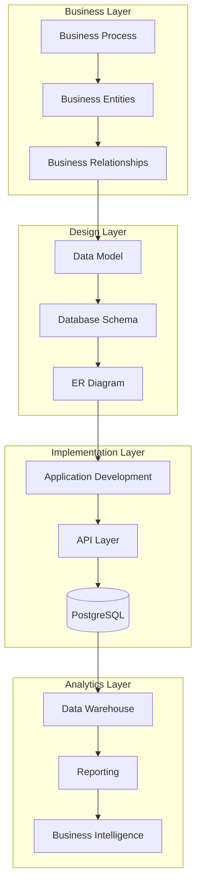

## The Complete Picture

### How Data Models Drive Everything

| Layer | Component | Purpose | Example |
|-------|-----------|---------|---------|
| **Business** | Business Entities | Real-world objects | QR Code, User, Scan |
| **Design** | Data Model | Structure definition | Tables, Relationships |
| **Database** | PostgreSQL Schema | Physical storage | DDL statements |
| **Application** | SQLAlchemy Models | Python classes | ORM mapping |
| **API** | FastAPI Routes | Data access | CRUD operations |
| **Analytics** | Reporting Views | Business insights | Scan statistics |

### Data Flow Architecture

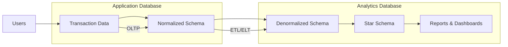

### Why This Matters for SQAnalytics

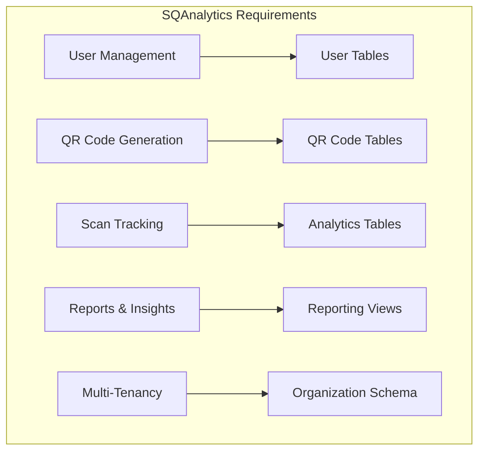

---

# Table of Contents

1. [Section 1: What Is Data Modeling?](#section-1)
2. [Section 2: Business Entities](#section-2)
3. [Section 3: Primary Keys](#section-3)
4. [Section 4: Foreign Keys](#section-4)
5. [Section 5: Database Relationships](#section-5)
6. [Section 6: Database Schema Design](#section-6)
7. [Section 7: Normalization](#section-7)
8. [Section 8: Denormalization](#section-8)
9. [Section 9: Data Modeling for SaaS Applications](#section-9)
10. [Section 10: Data Modeling for Analytics](#section-10)
11. [Section 11: PostgreSQL Data Modeling](#section-11)
12. [Section 12: FastAPI + PostgreSQL Mapping](#section-12)
13. [Section 13: SQAnalytics Case Study](#section-13)
14. [Section 14: Hands-On Exercises](#section-14)
15. [Section 15: Production Checklist](#section-15)
16. [Data Modeling Cheat Sheet](#cheat-sheet)
17. [Data Modeling Roadmap](#roadmap)
18. [Troubleshooting Guide](#troubleshooting)
19. [Interview Preparation Guide](#interview)

---

# Section 1: What Is Data Modeling?

## The Simple Explanation

**Data Modeling** is the process of creating a visual representation of:
- What data your application needs to store
- How different pieces of data relate to each other
- What rules govern your data

### The Building Analogy

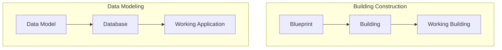

## Why Data Modeling Matters

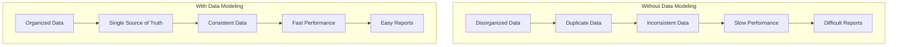

### Real-World Analogy

#### The Library System

Imagine building a library without a cataloging system:

**Without Data Modeling:**
- Books are shelved randomly
- No record of who borrowed what
- Can't find specific books
- Duplicates everywhere

**With Data Modeling:**
- Every book has a unique ID
- Borrowers are tracked
- Books are organized by category
- One copy, one record

## The Data Modeling Process

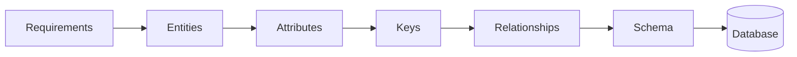

### Business Example: SQAnalytics

**Business Requirement:** "Users need to create QR codes and track when they're scanned."

**Data Model Translation:**

| Business Concept | Entity | Attributes |
|-----------------|--------|------------|
| A QR code generated by a user | QR_Code | id, short_code, title, url |
| When a QR code is scanned | Scan_Event | id, qr_code_id, timestamp, ip |
| The person generating QR codes | User | id, name, email |

---

## 🔍 Learning Checkpoint

1. Data modeling is primarily concerned with:
   - a) Writing code
   - b) Structuring data for applications
   - c) UI design
   - d) Marketing strategies

2. What does a data model represent?
   - a) Only the database structure
   - b) Business requirements and relationships
   - c) Only SQL queries
   - d) The user interface

**[Answers: 1-b, 2-b]**

---

# Section 2: Business Entities

## What Are Entities?

An **Entity** is a person, place, thing, or concept about which your system needs to store data.

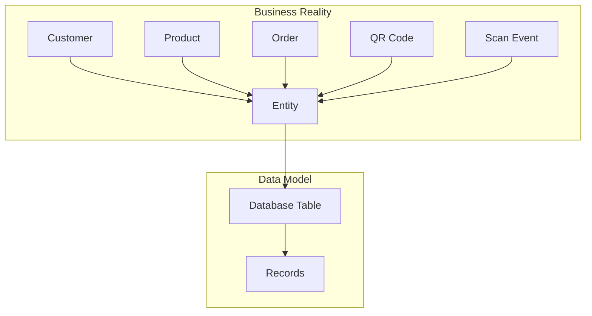

## Entity Discovery Framework

### Step-by-Step Process

1. **Identify Nouns** - Find all important nouns in requirements
2. **Eliminate Duplicates** - Remove synonyms and redundancies
3. **Validate Independence** - Can this exist on its own?
4. **Define Scope** - What details to include?

### Example: SQAnalytics Entity Discovery

| Requirement | Potential Entities | Valid Entity? | Reason |
|-------------|-------------------|---------------|---------|
| "Users create QR codes" | User, QR_Code | Yes | Both are core concepts |
| "QR codes have destination URLs" | URL | No | Attribute of QR_Code |
| "Scans are tracked" | Scan_Event | Yes | Standalone event |
| "Users belong to organizations" | Organization | Yes | Separate entity |

## Attributes

**Attributes** are the properties or characteristics of an entity.

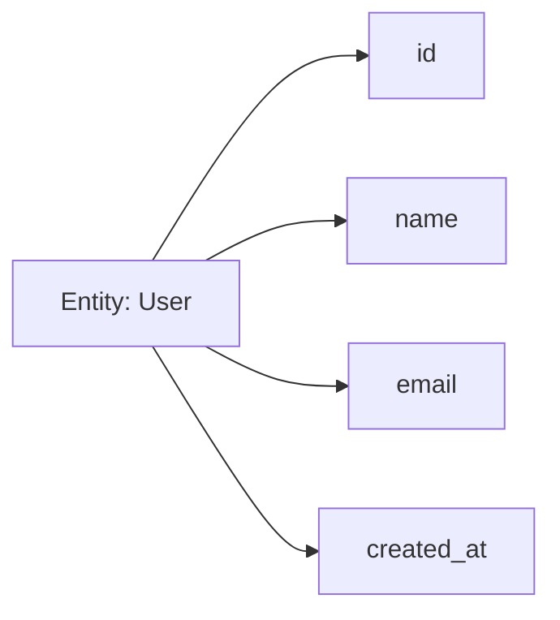

### Attribute Types

| Type | Description | Example |
|------|-------------|---------|
| **Identifier** | Uniquely identifies the entity | user.id |
| **Descriptive** | Provides information about the entity | user.name |
| **Temporal** | Records time-based information | user.created_at |
| **Reference** | Points to another entity | qr_code.user_id |

### Attribute Discovery Template

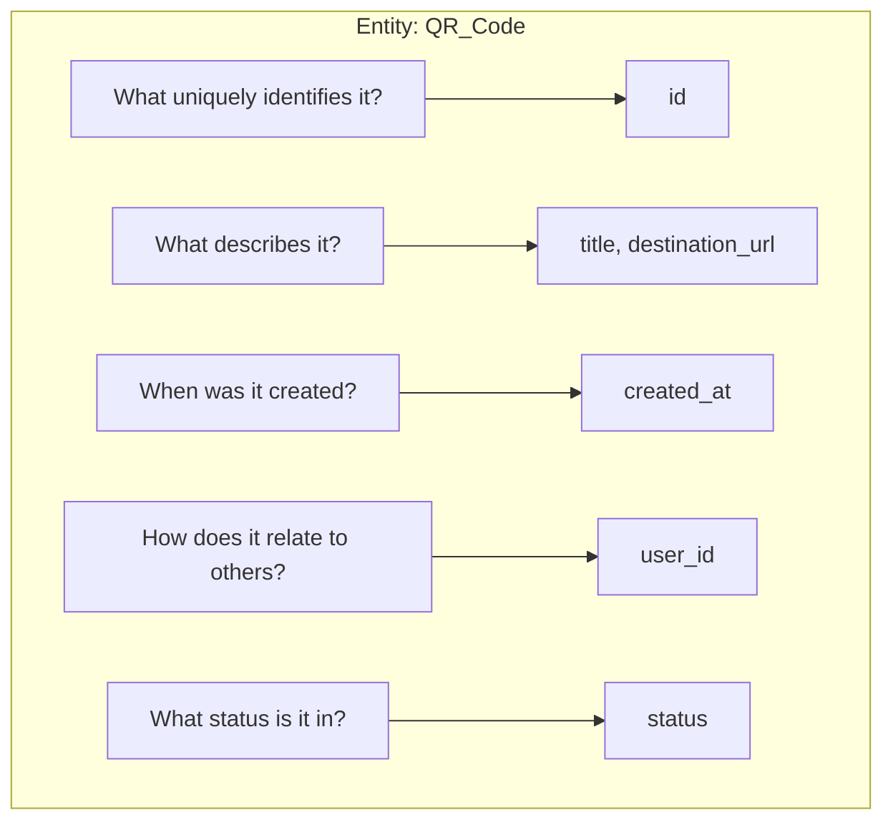

## Business Examples

### E-Commerce Entities

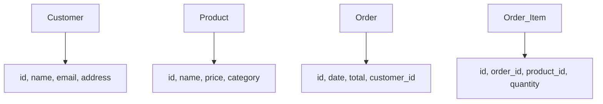

### Library System Entities

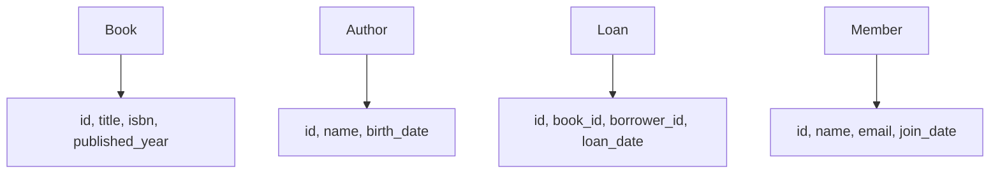

---

## 📝 Entity Discovery Checklist

- [ ] Have you identified all major nouns in requirements?
- [ ] Does each entity represent a distinct concept?
- [ ] Have you eliminated redundant entities?
- [ ] Are attributes clearly defined?
- [ ] Can each entity exist independently?

---

# Section 3: Primary Keys

## What Is a Primary Key?

A **Primary Key** is a column (or set of columns) that uniquely identifies each record in a database table.

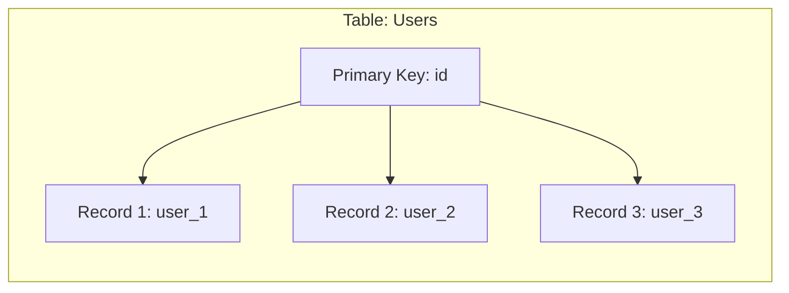

## Types of Primary Keys

### Natural Keys

A **Natural Key** uses existing data that uniquely identifies an entity.

```python
# Natural key example
class User:
    email = "user@example.com"  # This is naturally unique
```

| Natural Key | Entity | Why It Works |
|-------------|--------|--------------|
| Email | User | Each user has unique email |
| ISBN | Book | Each book has unique ISBN |
| SSN | Person | Unique government ID |

### Surrogate Keys

A **Surrogate Key** is an artificially created identifier.

```python
# Surrogate key example
class User:
    id = 1  # Auto-generated number
    email = "user@example.com"  # Still unique but not the key
```

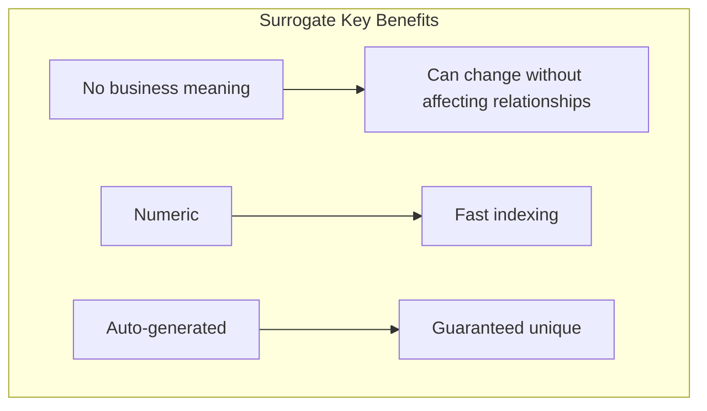

## Key Types Comparison

| Aspect | Natural Key | Surrogate Key |
|--------|------------|---------------|
| **Business Meaning** | Yes | No |
| **Can Change** | Sometimes | Never |
| **Uniqueness** | Usually guaranteed | Always guaranteed |
| **Performance** | Variable | Fast |
| **Stability** | May change | Stable |
| **Readability** | Human-friendly | Machine-friendly |

### UUIDs (Universally Unique Identifiers)

**UUIDs** are 128-bit identifiers that are globally unique.

```python
import uuid
user_id = uuid.uuid4()
# Example: 550e8400-e29b-41d4-a716-446655440000
```

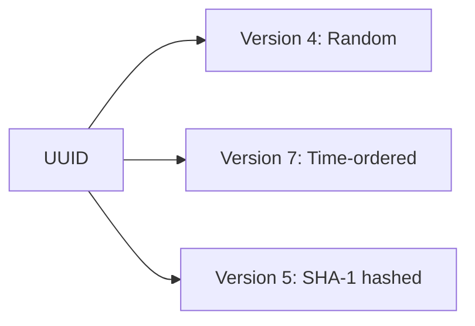

### PostgreSQL UUID Implementation

```sql
-- Using UUID as primary key
CREATE TABLE users (
    id UUID DEFAULT gen_random_uuid() PRIMARY KEY,
    name VARCHAR(100),
    email VARCHAR(100)
);

-- Example record
INSERT INTO users (name, email) 
VALUES ('John Doe', 'john@example.com');
-- id automatically generated as UUID
```

## Best Practices

### Rule 1: Always Have a Primary Key
```sql
-- GOOD
CREATE TABLE users (
    id BIGSERIAL PRIMARY KEY,
    ...
);

-- BAD: No primary key
CREATE TABLE users (
    name VARCHAR(100),
    email VARCHAR(100)
);
```

### Rule 2: Keep Keys Simple
```sql
-- GOOD: Simple single column
CREATE TABLE orders (
    id BIGSERIAL PRIMARY KEY
);

-- AVOID: Complex composite keys
CREATE TABLE orders (
    user_id BIGINT,
    order_date DATE,
    product_id BIGINT,
    PRIMARY KEY (user_id, order_date, product_id)
);
```

### Rule 3: Use Consistent Key Types

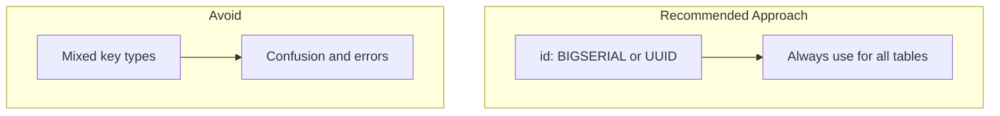

### SQAnalytics Primary Key Examples

```sql
-- Using SERIAL (auto-incrementing integer)
CREATE TABLE qr_codes (
    id BIGSERIAL PRIMARY KEY,
    short_code VARCHAR(50) UNIQUE NOT NULL,
    user_id BIGINT REFERENCES users(id)
);

-- Using UUID
CREATE TABLE scan_events (
    id UUID DEFAULT gen_random_uuid() PRIMARY KEY,
    qr_code_id BIGINT REFERENCES qr_codes(id),
    scanned_at TIMESTAMP
);
```

---

## 🎯 Quick Reference

| Scenario | Recommended Key |
|----------|-----------------|
| Simple application | BIGSERIAL |
| Distributed systems | UUID |
| Public-facing IDs | UUID |
| High-performance OLTP | BIGSERIAL |
| Need to hide record count | UUID |

---

# Section 4: Foreign Keys

## What Is a Foreign Key?

A **Foreign Key** is a column in one table that references the primary key of another table, establishing a relationship between them.

```mermaid
graph LR
    subgraph "Parent Table: users"
        P[id: 1, name: "Alice"]
        P2[id: 2, name: "Bob"]
    end
    
    subgraph "Child Table: qr_codes"
        C[qr_id: 1, user_id: 1, title: "Home"]
        C2[qr_id: 2, user_id: 2, title: "Shop"]
    end
    
    P -->|FK| C
    P2 -->|FK| C2
```

## Referential Integrity

**Referential Integrity** ensures that relationships between tables remain consistent.

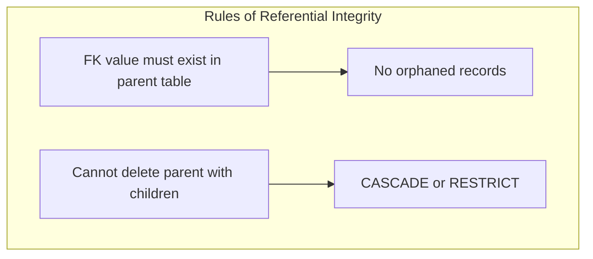

### PostgreSQL Referential Integrity

```sql
-- Adding foreign key constraint
CREATE TABLE qr_codes (
    id BIGSERIAL PRIMARY KEY,
    user_id BIGINT NOT NULL,
    title VARCHAR(200),
    CONSTRAINT fk_user 
        FOREIGN KEY (user_id) 
        REFERENCES users(id)
        ON DELETE CASCADE
);

-- Check existing constraints
SELECT 
    conname, 
    contype 
FROM pg_constraint 
WHERE conrelid = 'qr_codes'::regclass;
```

## Foreign Key Actions

| Action | Description | Use Case |
|--------|-------------|----------|
| **CASCADE** | Delete/update related records | User deletes account → Delete their QR codes |
| **RESTRICT** | Prevent deletion | Don't delete product with orders |
| **SET NULL** | Set FK to NULL on deletion | Keep order but remove user reference |
| **SET DEFAULT** | Set FK to default value | Set to default user |

### Example Implementation

```sql
-- CASCADE: User deletion cascades
CREATE TABLE qr_codes (
    id BIGSERIAL PRIMARY KEY,
    user_id BIGINT NOT NULL,
    FOREIGN KEY (user_id) 
        REFERENCES users(id) 
        ON DELETE CASCADE
);

-- SET NULL: Keep scans but lose user
CREATE TABLE scan_events (
    id BIGSERIAL PRIMARY KEY,
    user_id BIGINT,
    FOREIGN KEY (user_id) 
        REFERENCES users(id) 
        ON DELETE SET NULL
);

-- RESTRICT: Don't allow deletion
CREATE TABLE orders (
    id BIGSERIAL PRIMARY KEY,
    product_id BIGINT NOT NULL,
    FOREIGN KEY (product_id) 
        REFERENCES products(id) 
        ON DELETE RESTRICT
);
```

## Common Patterns

### Self-Referencing Foreign Key

```sql
-- User table with manager relationship
CREATE TABLE users (
    id BIGSERIAL PRIMARY KEY,
    name VARCHAR(100),
    manager_id BIGINT,
    FOREIGN KEY (manager_id) REFERENCES users(id)
);
```


### Composite Foreign Key

```sql
-- Composite primary key
CREATE TABLE users (
    tenant_id BIGINT,
    user_id BIGINT,
    PRIMARY KEY (tenant_id, user_id)
);

-- Foreign key referencing composite key
CREATE TABLE qr_codes (
    tenant_id BIGINT,
    user_id BIGINT,
    FOREIGN KEY (tenant_id, user_id) 
        REFERENCES users(tenant_id, user_id)
);
```

---

## 🔧 Best Practices

1. **Always define foreign keys** - Never rely on application logic
2. **Use ON DELETE CASCADE carefully** - Consider data implications
3. **Index foreign keys** - Query performance
4. **Use ON DELETE RESTRICT** for critical data
5. **Document relationships** - Use comments and naming conventions

---

# Section 5: Database Relationships

## Understanding Relationships

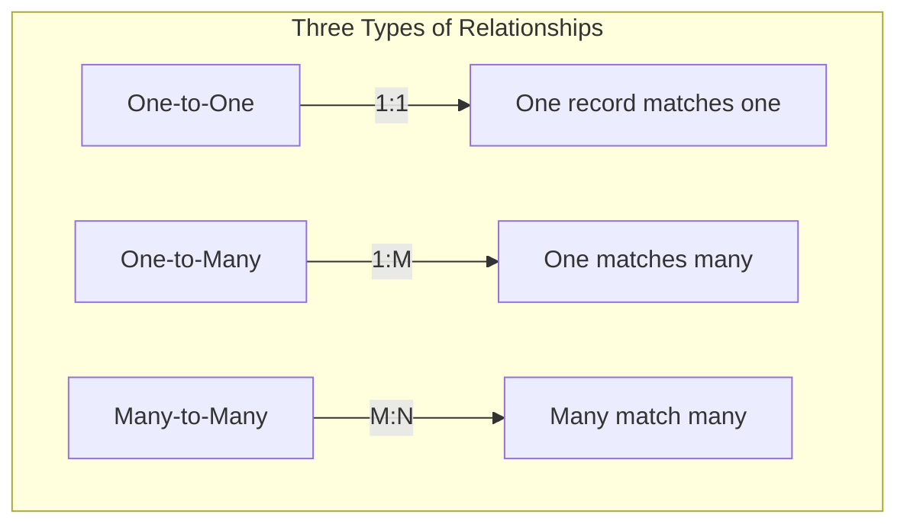

## One-to-One Relationships

### Definition
Each record in Table A corresponds to exactly one record in Table B.

### Business Example
- Person ↔ Passport
- User ↔ Profile
- QR_Code ↔ QR_Image

```mermaid
graph LR
    subgraph "User"
        U1[User 1: id=1]
        U2[User 2: id=2]
    end
    
    subgraph "Profile"
        P1[Profile: user_id=1]
        P2[Profile: user_id=2]
    end
    
    U1 --- P1
    U2 --- P2
```

### Implementation

```sql
-- User table
CREATE TABLE users (
    id BIGSERIAL PRIMARY KEY,
    username VARCHAR(100)
);

-- Profile table with one-to-one
CREATE TABLE profiles (
    id BIGSERIAL PRIMARY KEY,
    user_id BIGINT UNIQUE NOT NULL,
    bio TEXT,
    avatar_url VARCHAR(200),
    FOREIGN KEY (user_id) REFERENCES users(id)
);
```

### When to Use One-to-One

1. **Vertical Partitioning** - Split wide tables
2. **Sensitive Data** - Separate secure information
3. **Optional Data** - Some users have profiles, some don't
4. **Performance** - Frequently accessed vs. rarely accessed

## One-to-Many Relationships

### Definition
One record in Table A relates to many records in Table B.

### Business Example
- User → QR_Codes (one user creates many QR codes)
- Author → Books (one author writes many books)
- Category → Products (one category contains many products)

```mermaid
graph LR
    subgraph "User"
        U[User 1]
    end
    
    subgraph "QR Codes"
        Q1[QR Code 1] --> U
        Q2[QR Code 2] --> U
        Q3[QR Code 3] --> U
    end
```

### Implementation

```sql
-- Parent table
CREATE TABLE users (
    id BIGSERIAL PRIMARY KEY,
    name VARCHAR(100)
);

-- Child table with foreign key
CREATE TABLE qr_codes (
    id BIGSERIAL PRIMARY KEY,
    user_id BIGINT NOT NULL,
    title VARCHAR(200),
    FOREIGN KEY (user_id) REFERENCES users(id) ON DELETE CASCADE
);
```

### Common Patterns

```sql
-- One-to-many with timestamps
CREATE TABLE orders (
    id BIGSERIAL PRIMARY KEY,
    customer_id BIGINT NOT NULL,
    order_date TIMESTAMP DEFAULT CURRENT_TIMESTAMP
);

-- Many orders for one customer
CREATE TABLE order_items (
    id BIGSERIAL PRIMARY KEY,
    order_id BIGINT NOT NULL,
    product_id BIGINT NOT NULL,
    quantity INTEGER,
    FOREIGN KEY (order_id) REFERENCES orders(id)
);
```

## Many-to-Many Relationships

### Definition
Multiple records in Table A relate to multiple records in Table B.

### Business Example
- Students ↔ Courses
- Products ↔ Categories
- Users ↔ Permissions

```mermaid
graph LR
    subgraph "Students"
        S1[Alice] 
        S2[Bob] 
        S3[Charlie]
    end
    
    subgraph "Courses"
        C1[Math]
        C2[Science]
        C3[History]
    end
    
    S1 -->|Enrolled| C1
    S1 -->|Enrolled| C2
    S2 -->|Enrolled| C1
    S2 -->|Enrolled| C3
    S3 -->|Enrolled| C2
    S3 -->|Enrolled| C3
```

### Junction Table Implementation

```sql
-- Students table
CREATE TABLE students (
    id BIGSERIAL PRIMARY KEY,
    name VARCHAR(100)
);

-- Courses table
CREATE TABLE courses (
    id BIGSERIAL PRIMARY KEY,
    title VARCHAR(100)
);

-- Junction table for many-to-many
CREATE TABLE enrollments (
    id BIGSERIAL PRIMARY KEY,
    student_id BIGINT NOT NULL,
    course_id BIGINT NOT NULL,
    enrollment_date TIMESTAMP DEFAULT CURRENT_TIMESTAMP,
    grade VARCHAR(2),
    -- Composite unique to prevent duplicates
    UNIQUE(student_id, course_id),
    FOREIGN KEY (student_id) REFERENCES students(id) ON DELETE CASCADE,
    FOREIGN KEY (course_id) REFERENCES courses(id) ON DELETE CASCADE
);
```

### Practical SQAnalytics Example

```sql
-- QR Codes and Users (one-to-many)
CREATE TABLE qr_codes (
    id BIGSERIAL PRIMARY KEY,
    user_id BIGINT NOT NULL,
    title VARCHAR(200)
);

-- Scans and QR Codes (one-to-many)
CREATE TABLE scan_events (
    id BIGSERIAL PRIMARY KEY,
    qr_code_id BIGINT NOT NULL,
    scanned_at TIMESTAMP,
    ip_address VARCHAR(45),
    FOREIGN KEY (qr_code_id) REFERENCES qr_codes(id)
);

-- Users and Organizations (many-to-many)
CREATE TABLE organizations (
    id BIGSERIAL PRIMARY KEY,
    name VARCHAR(100)
);

CREATE TABLE user_organizations (
    user_id BIGINT NOT NULL,
    organization_id BIGINT NOT NULL,
    role VARCHAR(50),
    PRIMARY KEY (user_id, organization_id),
    FOREIGN KEY (user_id) REFERENCES users(id),
    FOREIGN KEY (organization_id) REFERENCES organizations(id)
);
```

---

## 📊 Relationship Summary Table

| Relationship | Implementation | SQL Pattern | Example |
|--------------|----------------|-------------|---------|
| **One-to-One** | Foreign key with UNIQUE | `user_id BIGINT UNIQUE` | User ↔ Profile |
| **One-to-Many** | Foreign key on many side | `user_id BIGINT` | User → QR Codes |
| **Many-to-Many** | Junction table | Many-to-many table | Users ↔ Organizations |

---

## 🎯 Relationship Design Guide

### Decision Tree

```mermaid
graph TD
    A[Is it a relationship?] -->|Yes| B[How many relate?]
    B -->|One-to-One| C[Use UNIQUE FK]
    B -->|One-to-Many| D[Add FK to many side]
    B -->|Many-to-Many| E[Create junction table]
```

### Check Your Understanding

1. A user has one profile. What relationship is this?
   - a) One-to-Many
   - b) One-to-One
   - c) Many-to-Many
   - d) Zero-to-Zero

2. A QR code has many scans. What relationship is this?
   - a) One-to-Many
   - b) One-to-One
   - c) Many-to-Many
   - d) Zero-to-Zero

**[Answers: 1-b, 2-a]**

---

# Section 6: Database Schema Design

## Schema Anatomy

```mermaid
graph TD
    subgraph "Database Schema"
        T1[Table: users]
        T2[Table: qr_codes]
        T3[Table: scan_events]
        T4[Table: organizations]
    end
    
    subgraph "Table Anatomy"
        C[Columns]
        D[Data Types]
        Con[Constraints]
        FK[Foreign Keys]
        I[Indexes]
    end
```

## Creating Database Schemas

### Step-by-Step Process

```mermaid
graph TD
    A[Business Requirements] --> B[Entity Identification]
    B --> C[Attribute Definition]
    C --> D[Key Selection]
    D --> E[Relationship Design]
    E --> F[Normalization]
    F --> G[Schema Creation]
    G --> H[Application Mapping]
```

### SQAnalytics Schema Evolution

```mermaid
graph TD
    subgraph "Phase 1: Basic"
        B1[users] --> B2[qr_codes]
    end
    
    subgraph "Phase 2: Analytics"
        A1[scan_events] --> A2[analytics_views]
    end
    
    subgraph "Phase 3: Multi-Tenancy"
        M1[organizations] --> M2[user_organizations]
    end
```

## Naming Conventions

### Table Naming

| Rule | Example |
|------|---------|
| **Plural** | `users`, `qr_codes` |
| **Snake Case** | `scan_events` |
| **Descriptive** | `user_profiles` |

### Column Naming

| Rule | Example |
|------|---------|
| **Singular** | `user_id`, `name` |
| **Snake Case** | `created_at` |
| **Descriptive** | `destination_url` |
| **Foreign Keys** | `{table}_id` |

### Comprehensive Example

```sql
-- Following naming conventions
CREATE TABLE qr_codes (
    -- Primary key (ID)
    id BIGSERIAL PRIMARY KEY,
    
    -- Foreign key (singular, snake_case, descriptive)
    user_id BIGINT NOT NULL,
    organization_id BIGINT NOT NULL,
    
    -- Data columns (singular, descriptive)
    short_code VARCHAR(50) UNIQUE NOT NULL,
    title VARCHAR(200) NOT NULL,
    destination_url VARCHAR(500) NOT NULL,
    
    -- Status columns (boolean prefix)
    is_active BOOLEAN DEFAULT TRUE,
    is_deleted BOOLEAN DEFAULT FALSE,
    
    -- Timestamps (timestamp suffix)
    created_at TIMESTAMP WITH TIME ZONE DEFAULT CURRENT_TIMESTAMP,
    updated_at TIMESTAMP WITH TIME ZONE DEFAULT CURRENT_TIMESTAMP,
    deleted_at TIMESTAMP WITH TIME ZONE,
    
    -- Constraints
    CONSTRAINT fk_user FOREIGN KEY (user_id) REFERENCES users(id),
    CONSTRAINT fk_organization FOREIGN KEY (organization_id) REFERENCES organizations(id)
);
```

## Data Types Selection Guide

### PostgreSQL Data Types

| SQLAlchemy Type | PostgreSQL Type | Use Case |
|-----------------|-----------------|----------|
| `Integer` | `INTEGER` | Counts, IDs (small ranges) |
| `BigInteger` | `BIGINT` | IDs (large ranges) |
| `String(50)` | `VARCHAR(50)` | Short text, codes |
| `Text` | `TEXT` | Long text, descriptions |
| `Boolean` | `BOOLEAN` | True/False flags |
| `DateTime` | `TIMESTAMP` | Dates with times |
| `Date` | `DATE` | Dates only |
| `Float` | `FLOAT` | Decimal numbers |
| `JSON` | `JSONB` | Structured data |

### Selection Decision Tree

```mermaid
graph TD
    D[What type of data?] -->|Numbers| N{Whole or Decimal?}
    N -->|Whole| I{Small or Large?}
    N -->|Decimal| F[FLOAT]
    I -->|Small| Int[INTEGER]
    I -->|Large| Big[BIGINT]
    
    D -->|Text| T{Length?}
    T -->|Short| V[VARCHAR]
    T -->|Long| Text[Text]
    
    D -->|Date/Time| DT[TIMESTAMP]
    D -->|Boolean| Bool[BOOLEAN]
    D -->|JSON| J[JSONB]
```

## SQAnalytics Schema Example

### Complete Database Schema

```sql
-- Users
CREATE TABLE users (
    id BIGSERIAL PRIMARY KEY,
    email VARCHAR(100) UNIQUE NOT NULL,
    name VARCHAR(100) NOT NULL,
    is_active BOOLEAN DEFAULT TRUE,
    created_at TIMESTAMP WITH TIME ZONE DEFAULT CURRENT_TIMESTAMP,
    updated_at TIMESTAMP WITH TIME ZONE DEFAULT CURRENT_TIMESTAMP
);

-- Organizations
CREATE TABLE organizations (
    id BIGSERIAL PRIMARY KEY,
    name VARCHAR(100) NOT NULL,
    slug VARCHAR(50) UNIQUE NOT NULL,
    subscription_tier VARCHAR(50) DEFAULT 'free',
    created_at TIMESTAMP WITH TIME ZONE DEFAULT CURRENT_TIMESTAMP
);

-- User-Organization mapping
CREATE TABLE user_organizations (
    user_id BIGINT NOT NULL,
    organization_id BIGINT NOT NULL,
    role VARCHAR(50) DEFAULT 'member',
    joined_at TIMESTAMP WITH TIME ZONE DEFAULT CURRENT_TIMESTAMP,
    PRIMARY KEY (user_id, organization_id),
    FOREIGN KEY (user_id) REFERENCES users(id) ON DELETE CASCADE,
    FOREIGN KEY (organization_id) REFERENCES organizations(id) ON DELETE CASCADE
);

-- QR Codes
CREATE TABLE qr_codes (
    id BIGSERIAL PRIMARY KEY,
    user_id BIGINT NOT NULL,
    organization_id BIGINT NOT NULL,
    short_code VARCHAR(50) UNIQUE NOT NULL,
    title VARCHAR(200) NOT NULL,
    destination_url VARCHAR(500) NOT NULL,
    scan_count INTEGER DEFAULT 0,
    is_active BOOLEAN DEFAULT TRUE,
    created_at TIMESTAMP WITH TIME ZONE DEFAULT CURRENT_TIMESTAMP,
    updated_at TIMESTAMP WITH TIME ZONE DEFAULT CURRENT_TIMESTAMP,
    FOREIGN KEY (user_id) REFERENCES users(id),
    FOREIGN KEY (organization_id) REFERENCES organizations(id)
);

-- Scan Events
CREATE TABLE scan_events (
    id UUID DEFAULT gen_random_uuid() PRIMARY KEY,
    qr_code_id BIGINT NOT NULL,
    organization_id BIGINT NOT NULL,
    scanned_at TIMESTAMP WITH TIME ZONE DEFAULT CURRENT_TIMESTAMP,
    ip_address VARCHAR(45),
    user_agent VARCHAR(255),
    location VARCHAR(100),
    device_type VARCHAR(50),
    FOREIGN KEY (qr_code_id) REFERENCES qr_codes(id) ON DELETE CASCADE,
    FOREIGN KEY (organization_id) REFERENCES organizations(id)
);
```

---

## 🔍 Schema Design Checkpoint

- [ ] All tables have primary keys
- [ ] Foreign keys are properly defined
- [ ] Data types are appropriate
- [ ] Naming conventions are consistent
- [ ] Constraints enforce data integrity
- [ ] Indexes are planned for performance

---

# Section 7: Normalization

## What Is Normalization?

**Normalization** is the process of organizing data to reduce redundancy and improve data integrity.

```mermaid
graph TD
    subgraph "Normalization Process"
        U[Unnormalized] --> 1NF[First Normal Form]
        1NF --> 2NF[Second Normal Form]
        2NF --> 3NF[Third Normal Form]
        3NF --> BCNF[Boyce-Codd Normal Form]
    end
```

## First Normal Form (1NF)

### Rules for 1NF
1. Each cell contains a single value
2. Each column has a unique name
3. All entries in a column are of the same type

### Example: Before 1NF

```mermaid
graph LR
    subgraph "Orders (Violating 1NF)"
        O1[Order: #101] --> P1[Products: Laptop, Mouse]
        O2[Order: #102] --> P2[Products: Monitor, Keyboard, Mouse]
    end
```

### After 1NF

```mermaid
graph LR
    subgraph "Orders (1NF Compliant)"
        O1[Order: #101] --> P1[Product: Laptop]
        O1 --> P2[Product: Mouse]
        O2[Order: #102] --> P3[Product: Monitor]
        O2 --> P4[Product: Keyboard]
        O2 --> P5[Product: Mouse]
    end
```

### Implementation

```sql
-- Violates 1NF
CREATE TABLE orders (
    id BIGSERIAL PRIMARY KEY,
    products TEXT  -- 'Laptop, Mouse' - multiple values!
);

-- 1NF Compliant
CREATE TABLE orders (
    id BIGSERIAL PRIMARY KEY
);

CREATE TABLE order_items (
    id BIGSERIAL PRIMARY KEY,
    order_id BIGINT NOT NULL,
    product_name VARCHAR(100),
    FOREIGN KEY (order_id) REFERENCES orders(id)
);
```

## Second Normal Form (2NF)

### Rules for 2NF
1. Table is in 1NF
2. All non-key columns depend on the entire primary key

### Example: Before 2NF

```sql
-- Composite primary key: (order_id, product_id)
CREATE TABLE order_details (
    order_id BIGINT,
    product_id BIGINT,
    product_name VARCHAR(100),  -- Depends on product_id only
    quantity INTEGER,            -- Depends on both
    PRIMARY KEY (order_id, product_id)
);
```

### After 2NF

```sql
-- Split into two tables
CREATE TABLE order_products (
    order_id BIGINT,
    product_id BIGINT,
    quantity INTEGER,
    PRIMARY KEY (order_id, product_id)
);

CREATE TABLE products (
    id BIGSERIAL PRIMARY KEY,
    name VARCHAR(100)
);
```

## Third Normal Form (3NF)

### Rules for 3NF
1. Table is in 2NF
2. No transitive dependencies

### Example: Before 3NF

```sql
CREATE TABLE orders (
    id BIGSERIAL PRIMARY KEY,
    customer_id BIGINT,
    customer_name VARCHAR(100),  -- Depends on customer_id
    customer_email VARCHAR(100),  -- Depends on customer_id
    order_date TIMESTAMP
    -- customer_name and customer_email depend on customer_id,