# Pydantic & API Schema Design for Modern Backend Development

## A Practical Beginner Guide for Building SQAnalytics with FastAPI, PostgreSQL, SQLAlchemy, Supabase & GitHub

---

# Cover Page

<div style="text-align: center; padding: 40px 0;">

# Pydantic & API Schema Design for Modern Backend Development

## A Practical Beginner Guide for Building SQAnalytics

**Version 1.0**

---

### Learning Path

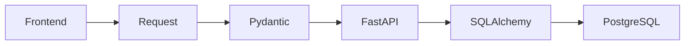

### Project Context: SQAnalytics

A Smart QR Analytics Platform built with:
- **FastAPI** - Modern Python web framework
- **Pydantic** - Data validation and settings management
- **PostgreSQL** - Enterprise-grade database
- **SQLAlchemy** - ORM for database interaction
- **Supabase** - PostgreSQL hosting

---

*"From Zero Pydantic to Production-Ready API Design in One Guide"*

</div>

---

# Learning Objectives

By completing this handbook, you will master:

### Fundamental Concepts
- **Pydantic Definition** - What it is and why it matters
- **API Schema Design** - Creating contracts for data exchange
- **Data Validation** - Ensuring data quality and safety
- **Type Safety** - Leveraging Python's type system
- **FastAPI Integration** - How Pydantic powers FastAPI

### Practical Skills
- **Creating Request Models** - Structuring incoming data
- **Designing Response Models** - Structuring outgoing data
- **Implementing Validation** - Data integrity rules
- **Handling Validation Errors** - Proper error responses
- **Nested Models** - Complex data structures

### Production Application
- **API Contract Design** - Professional API patterns
- **Schema Reusability** - DRY principles
- **Documentation Generation** - Auto-generated OpenAPI
- **Maintainable Schemas** - Scalable design patterns

---

# Executive Summary

## The API Schema Journey

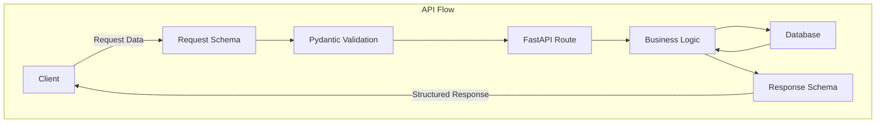

## The Complete Picture

### How Pydantic Powers FastAPI

| Layer | Component | Purpose | Example |
|-------|-----------|---------|---------|
| **Client** | Frontend/Mobile | Sends JSON data | `{"title": "Home"}` |
| **Request** | Pydantic Schema | Validates incoming data | `QRCodeCreate` |
| **Validation** | Pydantic | Type checks & constraints | `title: str, min_length=1` |
| **API Layer** | FastAPI Route | Handles request | `@app.post("/qr-codes")` |
| **Business Logic** | Service Layer | Process data | Create QR code |
| **Response** | Pydantic Schema | Structures outgoing data | `QRCodeResponse` |

### The Validation Flow

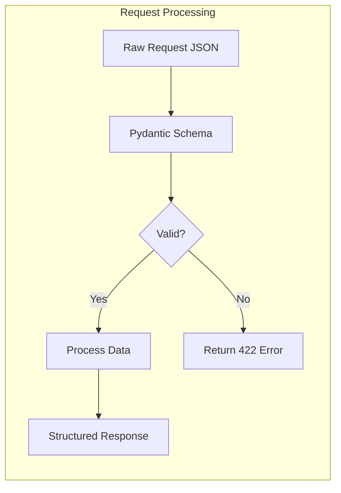

### Why This Matters for SQAnalytics

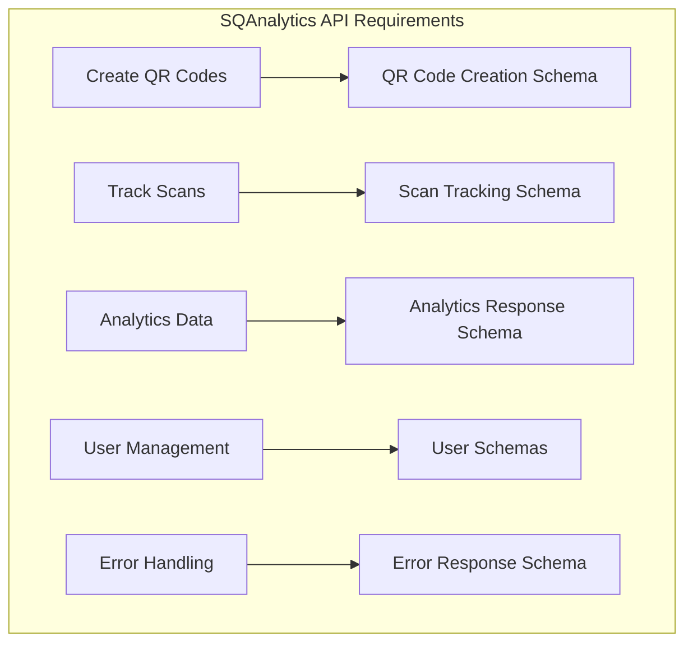

---

# Table of Contents

1. [Section 1: What Is Pydantic?](#section-1)
2. [Section 2: Why API Schemas Exist](#section-2)
3. [Section 3: Understanding Request Models](#section-3)
4. [Section 4: Understanding Response Models](#section-4)
5. [Section 5: Data Validation Fundamentals](#section-5)
6. [Section 6: Common Data Types](#section-6)
7. [Section 7: Pydantic Architecture](#section-7)
8. [Section 8: FastAPI + Pydantic Integration](#section-8)
9. [Section 9: API Design Best Practices](#section-9)
10. [Section 10: SQLAlchemy vs Pydantic](#section-10)
11. [Section 11: SQAnalytics Case Study](#section-11)
12. [Section 12: Common Developer Mistakes](#section-12)
13. [Section 13: Hands-On Exercises](#section-13)
14. [Section 14: Production Checklist](#section-14)
15. [Pydantic Cheat Sheet](#cheat-sheet)
16. [Pydantic Roadmap](#roadmap)
17. [Troubleshooting Guide](#troubleshooting)
18. [Interview Preparation Guide](#interview)
19. [Knowledge Check](#knowledge-check)

---

# Section 1: What Is Pydantic?

## The Simple Explanation

**Pydantic** is a Python library that:
- Validates incoming data
- Parses data into Python objects
- Ensures type safety
- Creates structured data contracts

### The Airport Security Analogy

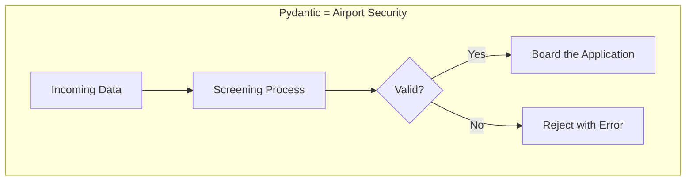

## Why FastAPI Uses Pydantic

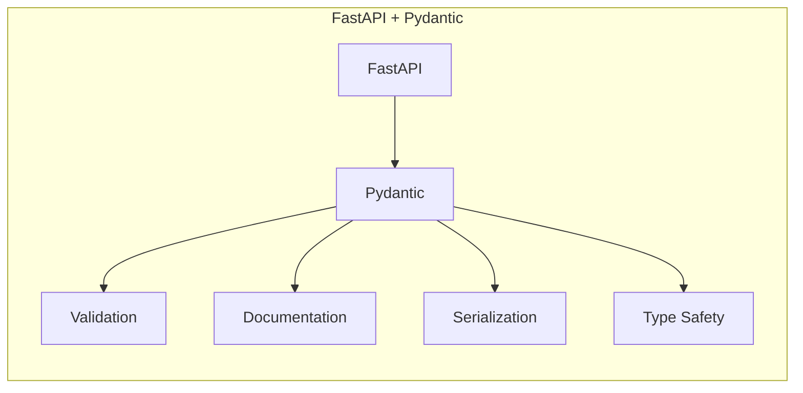

### The Conversion Process

```python
# Raw JSON (from client)
json_data = {
    "title": "Home Page",
    "destination_url": "https://example.com",
    "is_active": "true"  # String, not boolean!
}

# Pydantic converts and validates
from pydantic import BaseModel

class QRCodeCreate(BaseModel):
    title: str
    destination_url: str
    is_active: bool

# Pydantic handles:
# - type conversion (string "true" -> boolean True)
# - validation (is it a valid URL?)
# - data structuring (creates Python object)
```

## Real-World Example: SQAnalytics

```python
from pydantic import BaseModel, HttpUrl, Field
from datetime import datetime
from uuid import UUID

# Request schema - what the client sends
class QRCodeCreate(BaseModel):
    title: str = Field(..., min_length=1, max_length=200)
    destination_url: HttpUrl
    is_active: bool = True

# Response schema - what the API returns
class QRCodeResponse(BaseModel):
    id: int
    short_code: str
    title: str
    destination_url: str
    scan_count: int
    created_at: datetime
    
    class Config:
        from_attributes = True  # Enables ORM mode
```

## The Pydantic Workflow

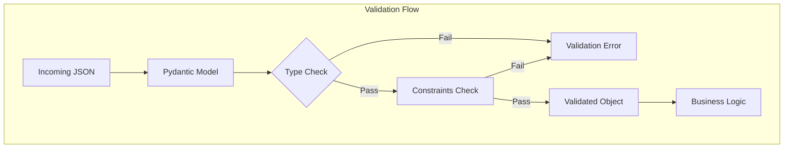

---

## 🔍 Learning Checkpoint

1. What is Pydantic primarily used for?
   - a) Database management
   - b) Data validation and parsing
   - c) Frontend development
   - d) Network configuration

2. How does FastAPI use Pydantic?
   - a) As a database ORM
   - b) For request/response validation
   - c) For UI rendering
   - d) For logging

**[Answers: 1-b, 2-b]**

---

# Section 2: Why API Schemas Exist

## The Problem Without Schemas

### API Without Schemas

```python
# BAD: No schema validation
@app.post("/qr-codes")
async def create_qr(title: str, url: str):
    # What if title is empty?
    # What if url is malformed?
    # What if extra fields are sent?
    # No documentation!
    return {"id": 1, "title": title}
```

### Issues Without Schemas

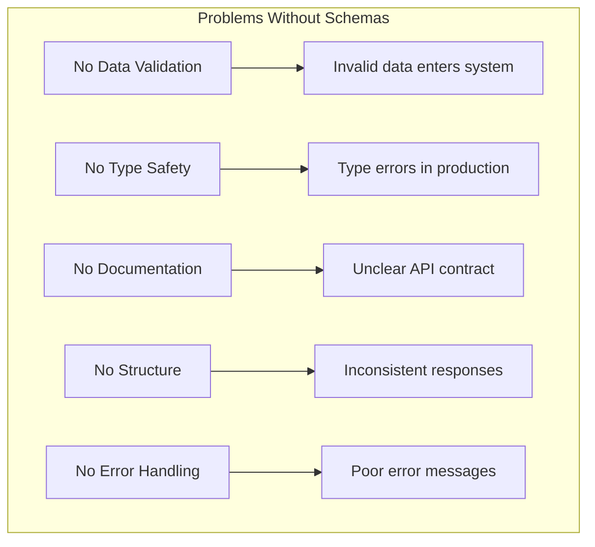

## API With Schemas

### Structured Approach

```python
# GOOD: With Pydantic schemas
from pydantic import BaseModel, HttpUrl, Field

class QRCodeCreate(BaseModel):
    title: str = Field(..., min_length=1, max_length=200)
    destination_url: HttpUrl
    is_active: bool = True
    
    class Config:
        schema_extra = {
            "example": {
                "title": "Home Page",
                "destination_url": "https://example.com",
                "is_active": True
            }
        }

@app.post("/qr-codes")
async def create_qr(qr: QRCodeCreate):
    # Validate done automatically!
    # qr is now a validated Python object
    return process_qr(qr)
```

### Benefits Visualized

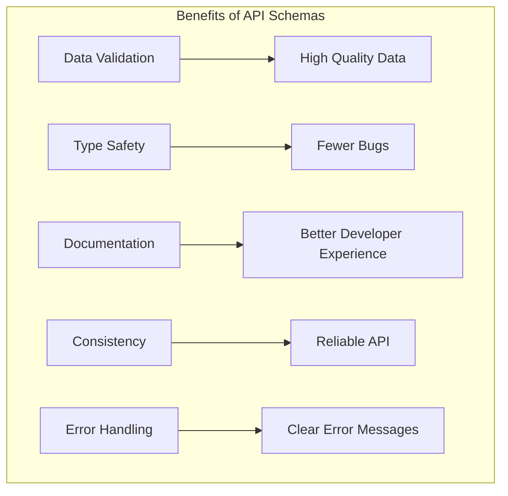

## Comparison Table

| Aspect | Without Schemas | With Pydantic |
|--------|----------------|---------------|
| **Data Validation** | Manual checks | Automatic |
| **Type Safety** | None | Enforced |
| **Documentation** | Manual/None | Auto-generated |
| **Error Messages** | Generic | Specific |
| **Code Quality** | Poor | Excellent |
| **Maintainability** | Difficult | Easy |
| **Testing** | Hard | Simple |

---

## 📊 API Contract Benefits

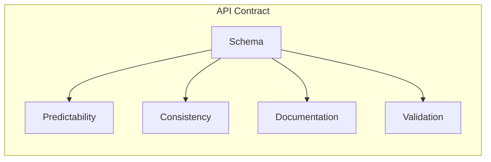

---

# Section 3: Understanding Request Models

## BaseModel Foundation

```python
from pydantic import BaseModel
from typing import Optional

class QRCodeCreate(BaseModel):
    """Request model for creating QR codes"""
    title: str
    destination_url: str
    is_active: bool = True  # Default value
```

## Field Configuration

```python
from pydantic import BaseModel, Field, HttpUrl

class QRCodeCreate(BaseModel):
    # Required field with constraints
    title: str = Field(
        ...,
        min_length=1,
        max_length=200,
        description="QR code title"
    )
    
    # Required URL
    destination_url: HttpUrl = Field(
        ...,
        description="Destination URL for QR code"
    )
    
    # Optional with default
    is_active: bool = Field(
        default=True,
        description="Whether QR code is active"
    )
    
    # Optional field with None default
    description: Optional[str] = Field(
        None,
        max_length=500,
        description="Optional description"
    )
```

## Required vs Optional Fields

```mermaid
graph TD
    subgraph "Field Types"
        R[Required] -->|Must be provided| R1[title: str]
        R -->|No default| R2[destination_url: str]
        
        O[Optional] -->|Default value| O1[is_active: bool = True]
        O -->|Optional field| O2[description: Optional[str] = None]
    end
```

### Field Decision Matrix

| Pattern | Syntax | Use Case |
|---------|--------|----------|
| **Required** | `title: str` | Always needed |
| **Required with default** | `is_active: bool = True` | Default value |
| **Optional with None** | `description: Optional[str] = None` | May be omitted |
| **Required with constraints** | `title: str = Field(..., min_length=1)` | Validation needed |

## Nested Models

### Complex Request Structures

```python
from typing import List, Optional
from pydantic import BaseModel, HttpUrl

class QRCodeMetadata(BaseModel):
    """Nested model for QR metadata"""
    color: str = Field(..., regex=r"^#[0-9a-fA-F]{6}$")
    size: str = Field(..., regex=r"^\d+x\d+$")
    custom_logo: Optional[HttpUrl] = None

class QRCodeCreate(BaseModel):
    """Main request model with nested model"""
    title: str = Field(..., min_length=1, max_length=200)
    destination_url: HttpUrl
    metadata: QRCodeMetadata  # Nested model
    tags: List[str] = Field(default_factory=list)
    is_active: bool = True
```

### Nested Model Example

```json
{
    "title": "Product Landing Page",
    "destination_url": "https://example.com/product",
    "metadata": {
        "color": "#FF5733",
        "size": "300x300",
        "custom_logo": "https://example.com/logo.png"
    },
    "tags": ["product", "landing", "promotion"],
    "is_active": true
}
```

## Validation Examples

### Common Validation Patterns

```python
from pydantic import BaseModel, Field, validator, EmailStr
from datetime import datetime
from typing import Optional

class QRCodeCreate(BaseModel):
    title: str = Field(..., min_length=3, max_length=200)
    destination_url: str = Field(..., description="Full URL")
    
    # Custom validator
    @validator('destination_url')
    def validate_url(cls, v):
        if not v.startswith(('http://', 'https://')):
            raise ValueError('URL must start with http:// or https://')
        return v
    
    # Validating multiple fields
    @validator('title')
    def validate_title(cls, v):
        if any(char.isdigit() for char in v):
            raise ValueError('Title cannot contain numbers')
        return v

class UserCreate(BaseModel):
    email: EmailStr
    username: str = Field(..., min_length=3, max_length=50)
    password: str = Field(..., min_length=8)
    
    @validator('password')
    def validate_password(cls, v):
        if not any(char.isdigit() for char in v):
            raise ValueError('Password must contain at least one digit')
        return v
```

## Request Model Best Practices

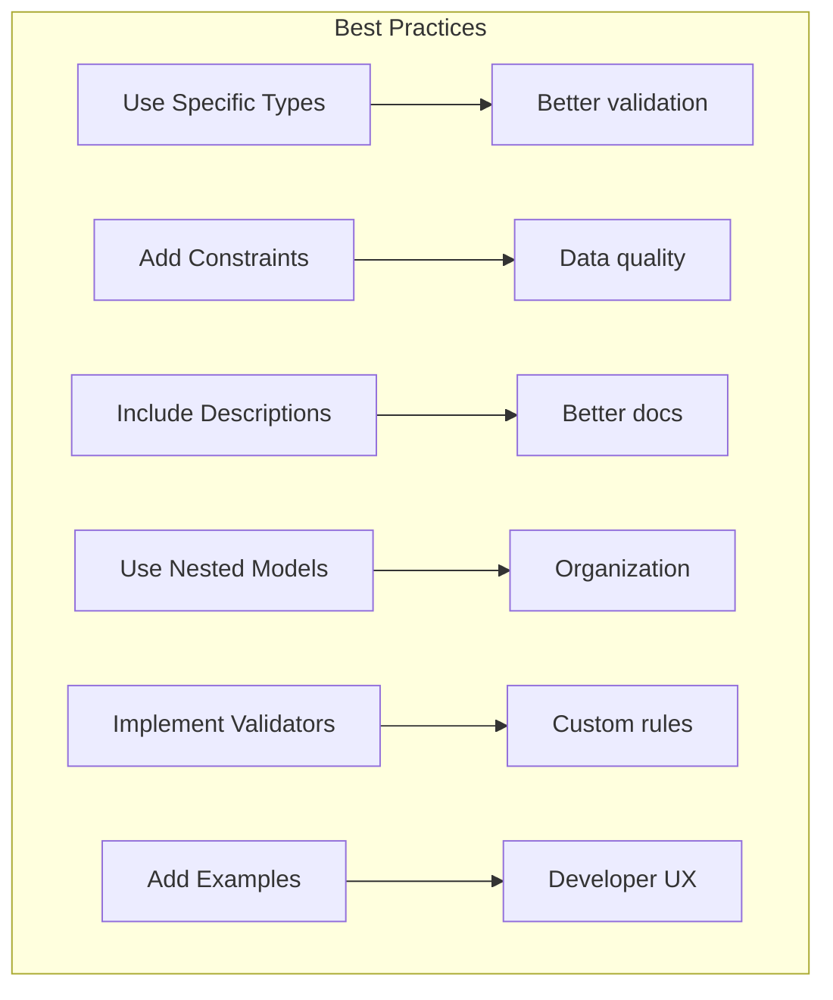

---

## 🎯 Request Model Quick Reference

| Component | Purpose | Example |
|-----------|---------|---------|
| `BaseModel` | Schema foundation | `class QRCodeCreate(BaseModel):` |
| `Field(...)` | Required field | `title: str = Field(...)` |
| `Field(default)` | Default value | `is_active: bool = True` |
| `Optional[...]` | May be omitted | `description: Optional[str] = None` |
| `@validator` | Custom validation | `def validate_title(cls, v):` |

---

# Section 4: Understanding Response Models

## The Purpose of Response Models

Response models:
- Structure API output
- Control what data is exposed
- Ensure consistency
- Provide documentation
- Filter internal data

## Basic Response Model

```python
from pydantic import BaseModel
from datetime import datetime

class QRCodeResponse(BaseModel):
    id: int
    short_code: str
    title: str
    destination_url: str
    scan_count: int
    is_active: bool
    created_at: datetime
    updated_at: datetime
```

## Response Model Options

### Using Response Models in FastAPI

```python
from fastapi import FastAPI
from typing import List

app = FastAPI()

@app.post("/qr-codes", response_model=QRCodeResponse)
async def create_qr(qr: QRCodeCreate):
    # Business logic
    return qr_object

@app.get("/qr-codes", response_model=List[QRCodeResponse])
async def list_qr_codes():
    # Business logic
    return qr_objects

@app.get("/qr-codes/{qr_id}", response_model=QRCodeResponse)
async def get_qr_code(qr_id: int):
    # Business logic
    return qr_object
```

## Response Filtering

### Controlling What Gets Exposed

```python
from pydantic import BaseModel
from datetime import datetime
from typing import Optional

class QRCodeResponse(BaseModel):
    """Public response - only what clients should see"""
    id: int
    short_code: str
    title: str
    destination_url: str
    scan_count: int
    is_active: bool
    created_at: datetime
    
    class Config:
        from_attributes = True

class QRCodeInternal(QRCodeResponse):
    """Internal model - includes sensitive fields"""
    updated_at: datetime
    user_id: int
    organization_id: int
    
    class Config:
        from_attributes = True
```

## Nested Response Models

### Complex Response Structures

```python
from typing import List, Optional
from datetime import datetime
from pydantic import BaseModel

class UserResponse(BaseModel):
    id: int
    email: str
    name: str
    created_at: datetime
    
    class Config:
        from_attributes = True

class QRCodeResponse(BaseModel):
    id: int
    short_code: str
    title: str
    destination_url: str
    scan_count: int
    is_active: bool
    created_at: datetime
    
    # Nested response
    user: Optional[UserResponse] = None
    recent_scans: List[dict] = []
    
    class Config:
        from_attributes = True

class AnalyticsSummaryResponse(BaseModel):
    total_qr_codes: int
    active_qr_codes: int
    total_scans: int
    average_scans_per_qr: float
    top_performing_codes: List[QRCodeResponse]
```

## Response Model Visualization

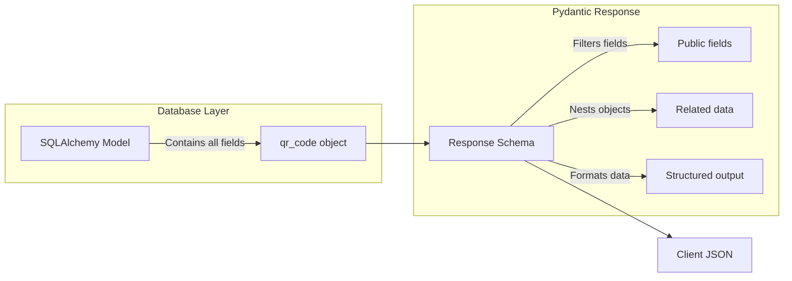

## Response Model Configuration

### Config Class Options

```python
class QRCodeResponse(BaseModel):
    id: int
    title: str
    
    class Config:
        # Enable ORM mode (for SQLAlchemy)
        from_attributes = True
        
        # Custom field name mapping
        alias_generator = lambda x: x.upper()
        allow_population_by_field_name = True
        
        # Additional examples
        schema_extra = {
            "example": {
                "id": 1,
                "title": "Home Page"
            }
        }
```

## Response Model Best Practices

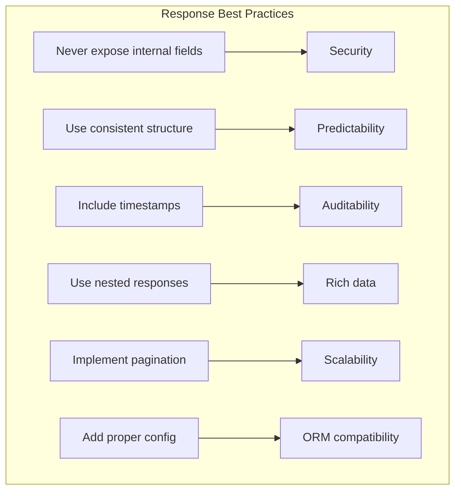

---

## 🎯 Response Model Checklist

- [ ] Only public fields included
- [ ] Correct types specified
- [ ] Config with `from_attributes = True`
- [ ] Nested structures as needed
- [ ] Appropriate field names (consistent with request)
- [ ] Pagination included for lists

---

# Section 5: Data Validation Fundamentals

## Validation Flow

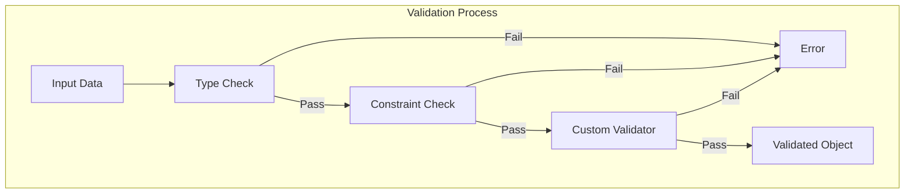

## Type Validation

### Automatic Type Checking

```python
from pydantic import BaseModel
from datetime import datetime

class DataExample(BaseModel):
    # String must be str
    text: str
    
    # Integer must be int
    number: int
    
    # Boolean must be bool
    flag: bool
    
    # Datetime must be datetime
    timestamp: datetime

# These work:
valid_data = DataExample(
    text="Hello",
    number=42,
    flag=True,
    timestamp="2024-01-01T12:00:00"  # Auto-converted to datetime
)

# These fail:
invalid_data = DataExample(
    text=123,  # Error: should be str
    number="42",  # Error: should be int
    flag="yes",  # Error: should be bool
    timestamp="invalid"  # Error: invalid datetime
)
```

## Constraint Validation

### Field Constraints

```python
from pydantic import BaseModel, Field
from typing import List

class QRCodeCreate(BaseModel):
    # String constraints
    title: str = Field(
        ...,
        min_length=1,
        max_length=200,
        regex=r"^[a-zA-Z0-9\s-]+$"  # Only letters, numbers, spaces, hyphens
    )
    
    # Numeric constraints
    priority: int = Field(
        1,
        ge=1,  # >= 1
        le=5   # <= 5
    )
    
    # List constraints
    tags: List[str] = Field(
        default_factory=list,
        min_items=0,
        max_items=10
    )
```

## Custom Validation

### Validator Functions

```python
from pydantic import BaseModel, validator, ValidationError

class QRCodeCreate(BaseModel):
    title: str
    destination_url: str
    password_protected: bool = False
    password: str = None
    
    @validator('title')
    def title_must_not_be_empty(cls, v):
        if not v or v.isspace():
            raise ValueError('Title cannot be empty or whitespace')
        return v.strip()
    
    @validator('destination_url')
    def url_must_be_valid(cls, v):
        if not v.startswith(('http://', 'https://')):
            raise ValueError('URL must start with http:// or https://')
        return v
    
    @validator('password')
    def password_required_if_protected(cls, v, values):
        if values.get('password_protected') and not v:
            raise ValueError('Password required when password_protected is True')
        return v
    
    @validator('password')
    def password_meets_requirements(cls, v):
        if v and len(v) < 8:
            raise ValueError('Password must be at least 8 characters')
        return v
```

## Validation Error Responses

### Default Error Structure

```json
{
    "detail": [
        {
            "type": "string_too_short",
            "loc": ["body", "title"],
            "msg": "String should have at least 1 character",
            "input": "",
            "ctx": {"min_length": 1}
        },
        {
            "type": "url_parsing",
            "loc": ["body", "destination_url"],
            "msg": "Input should be a valid URL, [type=url_parsing, ...]",
            "input": "not-a-url"
        }
    ]
}
```

### Custom Error Handling

```python
from fastapi import FastAPI, HTTPException
from pydantic import ValidationError

app = FastAPI()

@app.exception_handler(ValidationError)
async def validation_exception_handler(request, exc):
    return JSONResponse(
        status_code=400,
        content={
            "status": "error",
            "code": "VALIDATION_ERROR",
            "message": "Request validation failed",
            "errors": exc.errors()
        }
    )
```

---

## 🔍 Validation Best Practices

1. **Validate everything** - Never trust client data
2. **Use specific types** - Leverage Python's type system
3. **Add constraints** - Define boundaries
4. **Implement custom validators** - Business logic
5. **Handle errors gracefully** - Clear error messages

---

# Section 6: Common Data Types

## Type Overview

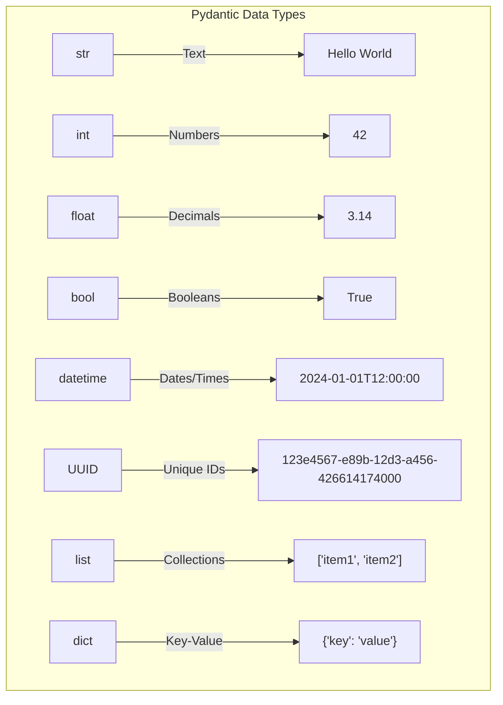

## String Types

```python
from pydantic import BaseModel, EmailStr, HttpUrl, Field
from typing import Optional

class StringExamples(BaseModel):
    # Basic string
    text: str
    
    # Email validation
    email: EmailStr
    
    # URL validation
    website: HttpUrl
    
    # Constrained string
    username: str = Field(
        ...,
        min_length=3,
        max_length=50,
        regex=r"^[a-zA-Z0-9_]+$"
    )
    
    # Optional string with None default
    description: Optional[str] = None
    
    # String with custom validation
    @validator('username')
    def username_has_no_spaces(cls, v):
        if ' ' in v:
            raise ValueError('Username cannot contain spaces')
        return v
```

## Numeric Types

```python
from pydantic import BaseModel, Field, conint, confloat

class NumericExamples(BaseModel):
    # Basic integer
    age: int
    
    # Constrained integer
    rating: conint(ge=1, le=5)
    quantity: int = Field(..., ge=0, le=100)
    
    # Basic float
    price: float
    
    # Constrained float
    discount_percent: confloat(ge=0, le=100)
    temperature: float = Field(..., ge=-273.15)
    
    # Integer with custom validation
    @validator('age')
    def age_must_be_valid(cls, v):
        if v < 18:
            raise ValueError('Must be at least 18 years old')
        return v
```

## Date/Time Types

```python
from pydantic import BaseModel
from datetime import datetime, date, time

class DateTimeExamples(BaseModel):
    # Full datetime with timezone
    timestamp: datetime
    
    # Date only
    birth_date: date
    
    # Time only
    meeting_time: time
    
    # Optional with default
    created_at: datetime = datetime.now()
    
    # Custom validation
    @validator('timestamp')
    def timestamp_not_in_past(cls, v):
        if v < datetime.now():
            raise ValueError('Timestamp cannot be in the past')
        return v
```

## Collection Types

```python
from pydantic import BaseModel
from typing import List, Dict, Set, Tuple

class CollectionExamples(BaseModel):
    # List of strings
    tags: List[str]
    
    # List with constraints
    scores: List[int] = Field(..., min_items=1, max_items=10)
    
    # Set (unique values)
    unique_items: Set[str]
    
    # Tuple (fixed length)
    coordinates: Tuple[float, float]
    
    # Dictionary with typed values
    metadata: Dict[str, str]
    
    # List of nested objects
    items: List[ItemModel]
```

## Special Types

```python
from pydantic import BaseModel
from uuid import UUID, uuid4
from typing import Optional

class SpecialTypes(BaseModel):
    # UUID
    user_id: UUID = uuid4()
    
    # Any type (use carefully)
    flexible_data: Optional[Any] = None
    
    # Literal (exact values)
    from typing import Literal
    status: Literal['active', 'inactive', 'pending']
```

## Type Selection Guide

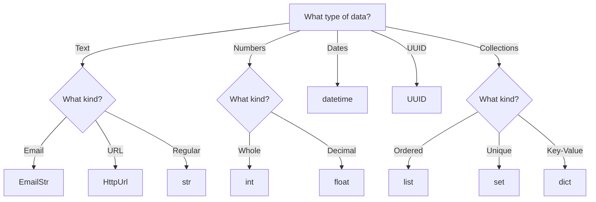

---

## 📊 Type Summary Table

| Type | Purpose | Example |
|------|---------|---------|
| `str` | Text data | `"Hello"` |
| `EmailStr` | Validated email | `"user@example.com"` |
| `HttpUrl` | Validated URL | `"https://example.com"` |
| `int` | Whole numbers | `42` |
| `float` | Decimal numbers | `3.14` |
| `bool` | True/False | `True` |
| `datetime` | Date and time | `"2024-01-01T12:00:00"` |
| `UUID` | Unique identifier | `"123e4567-e89b..."` |
| `List[T]` | Ordered collection | `["a", "b"]` |
| `Set[T]` | Unique collection | `{1, 2, 3}` |
| `Dict[K, V]` | Key-value pairs | `{"key": "value"}` |

---

# Section 7: Pydantic Architecture

## Pydantic's Role in FastAPI

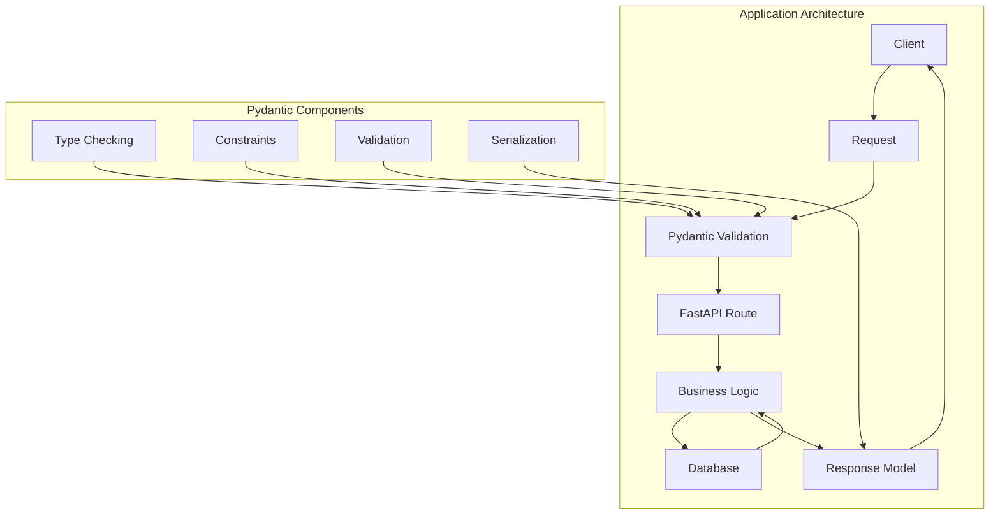

## The Validation Pipeline

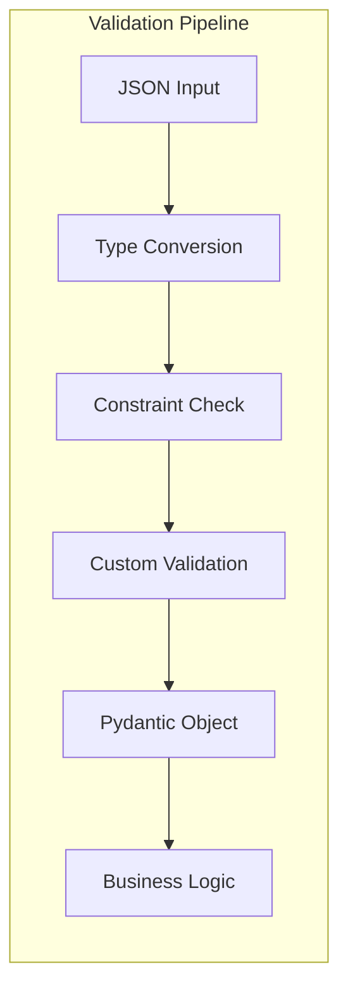

## Component Responsibilities

| Component | Responsibility | In Action |
|-----------|---------------|-----------|
| **Request Schema** | Define structure | `class QRCodeCreate` |
| **Validation** | Ensure data quality | `@validator`, `Field` |
| **Type System** | Type safety | `title: str` |
| **Serialization** | JSON conversion | `response_model` |
| **Documentation** | API docs | Auto-generated |

## Data Flow in FastAPI

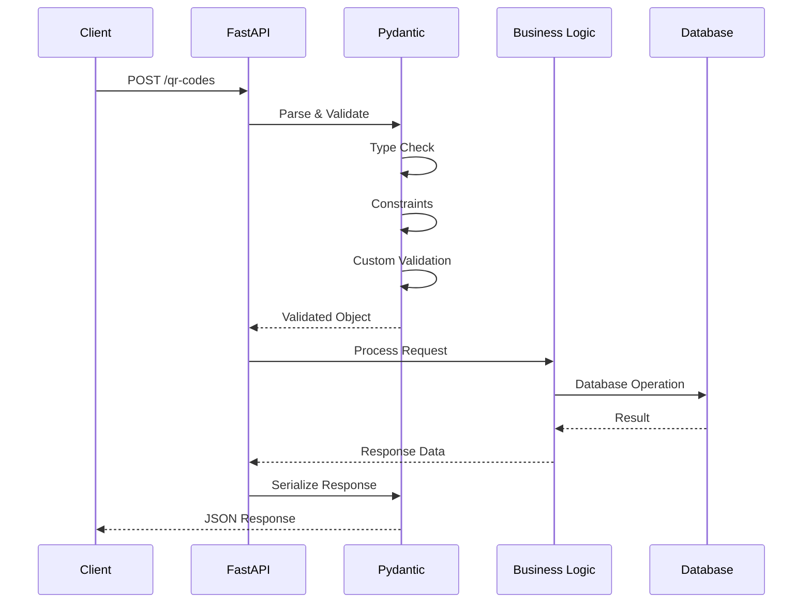

---

## 🔍 Architecture Benefits

1. **Separation of Concerns** - Validation logic separated
2. **Type Safety** - Catches errors early
3. **Documentation** - Auto-generated OpenAPI
4. **Maintainability** - Clear structure
5. **Testability** - Easy to test validation

---

# Section 8: FastAPI + Pydantic Integration

## Request Handling

### Basic Integration

```python
from fastapi import FastAPI, HTTPException
from pydantic import BaseModel

app = FastAPI()

class QRCodeCreate(BaseModel):
    title: str
    destination_url: str
    
@app.post("/qr-codes")
async def create_qr(qr: QRCodeCreate):
    # qr is already validated
    # Access fields: qr.title, qr.destination_url
    return {"id": 1, "title": qr.title}
```

### With Database Integration

```python
from fastapi import FastAPI, Depends
from sqlalchemy.orm import Session
from datetime import datetime

app = FastAPI()

@app.post("/qr-codes", response_model=QRCodeResponse)
async def create_qr(
    qr: QRCodeCreate,
    db: Session = Depends(get_db)
):
    # Validate business logic
    existing = db.query(QRCode).filter(
        QRCode.title == qr.title
    ).first()
    
    if existing:
        raise HTTPException(400, "QR Code title already exists")
    
    # Create database object
    db_qr = QRCode(
        title=qr.title,
        destination_url=qr.destination_url,
        is_active=qr.is_active,
        created_at=datetime.utcnow()
    )
    
    db.add(db_qr)
    db.commit()
    db.refresh(db_qr)
    
    return db_qr
```

## Path Parameters

```python
from fastapi import Path

@app.get("/qr-codes/{qr_id}")
async def get_qr_code(
    qr_id: int = Path(..., ge=1, description="QR Code ID"),
    db: Session = Depends(get_db)
):
    qr = db.get(QRCode, qr_id)
    if not qr:
        raise HTTPException(404, "QR Code not found")
    return qr
```

## Query Parameters

```python
from typing import Optional

@app.get("/qr-codes")
async def list_qr_codes(
    skip: int = 0,
    limit: int = 10,
    active_only: bool = True,
    search: Optional[str] = None,
    db: Session = Depends(get_db)
):
    query = db.query(QRCode)
    
    if active_only:
        query = query.filter(QRCode.is_active == True)
    
    if search:
        query = query.filter(QRCode.title.contains(search))
    
    return query.offset(skip).limit(limit).all()
```

## Automatic Documentation

```mermaid
graph LR
    F[FastAPI] -->|Generates| O[OpenAPI Schema]
    O -->|Provides| D[Interactive Docs]
    O -->|Provides| S[API Clients]
    
    P[Pydantic Models] --> F
```

### Documentation Example

```python
from fastapi import FastAPI, Query, Body

app = FastAPI(
    title="SQAnalytics API",
    version="1.0.0",
    description="Smart QR Analytics Platform"
)

class QRCodeCreate(BaseModel):
    title: str = Field(..., description="QR code title")
    destination_url: str = Field(..., description="Target URL")
    tags: List[str] = Field(default_factory=list, description="Tags")

@app.post(
    "/qr-codes",
    response_model=QRCodeResponse,
    status_code=201,
    summary="Create QR Code",
    description="Creates a new QR code with the provided details"
)
async def create_qr(qr: QRCodeCreate):
    """Create a new QR code.

    Args:
        qr (QRCodeCreate): QR code creation data

    Returns:
        QRCodeResponse: Created QR code details

    Raises:
        HTTPException: If title already exists
    """
    return await process_qr(qr)
```

## Error Handling

```python
from fastapi import HTTPException, status

# Custom exception handling
class ValidationError(Exception):
    pass

@app.exception_handler(ValidationError)
async def validation_error_handler(request, exc):
    return JSONResponse(
        status_code=400,
        content={
            "status": "error",
            "code": "VALIDATION_ERROR",
            "message": str(exc)
        }
    )

@app.post("/qr-codes")
async def create_qr(qr: QRCodeCreate):
    try:
        return process_qr(qr)
    except ValidationError as e:
        raise HTTPException(400, detail=str(e))
    except DatabaseError as e:
        raise HTTPException(500, detail="Database error")
```

---

## 🎯 FastAPI Integration Checklist

- [ ] Request models for POST/PUT/PATCH
- [ ] Response models for all endpoints
- [ ] Path parameter validation
- [ ] Query parameter validation
- [ ] Error handling for validation
- [ ] Documentation included
- [ ] Proper status codes

---

# Section 9: API Design Best Practices

## Naming Conventions

### Consistent Field Names

```python
# GOOD: Consistent naming
class QRCodeCreate(BaseModel):
    title: str
    destination_url: str
    is_active: bool
    created_at: datetime

# BAD: Inconsistent naming
class QRCodeCreate(BaseModel):
    title: str
    destUrl: str  # Should be destination_url
    isActive: bool  # Should be is_active
    createdAt: datetime  # Should be created_at
```

### Naming Pattern Guide

| Pattern | Example | Usage |
|---------|---------|-------|
| **Snake Case** | `destination_url` | Request/Response fields |
| **Singular** | `user_id` | Foreign keys |
| **Boolean prefix** | `is_active` | Boolean fields |
| **Timestamp suffix** | `created_at` | Date fields |
| **Descriptive** | `scan_count` | Count fields |

## Consistency Rules

```mermaid
graph TD
    subgraph "API Consistency"
        R1[Field Names] --> C1[Snake Case]
        R2[Data Types] --> C2[Same Type for Same Concept]
        R3[Responses] --> C3[Same Structure]
        R4[Status Codes] --> C4[Consistent Usage]
        R5[Error Messages] --> C5[Consistent Format]
    end
```

### Consistent Response Structure

```python
# Standard response wrapper
class APIResponse(BaseModel):
    status: str = "success"
    data: Any
    message: str = ""

# Usage
@app.post("/qr-codes")
async def create_qr(qr: QRCodeCreate):
    data = await process_qr(qr)
    return APIResponse(data=data, message="QR Code created")

# Error response
class APIErrorResponse(BaseModel):
    status: str = "error"
    code: str
    message: str
    details: Optional[dict] = None

@app.exception_handler(ValidationError)
async def validation_error_handler(request, exc):
    return JSONResponse(
        status_code=400,
        content=APIErrorResponse(
            code="VALIDATION_ERROR",
            message="Request validation failed",
            details=exc.errors()
        ).dict()
    )
```

## Versioning Awareness

### API Versioning Strategy

```python
# Version in path
@app.get("/v1/qr-codes")
async def get_qr_codes_v1():
    # Version 1 implementation
    pass

@app.get("/v2/qr-codes")
async def get_qr_codes_v2():
    # Version 2 implementation
    pass

# Or use headers
@app.get("/qr-codes")
async def get_qr_codes(
    api_version: str = Header("1.0.0")
):
    if api_version.startswith("2"):
        return handle_v2()
    return handle_v1()
```

## Schema Reusability

### DRY Principles

```python
from typing import Optional
from datetime import datetime
from pydantic import BaseModel, HttpUrl, Field

# Base schema with common fields
class QRCodeBase(BaseModel):
    title: str = Field(..., min_length=1, max_length=200)
    destination_url: HttpUrl
    is_active: bool = True

# Create-specific schema
class QRCodeCreate(QRCodeBase):
    tags: List[str] = Field(default_factory=list)

# Update-specific schema (all fields optional)
class QRCodeUpdate(BaseModel):
    title: Optional[str] = Field(None, min_length=1, max_length=200)
    destination_url: Optional[HttpUrl] = None
    is_active: Optional[bool] = None

# Response schema
class QRCodeResponse(QRCodeBase):
    id: int
    short_code: str
    scan_count: int
    created_at: datetime
    updated_at: datetime
    
    class Config:
        from_attributes = True
```

### Schema Hierarchy

```mermaid
graph TD
    subgraph "Schema Inheritance"
        B[Base Schema] --> C[Create Schema]
        B --> U[Update Schema]
        B --> R[Response Schema]
        
        C -->|Adds fields| C1["tags"]
        U -->|Makes optional| U1["title?"]
        R -->|Adds fields| R1["id, short_code"]
    end
```

## Good vs Poor API Design

### Comparison Examples

```python
# POOR API DESIGN
@app.post("/qr")
async def make_code(name: str, url: str):
    # No validation, poor naming
    # Response inconsistent
    return {"id": 1, "n": name}

# GOOD API DESIGN
class QRCodeCreate(BaseModel):
    title: str = Field(..., min_length=1)
    destination_url: HttpUrl

class QRCodeResponse(BaseModel):
    id: int
    title: str
    destination_url: str
    created_at: datetime
    
    class Config:
        from_attributes = True

@app.post("/qr-codes", response_model=QRCodeResponse)
async def create_qr_code(qr: QRCodeCreate):
    # Proper validation, good naming
    # Consistent response
    return process_qr(qr)
```

### Design Checklist

```mermaid
graph TD
    subgraph "API Design Checklist"
        C1[Use Pydantic Models] --> A1[✓ Validation]
        C2[Consistent Naming] --> A2[✓ Readability]
        C3[Response Models] --> A3[✓ Documentation]
        C4[Error Handling] --> A4[✓ Reliability]
        C5[Versioning Awareness] --> A5[✓ Scalability]
        C6[Documentation] --> A6[✓ Usability]
        C7[Security] --> A7[✓ Safety]
    end
```

---

## 🔍 Design Best Practices Summary

1. **Be Consistent** - Naming, structure, responses
2. **Be Specific** - Use precise types and constraints
3. **Be Reusable** - Share schemas where possible
4. **Be Documented** - Auto-generate API docs
5. **Be Secure** - Don't expose internal data
6. **Be Progressive** - Think about versioning
7. **Be Clear** - Use descriptive field names

---

# Section 10: SQLAlchemy vs Pydantic

## The Difference

```mermaid
graph TD
    subgraph "SQLAlchemy Model"
        S1[Defines Database Table] --> S2[Column Types]
        S2 --> S3[Relationships]
        S3 --> S4[Database Operations]
    end
    
    subgraph "Pydantic Model"
        P1[Defines API Contract] --> P2[Validation Rules]
        P2 --> P3[Serialization]
        P3 --> P4[API Operations]
    end
```

## When to Use Each

### SQLAlchemy for Database

```python
# SQLAlchemy Model - Database layer
from sqlalchemy import Column, Integer, String, DateTime, Boolean
from sqlalchemy.orm import declarative_base

Base = declarative_base()

class QRCode(Base):
    """Database model - how data is stored"""
    __tablename__ = "qr_codes"
    
    id = Column(Integer, primary_key=True, index=True)
    title = Column(String(200), nullable=False)
    destination_url = Column(String(500), nullable=False)
    is_active = Column(Boolean, default=True)
    created_at = Column(DateTime)
    updated_at = Column(DateTime)
```

### Pydantic for API

```python
# Pydantic Model - API layer
from pydantic import BaseModel, HttpUrl, Field
from datetime import datetime

class QRCodeCreate(BaseModel):
    """API request - how data is received"""
    title: str = Field(..., min_length=1, max_length=200)
    destination_url: HttpUrl
    is_active: bool = True

class QRCodeResponse(BaseModel):
    """API response - how data is sent"""
    id: int
    title: str
    destination_url: str
    is_active: bool
    created_at: datetime
    
    class Config:
        from_attributes = True  # ORM compatibility
```

## Comparison Table

| Aspect | SQLAlchemy Model | Pydantic Model |
|--------|-----------------|----------------|
| **Purpose** | Database mapping | API data validation |
| **Scope** | Database operations | API operations |
| **Validation** | Database constraints | Business rules |
| **Types** | SQL types | Python types |
| **Serialization** | To/From database | To/From JSON |
| **Relationships** | Database relationships | Nested structures |
| **Lifecycle** | Application lifetime | Request/Response |

## The Bridge Between Layers

```mermaid
graph LR
    subgraph "API Layer"
        R[Request JSON] --> P[Pydantic Model]
        P --> V[Validation]
    end
    
    subgraph "Bridge"
        V --> C[Conversion]
        C --> D[Database Model]
    end
    
    subgraph "Database Layer"
        D --> S[SQLAlchemy]
        S --> DB[(PostgreSQL)]
    end
```

### Conversion Examples

```python
from sqlalchemy.orm import Session
from datetime import datetime

def create_qr(qr_create: QRCodeCreate, db: Session):
    """Convert Pydantic to SQLAlchemy"""
    # Pydantic to SQLAlchemy
    db_qr = QRCode(
        title=qr_create.title,
        destination_url=str(qr_create.destination_url),
        is_active=qr_create.is_active,
        created_at=datetime.utcnow(),
        updated_at=datetime.utcnow()
    )
    
    db.add(db_qr)
    db.commit()
    db.refresh(db_qr)
    
    # SQLAlchemy to Pydantic
    return QRCodeResponse.from_orm(db_qr)
```

## Why Both Are Necessary

```mermaid
graph TD
    subgraph "Database Layer"
        DB[(PostgreSQL)]
        DB -->|SQL| A[SQLAlchemy]
    end
    
    subgraph "API Layer"
        C[Client]
        C -->|JSON| B[Pydantic]
    end
    
    subgraph "Application"
        A -->|Database Operations| App[FastAPI]
        B -->|Validation| App
    end
```

---

## 🎯 Key Takeaway

SQLAlchemy and Pydantic serve different purposes:
- **SQLAlchemy**: Database operations and structure
- **Pydantic**: API validation and serialization

Both are needed for a complete application.

---

# Section 11: SQAnalytics Case Study

## QR Code Creation Schema

### Request Model

```python
from pydantic import BaseModel, HttpUrl, Field, validator
from typing import List, Optional
from datetime import datetime
import re

class QRCodeCreate(BaseModel):
    """Request model for creating QR codes"""
    
    # Required fields
    title: str = Field(
        ...,
        min_length=1,
        max_length=200,
        description="QR code title (display name)"
    )
    
    destination_url: HttpUrl = Field(
        ...,
        description="Destination URL for the QR code"
    )
    
    # Optional fields
    tags: List[str] = Field(
        default_factory=list,
        max_items=10,
        description="Tags for categorization"
    )
    
    is_active: bool = Field(
        default=True,
        description="Whether QR code is immediately active"
    )
    
    # Custom validators
    @validator('title')
    def title_no_special_characters(cls, v):
        if not re.match(r'^[a-zA-Z0-9\s\-_]+$', v):
            raise ValueError('Title can only contain letters, numbers, spaces, hyphens, and underscores')
        return v.strip()
    
    @validator('tags')
    def tags_no_duplicates(cls, v):
        if len(v) != len(set(v)):
            raise ValueError('Tags must be unique')
        return v
```

### Request Example

```json
{
    "title": "Product Landing Page",
    "destination_url": "https://example.com/product/123",
    "tags": ["product", "landing", "promotion"],
    "is_active": true
}
```

## QR Code Update Schema

### Request Model

```python
from pydantic import BaseModel, HttpUrl, Field
from typing import Optional, List

class QRCodeUpdate(BaseModel):
    """Request model for updating QR codes"""
    
    title: Optional[str] = Field(
        None,
        min_length=1,
        max_length=200,
        description="Updated QR code title"
    )
    
    destination_url: Optional[HttpUrl] = Field(
        None,
        description="Updated destination URL"
    )
    
    tags: Optional[List[str]] = Field(
        None,
        max_items=10,
        description="Updated tags"
    )
    
    is_active: Optional[bool] = Field(
        None,
        description="Updated active status"
    )
    
    # Custom validator
    @validator('title')
    def title_no_special_characters(cls, v):
        if v and not re.match(r'^[a-zA-Z0-9\s\-_]+$', v):
            raise ValueError('Title can only contain letters, numbers, spaces, hyphens, and underscores')
        return v
```

### Update Example

```json
{
    "title": "Updated Product Page",
    "is_active": false
}
```

## QR Code Response Schema

### Response Model

```python
from pydantic import BaseModel, HttpUrl, Field
from datetime import datetime
from typing import List, Optional
from uuid import UUID

class QRCodeResponse(BaseModel):
    """Response model for QR code data"""
    
    id: int = Field(..., description="Unique QR code ID")
    short_code: str = Field(..., description="Short identifier for QR code")
    title: str = Field(..., description="QR code title")
    destination_url: str = Field(..., description="Destination URL")
    tags: List[str] = Field(..., description="Associated tags")
    scan_count: int = Field(..., description="Total number of scans")
    is_active: bool = Field(..., description="Active status")
    created_at: datetime = Field(..., description="Creation timestamp")
    updated_at: datetime = Field(..., description="Last update timestamp")
    
    class Config:
        from_attributes = True
        schema_extra = {
            "example": {
                "id": 1,
                "short_code": "ABC123",
                "title": "Product Landing Page",
                "destination_url": "https://example.com/product/123",
                "tags": ["product", "landing"],
                "scan_count": 42,
                "is_active": True,
                "created_at": "2024-01-01T10:00:00Z",
                "updated_at": "2024-01-01T10:00:00Z"
            }
        }
```

### Response Example

```json
{
    "id": 1,
    "short_code": "ABC123",
    "title": "Product Landing Page",
    "destination_url": "https://example.com/product/123",
    "tags": ["product", "landing"],
    "scan_count": 42,
    "is_active": true,
    "created_at": "2024-01-01T10:00:00Z",
    "updated_at": "2024-01-01T10:00:00Z"
}
```

## Scan Event Schema

### Request Model

```python
from pydantic import BaseModel, Field, validator
from typing import Optional
from datetime import datetime

class ScanEventCreate(BaseModel):
    """Request model for recording scan events"""
    
    qr_code_id: int = Field(
        ...,
        ge=1,
        description="ID of the scanned QR code"
    )
    
    ip_address: Optional[str] = Field(
        None,
        description="IP address of the scanner"
    )
    
    user_agent: Optional[str] = Field(
        None,
        max_length=500,
        description="Browser user agent"
    )
    
    referrer: Optional[str] = Field(
        None,
        max_length=500,
        description="Referring URL"
    )
    
    location: Optional[str] = Field(
        None,
        max_length=200,
        description="Geographic location"
    )
```

### Response Model

```python
class ScanEventResponse(BaseModel):
    """Response model for scan event data"""
    
    id: UUID = Field(..., description="Unique scan event ID")
    qr_code_id: int = Field(..., description="Associated QR code")
    scanned_at: datetime = Field(..., description="Scan timestamp")
    ip_address: Optional[str] = Field(None, description="IP address")
    user_agent: Optional[str] = Field(None, description="User agent")
    location: Optional[str] = Field(None, description="Location")
    
    class Config:
        from_attributes = True
```

## Analytics Summary Schema

### Response Model

```python
from pydantic import BaseModel, Field
from datetime import datetime
from typing import List, Optional

class DailyStats(BaseModel):
    """Daily statistics model"""
    date: datetime = Field(..., description="Date")
    total_scans: int = Field(..., description="Total scans for the day")
    unique_ips: int = Field(..., description="Unique IP addresses")

class AnalyticsSummaryResponse(BaseModel):
    """Response model for analytics summary"""
    
    total_qr_codes: int = Field(..., description="Total QR codes created")
    active_qr_codes: int = Field(..., description="Active QR codes")
    total_scans: int = Field(..., description="Total scans recorded")
    avg_scans_per_qr: float = Field(..., description="Average scans per QR code")
    
    top_codes: List[QRCodeResponse] = Field(
        ...,
        description="Top performing QR codes"
    )
    
    daily_stats: List[DailyStats] = Field(
        ...,
        description="Daily scan statistics"
    )
    
    period_start: datetime = Field(..., description="Analytics period start")
    period_end: datetime = Field(..., description="Analytics period end")
```

### Analytics Response Example

```json
{
    "total_qr_codes": 150,
    "active_qr_codes": 142,
    "total_scans": 5432,
    "avg_scans_per_qr": 36.2,
    "top_codes": [
        {
            "id": 1,
            "title": "Home Page",
            "scan_count": 823
        }
    ],
    "daily_stats": [
        {
            "date": "2024-01-01T00:00:00Z",
            "total_scans": 156,
            "unique_ips": 89
        }
    ],
    "period_start": "2024-01-01T00:00:00Z",
    "period_end": "2024-01-31T23:59:59Z"
}
```

## Complete API Integration

```python
from fastapi import FastAPI, Depends, HTTPException
from sqlalchemy.orm import Session
from typing import List

app = FastAPI()

@app.post(
    "/qr-codes",
    response_model=QRCodeResponse,
    status_code=201,
    summary="Create QR Code",
    description="Create a new QR code with the provided details"
)
async def create_qr_code(
    qr: QRCodeCreate,
    db: Session = Depends(get_db)
):
    # Check for duplicate title
    existing = db.query(QRCode).filter(
        QRCode.title == qr.title
    ).first()
    
    if existing:
        raise HTTPException(
            status_code=400,
            detail="QR Code with this title already exists"
        )
    
    # Create database object
    db_qr = QRCode(
        title=qr.title,
        destination_url=str(qr.destination_url),
        tags=qr.tags,
        is_active=qr.is_active,
        created_at=datetime.utcnow(),
        updated_at=datetime.utcnow()
    )
    
    db.add(db_qr)
    db.commit()
    db.refresh(db_qr)
    
    return db_qr

@app.get(
    "/qr-codes/{qr_id}",
    response_model=QRCodeResponse,
    summary="Get QR Code"
)
async def get_qr_code(
    qr_id: int,
    db: Session = Depends(get_db)
):
    qr = db.get(QRCode, qr_id)
    if not qr:
        raise HTTPException(
            status_code=404,
            detail="QR Code not found"
        )
    return qr

@app.get(
    "/qr-codes",
    response_model=List[QRCodeResponse],
    summary="List QR Codes"
)
async def list_qr_codes(
    skip: int = 0,
    limit: int = 20,
    active_only: bool = True,
    db: Session = Depends(get_db)
):
    query = db.query(QRCode)
    if active_only:
        query = query.filter(QRCode.is_active == True)
    return query.offset(skip).limit(limit).all()
```

---

## 📊 Schema Design Summary

| Schema Type | Purpose | Key Features |
|-------------|---------|--------------|
| **QRCodeCreate** | Create new QR | Required fields, validation |
| **QRCodeUpdate** | Update existing | All optional fields |
| **QRCodeResponse** | API output | ORM compatibility |
| **ScanEventCreate** | Record scan | IP, user-agent, location |
| **ScanEventResponse** | Scan data | Timestamp, details |
| **AnalyticsSummaryResponse** | Statistics | Aggregations, top codes |

---

# Section 12: Common Developer Mistakes

## 1. Missing Validation

### ❌ The Problem

```python
class QRCodeCreate(BaseModel):
    title: str  # No validation
    destination_url: str  # No validation
    
# Empty title accepted
qr = QRCodeCreate(title="", destination_url="not-a-url")
```

### ✅ The Solution

```python
class QRCodeCreate(BaseModel):
    title: str = Field(..., min_length=1, max_length=200)
    destination_url: HttpUrl  # Built-in validation
```

## 2. Weak Typing

### ❌ The Problem

```python
class QRCodeCreate(BaseModel):
    tags: list  # Unspecified type
    metadata: dict  # Unspecified type
```

### ✅ The Solution

```python
from typing import List, Dict

class QRCodeCreate(BaseModel):
    tags: List[str] = Field(..., min_items=1)
    metadata: Dict[str, str] = Field(...)
```

## 3. Duplicate Schemas

### ❌ The Problem

```python
# Duplicated in multiple places
class CreateQRCode(BaseModel):
    title: str

class UpdateQRCode(BaseModel):
    title: str

class ResponseQRCode(BaseModel):
    title: str
```

### ✅ The Solution

```python
class QRCodeBase(BaseModel):
    title: str

class QRCodeCreate(QRCodeBase):
    pass

class QRCodeUpdate(BaseModel):
    title: Optional[str] = None

class QRCodeResponse(QRCodeBase):
    id: int
    created_at: datetime
```

## 4. Exposing Internal Data

### ❌ The Problem

```python
class QRCodeResponse(BaseModel):
    # Includes internal fields
    internal_id: int
    db_secret: str
    user_password_hash: str
```

### ✅ The Solution

```python
class QRCodeResponse(BaseModel):
    id: int
    title: str
    # Don't include internal fields
    # Use SQLAlchemy's from_attributes carefully
```

## 5. Inconsistent Naming

### ❌ The Problem

```python
class QRCodeCreate(BaseModel):
    destinationUrl: str  # camelCase
    is_active: bool  # snake_case
    
class QRCodeResponse(BaseModel):
    destination_url: str  # different!
```

### ✅ The Solution

```python
class QRCodeCreate(BaseModel):
    destination_url: str  # Consistent
    is_active: bool
    
class QRCodeResponse(BaseModel):
    destination_url: str  # Same
    is_active: bool
```

## 6. Poor Error Handling

### ❌ The Problem

```python
@app.post("/qr-codes")
async def create_qr(qr: QRCodeCreate):
    # No error handling
    return process_qr(qr)  # May raise exception
```

### ✅ The Solution

```python
@app.post("/qr-codes")
async def create_qr(qr: QRCodeCreate):
    try:
        return process_qr(qr)
    except ValidationError as e:
        raise HTTPException(400, detail=str(e))
    except DatabaseError as e:
        raise HTTPException(500, detail="Database error")
```

## Troubleshooting Flowchart

```mermaid
graph TD
    A[API Error] --> B{Type of Issue?}
    
    B -->|Validation| C[Check Pydantic Model]
    C --> D{Valid?}
    D -->|No| E[Fix Constraints]
    D -->|Yes| F[Check Input Data]
    
    B -->|Type Error| G[Check Type Annotations]
    G --> H[Fix Types]
    
    B -->|Missing Fields| I[Check Field Requirements]
    I --> J[Add Missing Fields or Mark Optional]
    
    B -->|Internal Data Exposed| K[Check Response Model]
    K --> L[Remove Internal Fields]
```

---

## 🔍 Common Mistake Checklist

- [ ] All fields validated
- [ ] Specific types used
- [ ] No duplicate schemas
- [ ] Internal data not exposed
- [ ] Consistent naming
- [ ] Proper error handling
- [ ] Optional fields correctly marked
- [ ] Constraints appropriate

---

# Section 13: Hands-On Exercises

## Guided Exercise 1: Create First Schema

### Objective
Create a Pydantic model for a User registration endpoint.

### Instructions

```python
# 1. Create a UserCreate model with:
# - email (required, must be valid email)
# - username (required, 3-50 chars, alphanumeric)
# - password (required, min 8 chars)
# - full_name (required, 1-100 chars)

# 2. Add validation:
# - Username has no spaces
# - Password has at least one digit
# - Email is properly formatted

# 3. Create a UserResponse model with:
# - id (int)
# - email (str)
# - username (str)
# - full_name (str)
# - created_at (datetime)
```

### Expected Output

```python
from pydantic import BaseModel, EmailStr, Field, validator
from datetime import datetime
import re

class UserCreate(BaseModel):
    email: EmailStr
    username: str = Field(..., min_length=3, max_length=50)
    password: str = Field(..., min_length=8)
    full_name: str = Field(..., min_length=1, max_length=100)
    
    @validator('username')
    def username_no_spaces(cls, v):
        if ' ' in v:
            raise ValueError('Username cannot contain spaces')
        return v
    
    @validator('password')
    def password_has_digit(cls, v):
        if not any(char.isdigit() for char in v):
            raise ValueError('Password must contain at least one digit')
        return v

class UserResponse(BaseModel):
    id: int
    email: str
    username: str
    full_name: str
    created_at: datetime
    
    class Config:
        from_attributes = True
```

### Learning Outcomes
- Creating BaseModel classes
- Using Field constraints
- Implementing custom validators
- Creating response models
- Using ORM compatibility

---

## Guided Exercise 2: Nested Models

### Objective
Create a nested model for a QR code with metadata.

### Instructions

```python
# 1. Create a Metadata model with:
# - color (hex color code)
# - size (string, format "WxH")
# - custom_logo (optional URL)

# 2. Create a QRCodeCreate model with:
# - title (required, 1-200 chars)
# - destination_url (required)
# - metadata (required, nested)
# - tags (list of strings)
# - is_active (default True)

# 3. Add validation:
# - Color must be valid hex
# - Size must match pattern
# - Tags must be unique
```

### Expected Output

```python
class QRCodeMetadata(BaseModel):
    color: str = Field(
        ...,
        regex=r"^#[0-9a-fA-F]{6}$",
        description="Hex color code"
    )
    size: str = Field(
        ...,
        regex=r"^\d+x\d+$",
        description="Size in WxH format"
    )
    custom_logo: Optional[HttpUrl] = None

class QRCodeCreate(BaseModel):
    title: str = Field(..., min_length=1, max_length=200)
    destination_url: HttpUrl
    metadata: QRCodeMetadata
    tags: List[str] = Field(default_factory=list)
    is_active: bool = True
    
    @validator('tags')
    def tags_unique(cls, v):
        if len(v) != len(set(v)):
            raise ValueError('Tags must be unique')
        return v
```

### Learning Outcomes
- Creating nested models
- Using regex validation
- Working with HttpUrl
- List validation
- Optional fields

---

## Guided Exercise 3: Response Models

### Objective
Create complete response models for a QR code API.

### Instructions

```python
# 1. Create a QRCodeResponse model with all fields
# 2. Create a QRCodeListResponse for paginated results
# 3. Create an AnalyticsResponse with summary data
# 4. Implement proper Config for ORM mode
```

### Expected Output

```python
from typing import List, Optional
from datetime import datetime
from pydantic import BaseModel

class QRCodeResponse(BaseModel):
    id: int
    short_code: str
    title: str
    destination_url: str
    tags: List[str]
    scan_count: int
    is_active: bool
    created_at: datetime
    updated_at: datetime
    
    class Config:
        from_attributes = True
        json_schema_extra = {
            "example": {
                "id": 1,
                "short_code": "XYZ789",
                "title": "Example QR",
                "scan_count": 100
            }
        }

class QRCodeListResponse(BaseModel):
    items: List[QRCodeResponse]
    total: int
    page: int
    per_page: int
    
class AnalyticsResponse(BaseModel):
    total_codes: int
    active_codes: int
    total_scans: int
    avg_scans_per_code: float
    top_codes: List[QRCodeResponse]
    period: dict
    
    class Config:
        from_attributes = True
```

### Learning Outcomes
- Creating comprehensive response models
- Pagination patterns
- Analytics aggregation
- ORM compatibility
- Documentation examples

---

## Mini Project 1: User API

### Objective
Build complete schemas for a user management system.

### Requirements

```python
# Create schemas for:
# 1. User registration (Create)
# 2. User login (Login)
# 3. User update (Update)
# 4. User profile (Response)
# 5. User list (List Response)

# Include:
# - Proper validation
# - Password hashing awareness
# - Email validation
# - Role/permissions if applicable
# - ORM compatibility for responses
```

### Expected Structure

```python
class UserCreate:
    email: EmailStr
    password: str
    full_name: str
    role: Literal['user', 'admin']

class UserLogin:
    email: EmailStr
    password: str

class UserUpdate:
    email: Optional[EmailStr] = None
    full_name: Optional[str] = None
    password: Optional[str] = None

class UserResponse:
    id: int
    email: str
    full_name: str
    role: str
    created_at: datetime

class UserListResponse:
    items: List[UserResponse]
    total: int
    page: int
    per_page: int
```

---

## Mini Project 2: QR Analytics API

### Objective
Build comprehensive schemas for QR analytics.

### Requirements

```python
# Create schemas for:
# 1. QR Code creation (Create)
# 2. Scan event recording (Create)
# 3. QR Code status update (Update)
# 4. Analytics dashboard (Response)
# 5. Export data (Response)
# 6. Daily stats (Nested)

# Include:
# - Multi-level nesting
# - Date range filtering
# - Summary statistics
# - Top performers
# - Proper validation for all fields
```

### Expected Structure

```python
class QRCodeCreate:
    title: str
    destination_url: HttpUrl
    tags: List[str]
    expiry_date: Optional[datetime] = None

class ScanEventCreate:
    qr_code_id: int
    ip_address: Optional[str] = None
    user_agent: Optional[str] = None
    location: Optional[dict] = None

class DailyStats:
    date: date
    scans: int
    unique_ips: int
    top_code: dict

class DashboardResponse:
    total_codes: int
    active_codes: int
    total_scans: int
    daily_stats: List[DailyStats]
    top_codes: List[dict]
    growth_rate: float
    period: dict
```

---

## Exercise Solutions Check

### Common Validation Patterns

```python
# Email validation
email: EmailStr = Field(..., description="User email")

# URL validation
url: HttpUrl = Field(..., description="Valid URL")

# String constraints
text: str = Field(..., min_length=1, max_length=200)

# Number constraints
count: int = Field(..., ge=0, le=100)

# List constraints
tags: List[str] = Field(..., min_items=1, max_items=10)

# Custom validation
@validator('field')
def custom_validation(cls, v):
    # Business logic
    return v
```

### Learning Outcomes Checklist

- [ ] Able to create BaseModel classes
- [ ] Understand Field constraints
- [ ] Can implement custom validators
- [ ] Know nested model patterns
- [ ] Can create response models
- [ ] Understand ORM compatibility
- [ ] Know error handling patterns
- [ ] Can design API contracts

---

# Section 14: Production API Schema Checklist

## Design Phase Checklist

### Entity Identification
- [ ] All business entities identified
- [ ] Each entity has a purpose
- [ ] Boundaries are clear
- [ ] No duplicate concepts

### Field Definition
- [ ] All fields documented
- [ ] Field types specified
- [ ] Constraints defined
- [ ] Default values set
- [ ] Optional/Required determined

### Schema Organization
- [ ] Base schemas defined
- [ ] Create schemas inherit properly
- [ ]