# QR Code Generation & Image Handling for Modern Applications

## A Practical Beginner Guide for Building SQAnalytics, QR Platforms & Analytics-Enabled Tracking Systems

---

# Cover Page

<div style="text-align: center; padding: 40px 0;">

# QR Code Generation & Image Handling for Modern Applications

## A Practical Beginner Guide for Building SQAnalytics, QR Platforms & Analytics-Enabled Tracking Systems

**Version 1.0**

---

### Learning Path


### Project Context: SQAnalytics

A Smart QR Analytics Platform built with:
- **FastAPI** - Modern Python web framework
- **PostgreSQL** - Enterprise-grade database
- **SQLAlchemy** - ORM for database interaction
- **Pillow** - Image processing
- **qrcode** - QR generation library

---

*"From Static QR Codes to Full Analytics-Enabled Platforms"*

</div>

---

# Learning Objectives

By completing this handbook, you will master:

### Fundamental Concepts
- **QR Code Technology** - How QR codes work
- **QR Structure** - Anatomy of a QR code
- **Encoding Process** - Data to QR matrix
- **Static vs Dynamic** - Different QR types

### Practical Skills
- **QR Generation** - Creating QR codes in Python
- **Image Export** - Generating PNG files
- **Redirect Systems** - Building dynamic QR workflows
- **Analytics Integration** - Tracking QR scans

### Production Application
- **QR Platform Design** - Building scalable systems
- **Print-Ready QR** - Book and print production
- **Lifecycle Management** - QR code lifecycle
- **Analytics Platforms** - Complete tracking systems

---

# Executive Summary

## The QR Journey

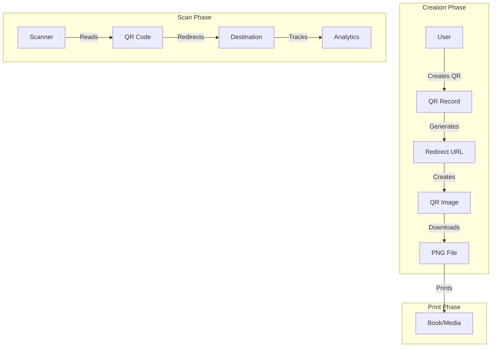

## Why QR Technology Matters

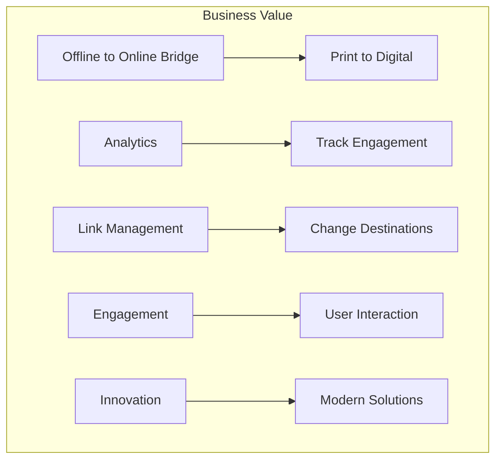

## The Complete Architecture

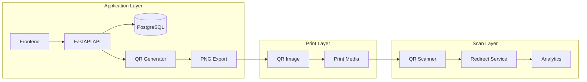

---

# Table of Contents

1. [Section 1: What Is a QR Code?](#section-1)
2. [Section 2: Anatomy of a QR Code](#section-2)
3. [Section 3: How QR Encoding Works](#section-3)
4. [Section 4: Static vs Dynamic QR Codes](#section-4)
5. [Section 5: Why Dynamic QR Codes Matter](#section-5)
6. [Section 6: QR Generation Libraries](#section-6)
7. [Section 7: QR Image Generation Workflow](#section-7)
8. [Section 8: QR Image Storage Strategies](#section-8)
9. [Section 9: Print-Ready QR Design](#section-9)
10. [Section 10: Common Developer Mistakes](#section-10)
11. [Section 11: SQAnalytics Case Study](#section-11)
12. [Section 12: Hands-On Exercises](#section-12)
13. [QR Platform Roadmap](#roadmap)
14. [QR Development Cheat Sheet](#cheat-sheet)
15. [Troubleshooting Guide](#troubleshooting)
16. [Interview Preparation Guide](#interview)

---

# Section 1: What Is a QR Code?

## The Simple Explanation

A **QR Code** (Quick Response Code) is a two-dimensional barcode that can store information like URLs, text, or contact details. When scanned by a smartphone, it instantly directs users to the encoded content.

### The Digital Bridge Analogy

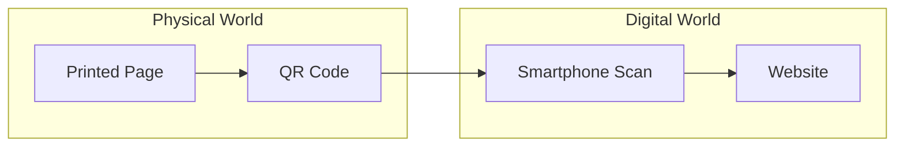

## History of QR Codes

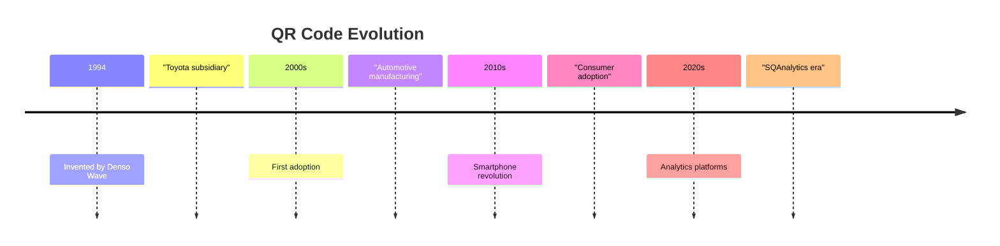

## QR Code Structure

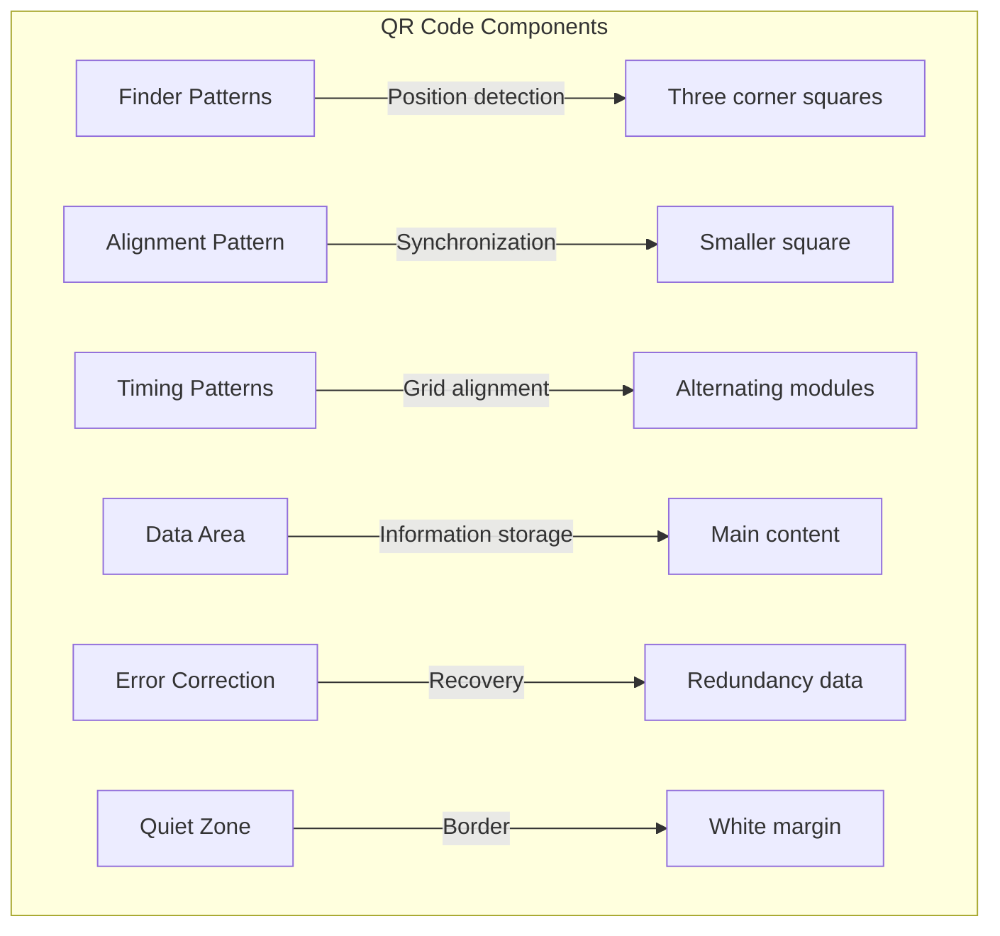

## Common QR Code Uses

### Real-World Examples

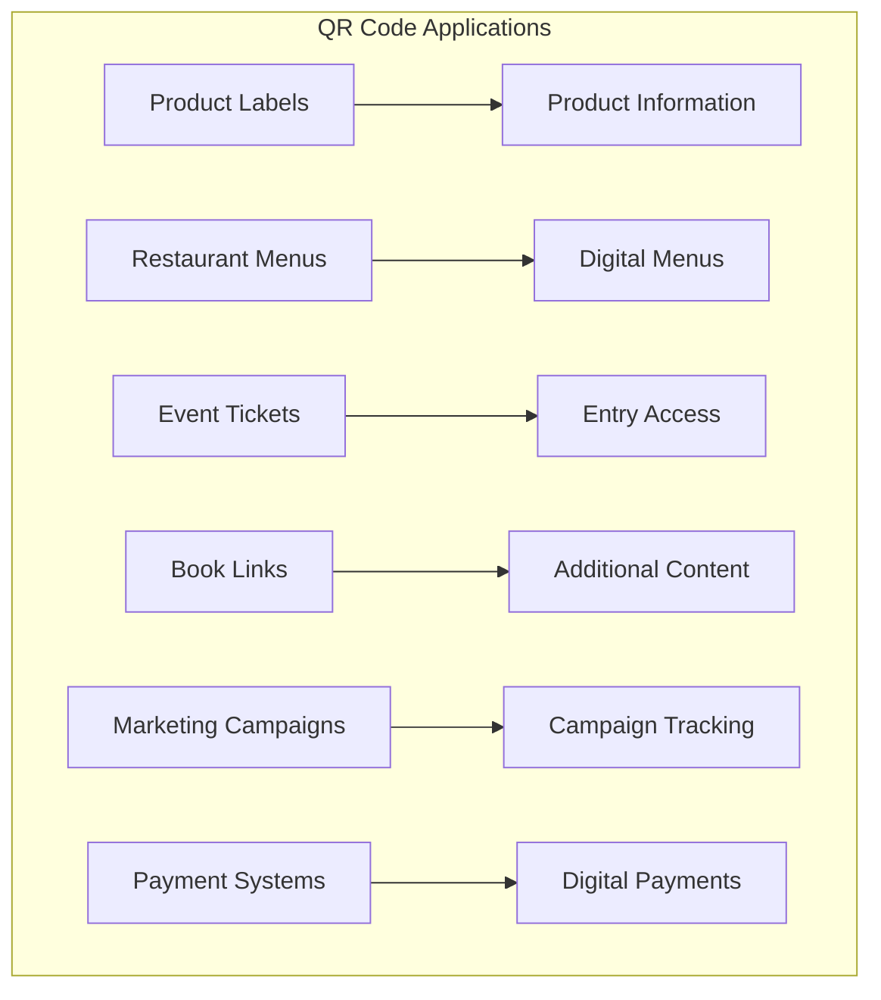

### SQAnalytics Use Case

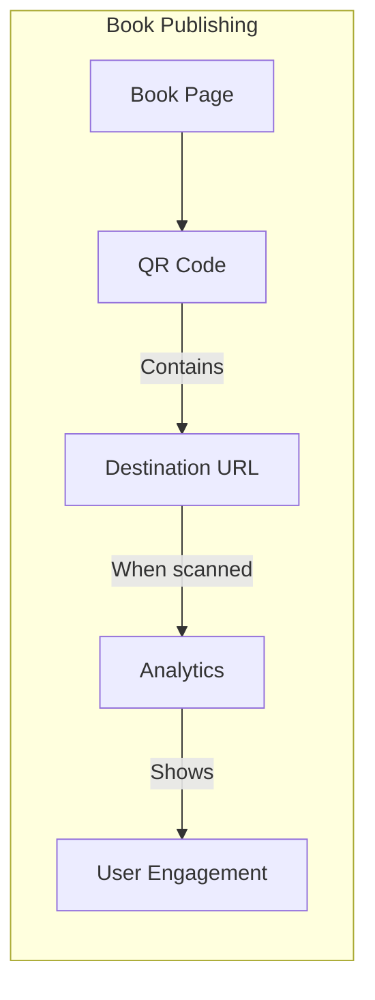

## How QR Scanners Work


---

## 🔍 Learning Checkpoint

1. What does QR stand for?
   - a) Quick Response
   - b) Quality Record
   - c) Query Request
   - d) Quick Route

2. What information can QR codes store?
   - a) Only text
   - b) URLs, text, contact info
   - c) Only images
   - d) Only numbers

**[Answers: 1-a, 2-b]**

---

# Section 2: Anatomy of a QR Code

## Visual Breakdown

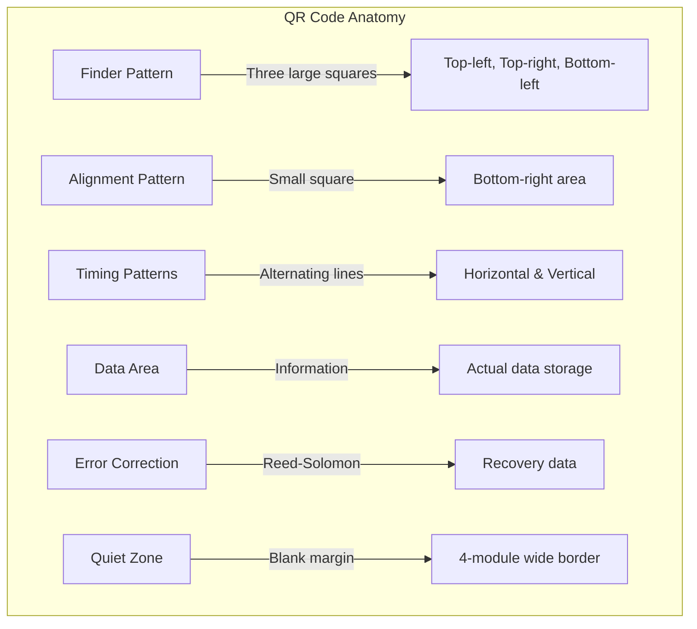

## Component Details

### 1. Finder Patterns

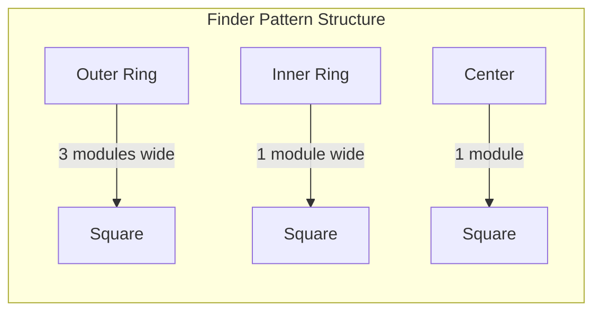

### 2. Alignment Patterns

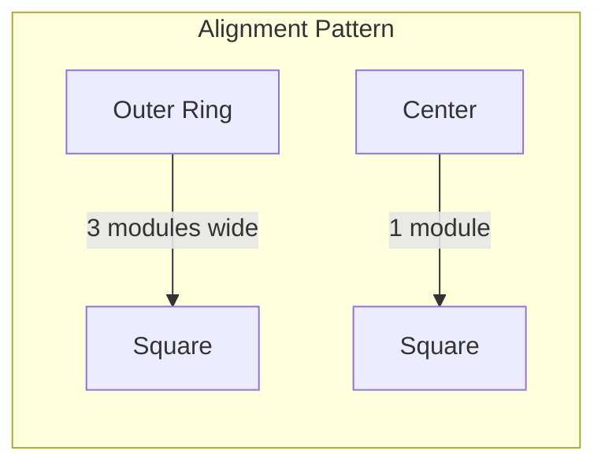

### 3. Error Correction Levels

| Level | Recovery Capacity | Use Case |
|-------|------------------|----------|
| **L** | ~7% | Clean environment |
| **M** | ~15% | Standard use |
| **Q** | ~25% | Some damage expected |
| **H** | ~30% | Maximum protection |

## QR Code Versions

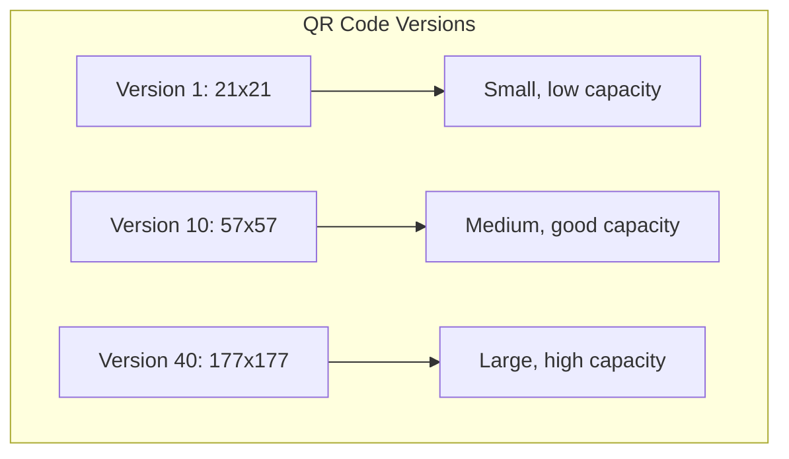

### Version Size Guide

| Version | Matrix Size | Capacity (Alphanumeric) |
|---------|-------------|------------------------|
| 1 | 21×21 | 25 characters |
| 5 | 37×37 | 87 characters |
| 10 | 57×57 | 208 characters |
| 20 | 101×101 | 611 characters |
| 40 | 177×177 | 1852 characters |

## QR Code Example

```python
# Visual QR code structure
"""
   ┌─────────┐   ┌─────────┐
   │  Finder  │   │  Finder │
   │  Pattern │   │ Pattern │
   │  ██████  │   │ ██████  │
   └─────────┘   └─────────┘
   │  Timing  │              │
   │  Pattern │   Data Area  │
   │          │              │
   │  Data    │   Alignment  │
   │  Area    │   Pattern    │
   │          │              │
   └─────────┘   └─────────┘
      Finder Pattern
"""
```

## Module Size and Quiet Zone

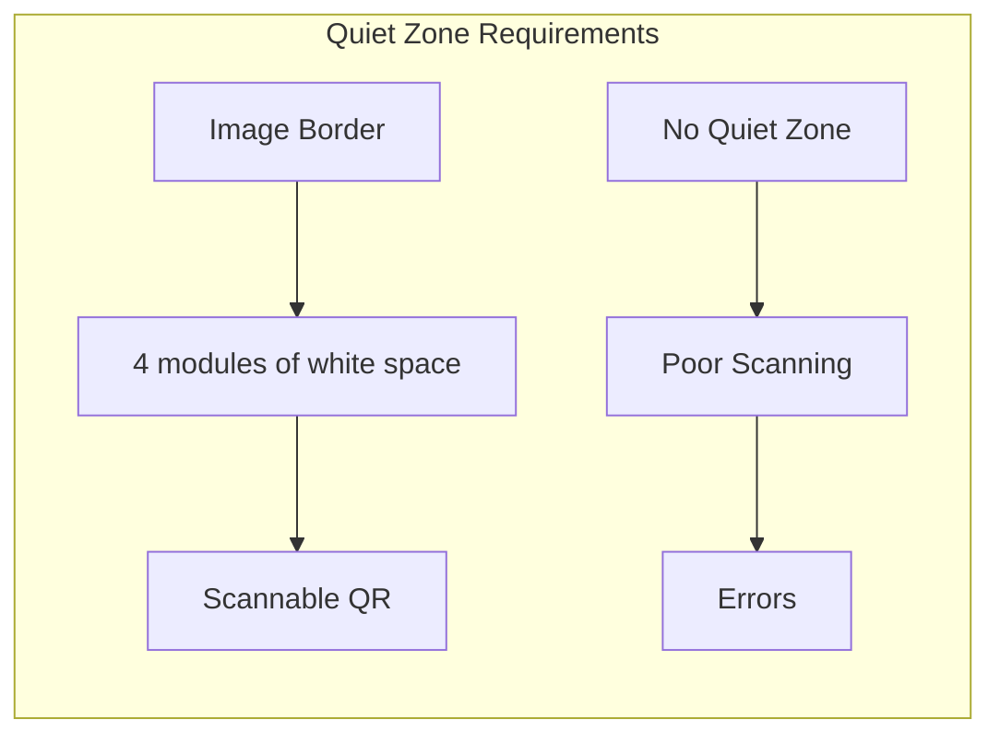

### Minimum Quiet Zone Guide

| Application | Recommended Quiet Zone |
|-------------|----------------------|
| **Digital** | 4-8 modules |
| **Print (Large)** | 8-12 modules |
| **Print (Small)** | 12-16 modules |
| **Book Publishing** | 10-15 modules |

---

## 🔍 Anatomy Check

1. How many finder patterns does a QR code have?
   - a) 1
   - b) 2
   - c) 3
   - d) 4

2. What is the purpose of error correction?
   - a) Make QR bigger
   - b) Recover data if damaged
   - c) Make prettier QR
   - d) Add more data

**[Answers: 1-c, 2-b]**

---

# Section 3: How QR Encoding Works

## The Encoding Process

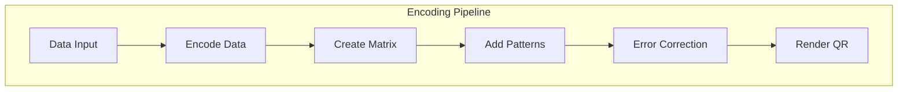

## Step-by-Step Flow

### Step 1: Data Input

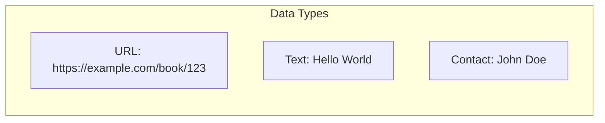

### Step 2: Encoding

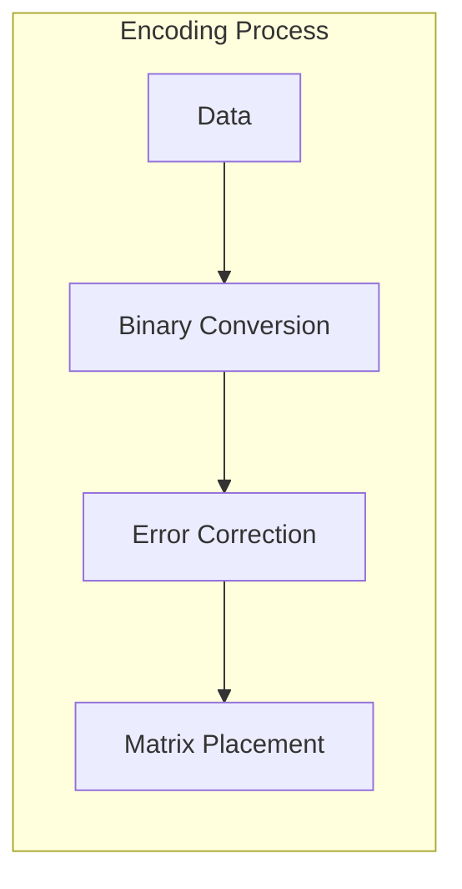

### Step 3: Matrix Creation

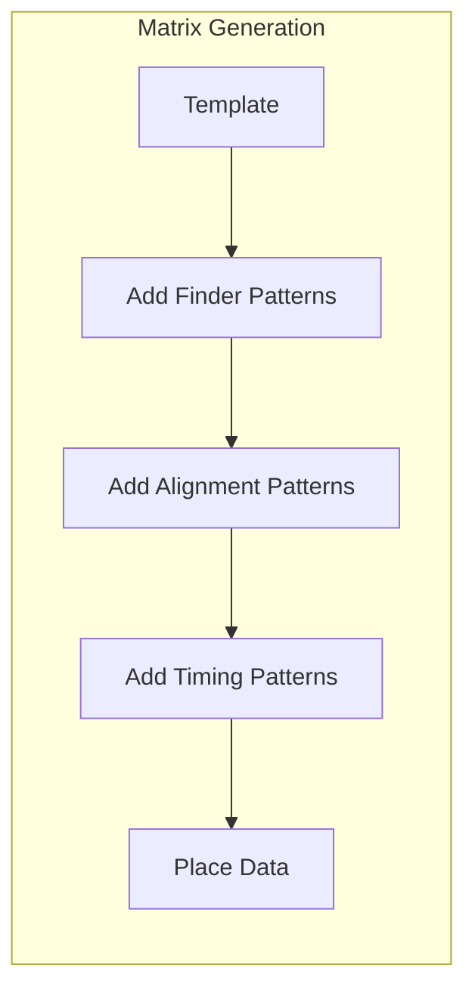

### Step 4: Rendering

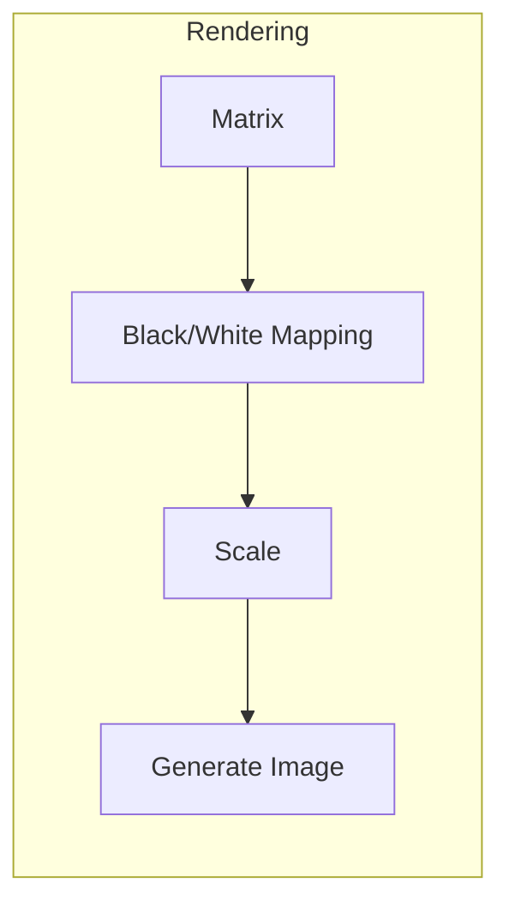

## Encoding Example

```python
import qrcode

# Data to encode
data = "https://sqanalytics.com/book/123"

# Create QR code instance
qr = qrcode.QRCode(
    version=1,
    error_correction=qrcode.constants.ERROR_CORRECT_M,
    box_size=10,
    border=4
)

# Add data
qr.add_data(data)
qr.make(fit=True)

# Create image
img = qr.make_image(fill_color="black", back_color="white")
```

## Error Correction in Action

```mermaid
graph TD
    subgraph "Error Correction"
        D[Data] --> RS[Reed-Solomon]
        RS --> R1[Redundant Data]
        R1 --> QR[QR Code]
        QR --> S[Scan]
        S -->|Partial Data| EC[Error Correction]
        EC --> R2[Recovered Data]
    end
```

### Error Correction Example

```python
# Error correction levels in qrcode library
from qrcode.constants import (
    ERROR_CORRECT_L,  # ~7% recovery
    ERROR_CORRECT_M,  # ~15% recovery
    ERROR_CORRECT_Q,  # ~25% recovery
    ERROR_CORRECT_H   # ~30% recovery
)

# Creating QR with high error correction for print
qr = qrcode.QRCode(
    version=1,
    error_correction=ERROR_CORRECT_H,
    box_size=10,
    border=4
)
```

## Data Capacity Guide

```mermaid
graph LR
    subgraph "Capacity by Type"
        N[Numeric] -->|"~7089 digits"| C1[Maximum]
        A[Alphanumeric] -->|"~4296 chars"| C2[Maximum]
        B[Binary] -->|"~2953 bytes"| C3[Maximum]
        K[Kanji] -->|"~1817 chars"| C4[Maximum]
    end
```

### Capacity Example

```python
# Check if data fits
data = "https://sqanalytics.com/this-is-a-long-url-12345" * 5

try:
    qr = qrcode.QRCode(version=40)
    qr.add_data(data)
    qr.make(fit=True)
    print("Data fits!")
except:
    print("Data too large!")
```

---

## 🔍 Encoding Checkpoint

1. What is the purpose of error correction in QR codes?
   - a) Add color
   - b) Fix damaged QR codes
   - c) Remove data
   - d) Make smaller

2. Which error correction level provides the most recovery?
   - a) L
   - b) M
   - c) Q
   - d) H

**[Answers: 1-b, 2-d]**

---

# Section 4: Static vs Dynamic QR Codes

## The Difference Explained

```mermaid
graph TD
    subgraph "Static QR Code"
        S1[URL Hardcoded] --> S2[No Tracking]
        S2 --> S3[Cannot Update]
        S3 --> S4[Fixed Destination]
    end
    
    subgraph "Dynamic QR Code"
        D1[Redirect URL] --> D2[Tracking Enabled]
        D2 --> D3[Updatable]
        D3 --> D4[Flexible Destination]
    end
```

## Static QR Codes

### How They Work

```python
# Static QR Code: URL is fixed
static_url = "https://youtube.com/watch?v=abc123"

qr = qrcode.QRCode(version=1)
qr.add_data(static_url)
qr.make(fit=True)
img = qr.make_image()
```

### Characteristics

```mermaid
graph LR
    subgraph "Static QR Features"
        F1[Fixed Destination] --> P1[No changes]
        F2[No Tracking] --> P2[No analytics]
        F3[Direct Link] --> P3[Fast scan]
        F4[One-Time Use] --> P4[Print and forget]
    end
```

## Dynamic QR Codes

### How They Work

```python
# Dynamic QR Code: Uses redirect
dynamic_url = "https://sqanalytics.com/redirect/abc123"

qr = qrcode.QRCode(version=1)
qr.add_data(dynamic_url)  # Points to our redirect service
qr.make(fit=True)
img = qr.make_image()
```

### Characteristics

```mermaid
graph LR
    subgraph "Dynamic QR Features"
        F1[Redirect Service] --> P1[Trackable]
        F2[Analytics] --> P2[Scans tracked]
        F3[Updatable] --> P3[Change destination]
        F4[Lifecycle] --> P4[Manage QR codes]
    end
```

## Comparison Table

| Aspect | Static QR | Dynamic QR |
|--------|-----------|------------|
| **Destination** | Fixed | Updatable |
| **Analytics** | None | Full tracking |
| **URL Length** | Long (direct) | Short (redirect) |
| **Maintenance** | None needed | Requires service |
| **Cost** | Free | Platform cost |
| **Use Case** | Simple use | Professional |
| **Tracking** | No | Yes |
| **Expiry** | Never | Manageable |

## Real-World Examples

### Static QR Example

```mermaid
graph LR
    S[QR Code] -->|Direct to| Y[YouTube]
    Y -->|No tracking| U[User]
```

### Dynamic QR Example

```mermaid
graph LR
    S[QR Code] -->|Scan| R[Redirect Service]
    R -->|Log| A[Analytics]
    R -->|Redirect| D[Destination]
    D -->|Viewed by| U[User]
```

## SQAnalytics Dynamic QR Flow

```mermaid
graph TD
    subgraph "SQAnalytics Dynamic QR"
        C[Create QR] --> DB[(Database)]
        DB --> S[Short Code]
        S --> URL[Redirect URL]
        
        URL -->|Scanned| TR[Track Scan]
        TR -->|Record| A[Analytics]
        TR -->|Redirect| D[Destination]
        
        D -->|Update| U[Admin]
        U -->|Change| URL
    end
```

---

## 🎯 Key Differences

**Static QR:**
- Simple, fast, no tracking
- Cannot change destination
- No analytics

**Dynamic QR:**
- Professional, trackable
- Can change destination
- Full analytics
- Platform required

---

# Section 5: Why Dynamic QR Codes Matter

## The Business Case

```mermaid
graph TD
    subgraph "Dynamic QR Benefits"
        B1[Analytics] --> V1[Understand Users]
        B2[Flexibility] --> V2[Change Destinations]
        B3[Lifecycle] --> V3[Manage QR Codes]
        B4[Engagement] --> V4[Track Effectiveness]
        B5[Optimization] --> V5[Improve Campaigns]
    end
```

## Analytics Benefits

```mermaid
graph TD
    subgraph "What You Can Track"
        T1[Scan Count] --> I1[Popularity]
        T2[Scan Location] --> I2[Geographic Spread]
        T3[Scan Time] --> I3[Time Patterns]
        T4[Device Type] --> I4[User Technology]
        T5[User Agent] --> I5[Browser/OS]
    end
```

### Analytics Data Example

```python
# From SQAnalytics scan tracking
scan_data = {
    'timestamp': '2024-01-01 10:00:00',
    'location': 'New York, USA',
    'device_type': 'Mobile',
    'browser': 'Chrome',
    'os': 'iOS',
    'source': 'QR Code in Book'
}
```

## Link Management

```mermaid
graph LR
    subgraph "Link Management"
        C[Campaign] --> L[Landing Page]
        L --> O[Offer Changes]
        O --> U[Update QR Destination]
        U --> S[Same QR, New Content]
    end
```

### Use Cases

```mermaid
graph TD
    subgraph "Dynamic QR Use Cases"
        U1[Marketing Campaigns] --> E1[A/B Testing]
        U2[Product Launches] --> E2[Feature Updates]
        U3[Event Tickets] --> E3[Venue Changes]
        U4[Book Publishing] --> E4[Content Updates]
        U5[Restaurant Menus] --> E5[Daily Specials]
    end
```

## SQAnalytics Implementation

### Complete Dynamic System

```python
from fastapi import FastAPI, Depends
from sqlalchemy.orm import Session
import qrcode

app = FastAPI()

class QRCodeSystem:
    def __init__(self, db: Session):
        self.db = db
    
    def create_qr(self, user_id: int, destination_url: str):
        # 1. Create record
        qr_code = QRCode(
            user_id=user_id,
            destination_url=destination_url,
            short_code=self.generate_short_code(),
            is_active=True
        )
        self.db.add(qr_code)
        self.db.commit()
        
        # 2. Generate redirect URL
        redirect_url = f"https://sqanalytics.com/r/{qr_code.short_code}"
        
        # 3. Generate QR image
        qr_image = self.generate_qr(redirect_url)
        
        return {
            'qr_code': qr_code,
            'redirect_url': redirect_url,
            'image': qr_image
        }
    
    def generate_qr(self, url: str):
        qr = qrcode.QRCode(
            version=1,
            error_correction=qrcode.constants.ERROR_CORRECT_H,
            box_size=10,
            border=4
        )
        qr.add_data(url)
        qr.make(fit=True)
        return qr.make_image(fill_color="black", back_color="white")
    
    def redirect_scan(self, short_code: str):
        # 1. Track scan
        qr = self.db.query(QRCode).filter(
            QRCode.short_code == short_code
        ).first()
        
        if not qr:
            return None
        
        # 2. Record analytics
        scan = ScanEvent(
            qr_code_id=qr.id,
            scanned_at=datetime.utcnow()
        )
        self.db.add(scan)
        self.db.commit()
        
        # 3. Increment scan count
        qr.scan_count += 1
        self.db.commit()
        
        # 4. Redirect to destination
        return qr.destination_url
```

---

## 📊 Business Impact

```mermaid
graph TD
    subgraph "Business Benefits"
        B1[Data-Driven Decisions] --> O1[Better Marketing]
        B2[User Insights] --> O2[Improved UX]
        B3[Flexibility] --> O3[Quick Changes]
        B4[Tracking] --> O4[ROI Measurement]
        B5[Optimization] --> O5[Higher Engagement]
    end
```

---

# Section 6: QR Generation Libraries

## Python QR Libraries

```mermaid
graph TD
    subgraph "QR Libraries"
        L1[qrcode] --> U1[Simple QR Generation]
        L2[pillow] --> U2[Image Processing]
        L3[pyqrcode] --> U3[Alternative QR]
        L4[segno] --> U4[Advanced QR]
    end
```

## 1. QRCode Library

### Installation

```bash
pip install qrcode[pil]
```

### Basic Usage

```python
import qrcode

# Simple QR generation
qr = qrcode.QRCode(
    version=1,
    error_correction=qrcode.constants.ERROR_CORRECT_M,
    box_size=10,
    border=4
)

# Add data
qr.add_data("https://example.com")
qr.make(fit=True)

# Generate image
img = qr.make_image(fill_color="black", back_color="white")
img.save("qr_code.png")
```

### Advanced Options

```python
from qrcode.image.styledpil import StyledPilImage
from qrcode.image.styles.moduledrawers import RoundedModuleDrawer

# Styled QR with rounded corners
qr = qrcode.QRCode(
    version=1,
    error_correction=qrcode.constants.ERROR_CORRECT_H
)

qr.add_data("https://sqanalytics.com/abc123")

img = qr.make_image(
    image_factory=StyledPilImage,
    module_drawer=RoundedModuleDrawer()
)
img.save("styled_qr.png")
```

## 2. Pillow Integration

### Installation

```bash
pip install Pillow
```

### Image Processing

```python
from PIL import Image, ImageDraw, ImageFont

def create_qr_with_logo(qr_image_path, logo_path, output_path):
    """Add logo to QR code"""
    # Open QR image
    qr = Image.open(qr_image_path)
    
    # Open logo
    logo = Image.open(logo_path)
    logo_size = qr.size[0] // 4
    
    # Resize logo
    logo = logo.resize((logo_size, logo_size))
    
    # Calculate position (center)
    pos = ((qr.size[0] - logo.size[0]) // 2,
           (qr.size[1] - logo.size[1]) // 2)
    
    # Paste logo
    qr.paste(logo, pos, mask=logo)
    qr.save(output_path)
```

## 3. Advanced QR Features

### Custom Styling

```python
from qrcode.image.styledpil import StyledPilImage
from qrcode.image.styles.moduledrawers import (
    RoundedModuleDrawer,
    GappedSquareModuleDrawer,
    CircleModuleDrawer
)
from qrcode.image.styles.colormasks import (
    SolidFillColorMask,
    GradientFillColorMask
)

def create_custom_qr(data, output_path, style="rounded"):
    """Create QR with custom styling"""
    
    # Style mapping
    styles = {
        "rounded": RoundedModuleDrawer(),
        "gapped": GappedSquareModuleDrawer(),
        "circle": CircleModuleDrawer()
    }
    
    qr = qrcode.QRCode(
        version=1,
        error_correction=qrcode.constants.ERROR_CORRECT_H
    )
    qr.add_data(data)
    
    img = qr.make_image(
        image_factory=StyledPilImage,
        module_drawer=styles.get(style, RoundedModuleDrawer()),
        color_mask=SolidFillColorMask(
            back_color=(255, 255, 255),
            front_color=(0, 0, 0)
        )
    )
    
    img.save(output_path)
```

### Gradient Colors

```python
def create_gradient_qr(data, output_path):
    """Create QR with gradient colors"""
    
    qr = qrcode.QRCode(
        version=1,
        error_correction=qrcode.constants.ERROR_CORRECT_H
    )
    qr.add_data(data)
    
    img = qr.make_image(
        image_factory=StyledPilImage,
        color_mask=GradientFillColorMask(
            back_color=(255, 255, 255),
            front_color=(0, 0, 255),
            gradient=(255, 0, 0)  # Blue to red gradient
        )
    )
    
    img.save(output_path)
```

## 4. Performance Considerations

### Batch Generation

```python
import asyncio
from concurrent.futures import ThreadPoolExecutor

def generate_batch_qr_codes(urls: List[str]) -> List[bytes]:
    """Generate multiple QR codes in parallel"""
    
    def generate_single(url):
        qr = qrcode.QRCode(version=1)
        qr.add_data(url)
        qr.make(fit=True)
        img = qr.make_image()
        
        # Convert to bytes
        from io import BytesIO
        buffer = BytesIO()
        img.save(buffer, format='PNG')
        return buffer.getvalue()
    
    with ThreadPoolExecutor(max_workers=10) as executor:
        results = list(executor.map(generate_single, urls))
    
    return results
```

### Caching Generated QRs

```python
from functools import lru_cache
import hashlib

class QRCodeCache:
    def __init__(self):
        self.cache = {}
    
    def get_cache_key(self, data, version=1, error_correction='M'):
        """Generate cache key from QR parameters"""
        key_str = f"{data}_{version}_{error_correction}"
        return hashlib.md5(key_str.encode()).hexdigest()
    
    @lru_cache(maxsize=1000)
    def generate_qr(self, data: str):
        """Generate QR with caching"""
        qr = qrcode.QRCode(version=1)
        qr.add_data(data)
        qr.make(fit=True)
        return qr.make_image()
    
    def get_qr(self, data: str):
        """Get QR from cache or generate"""
        key = self.get_cache_key(data)
        if key in self.cache:
            return self.cache[key]
        
        img = self.generate_qr(data)
        self.cache[key] = img
        return img
```

---

## 📊 Library Comparison

| Library | Ease | Features | Speed | Maintenance |
|---------|------|----------|-------|-------------|
| **qrcode** | Excellent | Basic | Fast | Active |
| **pillow** | Good | Image processing | Fast | Active |
| **pyqrcode** | Good | Basic | Medium | Moderate |
| **segno** | Good | Advanced | Good | Active |

---

# Section 7: QR Image Generation Workflow

## Complete Workflow

```mermaid
graph TD
    subgraph "QR Generation Workflow"
        U[User Request] --> V[Validate Input]
        V --> C[Create Record]
        C --> G[Generate Short Code]
        G --> B[Build Redirect URL]
        B --> Q[Generate QR Code]
        Q --> S[Save Image/Data]
        S --> R[Return Response]
    end
```

## Step-by-Step Implementation

### Step 1: Validate Input

```python
from pydantic import BaseModel, HttpUrl, Field

class QRCodeCreate(BaseModel):
    title: str = Field(..., min_length=1, max_length=200)
    destination_url: HttpUrl
    user_id: int
    
    @validator('destination_url')
    def validate_destination(cls, v):
        # Ensure URL is valid and accessible
        return v
```

### Step 2: Create Database Record

```python
def create_qr_record(db: Session, qr_data: QRCodeCreate) -> QRCode:
    """Create QR code record in database"""
    
    # Generate short code
    short_code = generate_short_code()
    
    # Create record
    qr = QRCode(
        user_id=qr_data.user_id,
        title=qr_data.title,
        destination_url=str(qr_data.destination_url),
        short_code=short_code,
        is_active=True,
        created_at=datetime.utcnow()
    )
    
    db.add(qr)
    db.commit()
    db.refresh(qr)
    
    return qr
```

### Step 3: Generate Redirect URL

```python
def build_redirect_url(short_code: str) -> str:
    """Build redirect URL for QR code"""
    base_url = "https://sqanalytics.com/r"
    return f"{base_url}/{short_code}"
```

### Step 4: Generate QR Code Image

```python
import qrcode
from io import BytesIO
import base64

def generate_qr_image(url: str, size: int = 300) -> bytes:
    """Generate QR code image as bytes"""
    
    qr = qrcode.QRCode(
        version=1,
        error_correction=qrcode.constants.ERROR_CORRECT_H,
        box_size=size // 25,  # Adjust for size
        border=4
    )
    
    qr.add_data(url)
    qr.make(fit=True)
    
    img = qr.make_image(fill_color="black", back_color="white")
    
    # Convert to bytes
    buffer = BytesIO()
    img.save(buffer, format='PNG')
    return buffer.getvalue()
```

### Step 5: Complete API Endpoint

```python
from fastapi import FastAPI, Depends, HTTPException
from fastapi.responses import FileResponse
from sqlalchemy.orm import Session

app = FastAPI()

@app.post("/qr-codes", response_model=QRCodeResponse)
async def create_qr_code(
    qr_data: QRCodeCreate,
    db: Session = Depends(get_db)
):
    """Create QR code and return image"""
    
    # 1. Validate
    if qr_data.user_id not in valid_users:
        raise HTTPException(400, "Invalid user")
    
    # 2. Create record
    qr_record = create_qr_record(db, qr_data)
    
    # 3. Build redirect URL
    redirect_url = build_redirect_url(qr_record.short_code)
    
    # 4. Generate QR image
    qr_image_bytes = generate_qr_image(redirect_url)
    
    # 5. Store or serve image
    # Option A: Store in database
    qr_record.image_data = qr_image_bytes
    db.commit()
    
    # Option B: Save to file system
    # with open(f"qr_{qr_record.id}.png", "wb") as f:
    #     f.write(qr_image_bytes)
    
    return QRCodeResponse(
        id=qr_record.id,
        short_code=qr_record.short_code,
        title=qr_record.title,
        destination_url=qr_record.destination_url,
        redirect_url=redirect_url,
        created_at=qr_record.created_at
    )
```

## Download Endpoint

```python
@app.get("/qr-codes/{qr_id}/download")
async def download_qr_code(
    qr_id: int,
    format: str = "png",
    db: Session = Depends(get_db)
):
    """Download QR code image"""
    
    qr = db.get(QRCode, qr_id)
    if not qr:
        raise HTTPException(404, "QR code not found")
    
    if qr.image_data:
        # Serve from database
        from fastapi.responses import Response
        return Response(
            content=qr.image_data,
            media_type="image/png",
            headers={
                "Content-Disposition": f"attachment; filename=qr_{qr_id}.{format}"
            }
        )
    else:
        # Generate on demand
        redirect_url = build_redirect_url(qr.short_code)
        image_bytes = generate_qr_image(redirect_url)
        
        return Response(
            content=image_bytes,
            media_type="image/png",
            headers={
                "Content-Disposition": f"attachment; filename=qr_{qr_id}.{format}"
            }
        )
```

## QR Code with Logo Example

```python
def generate_qr_with_logo(url: str, logo_path: str = None, size: int = 400) -> bytes:
    """Generate QR with optional logo"""
    
    # Generate basic QR
    qr = qrcode.QRCode(
        version=1,
        error_correction=qrcode.constants.ERROR_CORRECT_H,
        box_size=size // 25,
        border=4
    )
    qr.add_data(url)
    qr.make(fit=True)
    
    img = qr.make_image(fill_color="black", back_color="white")
    
    # Add logo if provided
    if logo_path:
        from PIL import Image
        
        # Resize QR to PIL Image
        img = img.convert('RGB')
        
        logo = Image.open(logo_path)
        logo_size = img.size[0] // 4
        logo = logo.resize((logo_size, logo_size))
        
        # Calculate center position
        pos = ((img.size[0] - logo.size[0]) // 2,
               (img.size[1] - logo.size[1]) // 2)
        
        # Paste logo
        img.paste(logo, pos, mask=logo if logo.mode == 'RGBA' else None)
    
    # Convert to bytes
    buffer = BytesIO()
    img.save(buffer, format='PNG')
    return buffer.getvalue()
```

---

## 🔍 Workflow Check

```mermaid
graph TD
    subgraph "Check Your Understanding"
        Q1[What is the first step?] --> A1[Validate Input]
        Q2[What creates the redirect?] --> A2[Short Code]
        Q3[What does QR contain?] --> A3[Redirect URL]
        Q4[What is stored?] --> A4[Record and Image]
    end
```

---

# Section 8: QR Image Storage Strategies

## Storage Options Overview

```mermaid
graph TD
    subgraph "QR Storage Strategies"
        G[Generate On Demand] --> P1[Pros: Simple, No Storage]
        G --> C1[Cons: Slower, Resource Heavy]
        
        S[Store Images] --> P2[Pros: Fast Access]
        S --> C2[Cons: Storage Costs]
        
        C[Cloud Storage] --> P3[Pros: Scalable, CDN]
        C --> C3[Cons: External Service]
    end
```

## Option A: Generate On Demand

### Implementation

```python
class OnDemandQRGenerator:
    """Generate QR codes on demand (no storage)"""
    
    def __init__(self):
        self.cache = LRUCache(maxsize=1000)
    
    def get_qr(self, short_code: str) -> bytes:
        """Get QR image, generate if not cached"""
        
        # Check cache
        if short_code in self.cache:
            return self.cache[short_code]
        
        # Build URL
        redirect_url = f"https://sqanalytics.com/r/{short_code}"
        
        # Generate QR
        image_bytes = self.generate_qr(redirect_url)
        
        # Cache
        self.cache[short_code] = image_bytes
        
        return image_bytes
    
    def generate_qr(self, url: str) -> bytes:
        qr = qrcode.QRCode(version=1)
        qr.add_data(url)
        qr.make(fit=True)
        
        buffer = BytesIO()
        qr.make_image().save(buffer, format='PNG')
        return buffer.getvalue()
```

### Pros and Cons

| Aspect | Rating | Notes |
|--------|--------|-------|
| **Storage** | No storage | Zero storage cost |
| **Speed** | Slower | Generation time per request |
| **Scalability** | Limited | CPU bound |
| **Complexity** | Simple | Easy to implement |
| **Cost** | Low | CPU costs only |

## Option B: Store Images in Database

### Implementation

```python
from sqlalchemy import Column, Integer, String, LargeBinary

class QRCode(Base):
    __tablename__ = "qr_codes"
    
    id = Column(Integer, primary_key=True)
    short_code = Column(String(50), unique=True)
    destination_url = Column(String(500))
    image_data = Column(LargeBinary)  # Store PNG bytes
    image_size = Column(Integer)  # KB

def create_qr_with_storage(data, db):
    # Generate QR
    redirect_url = f"https://sqanalytics.com/r/{short_code}"
    image_bytes = generate_qr_image(redirect_url)
    
    # Store in database
    qr = QRCode(
        short_code=short_code,
        destination_url=data.destination_url,
        image_data=image_bytes,
        image_size=len(image_bytes) // 1024  # KB
    )
    
    db.add(qr)
    db.commit()
    
    return qr

def get_qr_image(qr_id, db):
    qr = db.get(QRCode, qr_id)
    return qr.image_data
```

### Pros and Cons

| Aspect | Rating | Notes |
|--------|--------|-------|
| **Storage** | Moderate | Database storage |
| **Speed** | Fast | Direct retrieval |
| **Scalability** | Limited | Database size |
| **Complexity** | Moderate | DB management |
| **Cost** | Moderate | DB storage costs |

## Option C: Cloud Storage

### Implementation

```python
import boto3
from io import BytesIO

class CloudQRStorage:
    def __init__(self, bucket_name: str):
        self.s3 = boto3.client('s3')
        self.bucket = bucket_name
    
    def store_qr(self, short_code: str, image_bytes: bytes) -> str:
        """Store QR image in cloud"""
        key = f"qr_codes/{short_code}.png"
        
        self.s3.put_object(
            Bucket=self.bucket,
            Key=key,
            Body=image_bytes,
            ContentType='image/png',
            ACL='public-read'
        )
        
        return f"https://{self.bucket}.s3.amazonaws.com/{key}"
    
    def get_qr_url(self, short_code: str) -> str:
        """Get cloud URL for QR image"""
        return f"https://{self.bucket}.s3.amazonaws.com/qr_codes/{short_code}.png"
    
    def delete_qr(self, short_code: str):
        """Delete QR image from cloud"""
        key = f"qr_codes/{short_code}.png"
        self.s3.delete_object(Bucket=self.bucket, Key=key)

def create_qr_with_cloud(data, db, cloud_storage):
    # Generate QR
    redirect_url = build_redirect_url(short_code)
    image_bytes = generate_qr_image(redirect_url)
    
    # Store in cloud
    image_url = cloud_storage.store_qr(short_code, image_bytes)
    
    # Store metadata in database
    qr = QRCode(
        short_code=short_code,
        destination_url=data.destination_url,
        image_url=image_url,  # Cloud URL
        image_size=len(image_bytes) // 1024
    )
    
    db.add(qr)
    db.commit()
    
    return qr
```

### Pros and Cons

| Aspect | Rating | Notes |
|--------|--------|-------|
| **Storage** | Unlimited | Cloud scalable |
| **Speed** | Very Fast | CDN delivery |
| **Scalability** | Excellent | Auto-scales |
| **Complexity** | High | External service |
| **Cost** | Variable | Pay for usage |

## Decision Tree

```mermaid
graph TD
    Q[Storage Strategy] --> A{Scale?}
    A -->|Low| B[Generate On Demand]
    A -->|Medium| C[Store in Database]
    A -->|High| D[Cloud Storage]
    
    B --> B1[Use for: Small apps, testing]
    C --> C1[Use for: Medium apps, moderate traffic]
    D --> D1[Use for: Enterprise, high traffic]
```

---

## 🎯 Storage Recommendations

| Use Case | Recommended Strategy |
|----------|---------------------|
| **Development** | Generate on demand |
| **Small Production** | Database storage |
| **Medium Production** | Database + cache |
| **Large Production** | Cloud storage + CDN |
| **Enterprise** | Cloud + CDN + edge cache |

---

# Section 9: Print-Ready QR Design

## Print Quality Requirements

```mermaid
graph TD
    subgraph "Print-Ready QR"
        R1[Resolution] --> Q1[300 DPI Minimum]
        R2[Size] --> Q2[At least 2cm x 2cm]
        R3[Quiet Zone] --> Q3[4x module width]
        R4[Error Correction] --> Q4[High Level - H]
        R5[Color] --> Q5[High Contrast]
        R6[Format] --> Q6[Vector or High-Res PNG]
    end
```

## Resolution Guidelines

### Minimum Requirements

| Printing Method | Minimum DPI | Recommended Size |
|-----------------|-------------|------------------|
| **Inkjet/Laser** | 300 DPI | 300x300 pixels |
| **Offset Print** | 600 DPI | 600x600 pixels |
| **Screen Print** | 300 DPI | 300x300 pixels |
| **Digital Print** | 300 DPI | 300x300 pixels |

### Calculating Image Size

```python
def calculate_qr_size(dpi: int, physical_size_cm: float) -> int:
    """
    Calculate pixel size from DPI and physical size
    """
    inches = physical_size_cm / 2.54
    pixels = dpi * inches
    return int(pixels)

# Example: 2cm QR at 300 DPI
size_pixels = calculate_qr_size(300, 2.0)
print(f"QR size: {size_pixels}x{size_pixels} pixels")
# Output: 236x236 pixels
```

## Error Correction for Print

```python
from qrcode.constants import ERROR_CORRECT_H

def generate_print_qr(data: str, logo_path: str = None) -> bytes:
    """
    Generate QR optimized for print
    """
    # High error correction for damaged/printed QR
    qr = qrcode.QRCode(
        version=1,
        error_correction=ERROR_CORRECT_H,  # Maximum recovery
        box_size=10,  # Larger modules
        border=6  # Extra quiet zone for print
    )
    
    qr.add_data(data)
    qr.make(fit=True)
    
    img = qr.make_image(fill_color="black", back_color="white")
    
    # Convert to RGB for printing
    img = img.convert('RGB')
    
    # Optional: Add logo
    if logo_path:
        logo = Image.open(logo_path)
        logo_size = img.size[0] // 4
        logo = logo.resize((logo_size, logo_size))
        
        # Paste center
        pos = ((img.size[0] - logo.size[0]) // 2,
               (img.size[1] - logo.size[1]) // 2)
        img.paste(logo, pos)
    
    # Save as high quality PNG
    buffer = BytesIO()
    img.save(buffer, format='PNG', dpi=(300, 300))
    return buffer.getvalue()
```

## Quiet Zone Considerations

```python
def add_quiet_zone(image, padding=50, background=(255, 255, 255)):
    """
    Add white padding around QR for print
    """
    from PIL import ImageOps
    
    return ImageOps.expand(
        image,
        border=padding,
        fill=background
    )

# Example for print
qr_image = qrcode.make("https://sqanalytics.com/abc123")
qr_with_quiet_zone = add_quiet_zone(qr_image, padding=100)
```

## Book Publishing Guidelines

### SQAnalytics Book Integration

```mermaid
graph TD
    subgraph "Book QR Design"
        P1[Page Design] --> L1[QR Placement]
        L1 --> L2[Clear Call-to-Action]
        L2 --> L3[Minimal Distraction]
        L3 --> L4[High Contrast]
        L4 --> L5[Proper Size]
    end
```

### Best Practices for Books

```python
def create_book_qr(url: str, page_number: int, book_title: str) -> bytes:
    """
    Generate QR specifically for book publishing
    """
    # Include tracking in URL
    tracking_url = f"{url}?source={book_title}&page={page_number}"
    
    # High resolution for print
    qr = qrcode.QRCode(
        version=1,
        error_correction=ERROR_CORRECT_H,
        box_size=12,  # Larger modules for print
        border=6
    )
    
    qr.add_data(tracking_url)
    qr.make(fit=True)
    
    img = qr.make_image(fill_color="black", back_color="white")
    img = img.convert('RGB')
    
    # Add label
    from PIL import ImageDraw, ImageFont
    
    draw = ImageDraw.Draw(img)
    try:
        font = ImageFont.truetype("arial.ttf", 20)
    except:
        font = ImageFont.load_default()
    
    label = f"Scan to view page {page_number}"
    draw.text((10, img.size[1] - 30), label, fill="black", font=font)
    
    # Save high quality
    buffer = BytesIO()
    img.save(buffer, format='PNG', dpi=(300, 300))
    return buffer.getvalue()
```

## Color Considerations

### High Contrast Color Combinations

```mermaid
graph LR
    subgraph "Good Color Pairs"
        G1[Black on White] --> OK[✓ Scannable]
        G2[Dark Blue on White] --> OK2[✓ Scannable]
        G3[Black on Light Yellow] --> OK3[✓ Scannable]
    end
    
    subgraph "Bad Color Pairs"
        B1[Red on Pink] --> NO[✗ Poor Scan]
        B2[Light Gray on White] --> NO2[✗ Poor Scan]
        B3[Colors Inverted] --> NO3[✗ Poor Scan]
    end
```

### Color QR Example

```python
def create_colored_qr(data: str, front_color: tuple, back_color: tuple):
    """
    Create QR with custom colors
    """
    qr = qrcode.QRCode(version=1)
    qr.add_data(data)
    qr.make(fit=True)
    
    img = qr.make_image(
        fill_color=front_color,
        back_color=back_color
    )
    
    return img

# Good: Black on white
black_white = create_colored_qr("https://example.com", (0, 0, 0), (255, 255, 255))

# Good: Dark blue on white
blue_white = create_colored_qr("https://example.com", (0, 0, 100), (255, 255, 255))

# Bad: Light gray on white
gray_white = create_colored_qr("https://example.com", (200, 200, 200), (255, 255, 255))
```

---

## 📋 Print-Ready Checklist

- [ ] Minimum 300 DPI
- [ ] At least 2cm x 2cm size
- [ ] High error correction (H)
- [ ] 4-8 module quiet zone
- [ ] High contrast colors
- [ ] Vector or high-res PNG
- [ ] Test scan before printing
- [ ] Include tracking in URL
- [ ] Proper margins
- [ ] Clear call-to-action

---

# Section 10: Common Developer Mistakes

## Mistake 1: Tiny QR Codes

### ❌ The Problem

```python
# BAD: Too small
qr = qrcode.QRCode(box_size=1)
qr.add_data("https://example.com")
qr.make(fit=True)
img = qr.make_image()
# Image is tiny and unreadable
```

### Symptoms
- Scanner can't read
- Pixelated image
- Blurry when printed

### Impact
- Unusable QR codes
- User frustration
- Missed engagement

### ✅ The Solution

```python
# GOOD: Proper size for use case
def create_qr_with_proper_size(data: str, use_case: str):
    """
    Create QR with appropriate size
    """
    size_mapping = {
        'web': 300,
        'email': 300,
        'print': 600,
        'billboard': 1200
    }
    
    pixels = size_mapping.get(use_case, 300)
    box_size = pixels // 25  # 300px = 12px boxes
    
    qr = qrcode.QRCode(
        version=1,
        box_size=box_size,
        border=4
    )
    qr.add_data(data)
    qr.make(fit=True)
    return qr.make_image()
```

## Mistake 2: Low Resolution Exports

### ❌ The Problem

```python
# BAD: Default resolution
img = qr.make_image()
img.save("qr_code.jpg", quality=50)  # Low quality JPEG
```

### Symptoms
- Blurry when printed
- Pixelated at larger sizes
- Unprofessional appearance

### ✅ The Solution

```python
# GOOD: High quality export
def export_print_qr(qr_data: bytes, output_path: str):
    """
    Export QR at print quality
    """
    from PIL import Image
    from io import BytesIO
    
    img = Image.open(BytesIO(qr_data))
    
    # Ensure RGB for JPEG
    if img.mode != 'RGB':
        img = img.convert('RGB')
    
    # Save with high quality
    img.save(
        output_path,
        format='PNG',  # PNG for lossless
        dpi=(300, 300)
    )
    # OR for JPEG
    img.save(
        output_path.replace('.png', '.jpg'),
        format='JPEG',
        quality=95,  # High quality
        dpi=(300, 300)
    )
```

## Mistake 3: Direct Destination URLs

### ❌ The Problem

```python
# BAD: Direct to final destination
direct_url = "https://amazon.com/product/abc123"
qr.add_data(direct_url)  # Cannot track or change
```

### Impact
- No analytics
- Cannot update destination
- No lifecycle management

### ✅ The Solution

```python
# GOOD: Use redirect system
class DynamicQRService:
    def __init__(self, base_url: str):
        self.base_url = base_url
    
    def create_qr_url(self, short_code: str) -> str:
        """Build redirect URL"""
        return f"{self.base_url}/r/{short_code}"
    
    def track_scan(self, short_code: str, request_data: dict):
        """Record scan analytics"""
        pass

# Usage
service = DynamicQRService("https://sqanalytics.com")
qr_url = service.create_qr_url("abc123")
qr.add_data(qr_url)  # Trackable and updatable
```

## Mistake 4: Broken Redirect Architecture

### ❌ The Problem

```python
# BAD: No redirect service
@app.get("/r/{code}")
async def redirect(code: str):
    # Direct redirect without tracking
    return RedirectResponse(f"https://example.com/{code}")
```

### Impact
- No analytics
- No error handling
- No maintenance

### ✅ The Solution

```python
# GOOD: Complete redirect service
@app.get("/r/{short_code}")
async def redirect_qr(
    short_code: str,
    request: Request,
    db: Session = Depends(get_db)
):
    """
    Full redirect with tracking
    """
    # 1. Look up QR
    qr = db.query(QRCode).filter(
        QRCode.short_code == short_code,
        QRCode.is_active == True
    ).first()
    
    if not qr:
        return HTMLResponse("QR code not found", status_code=404)
    
    # 2. Record analytics
    await record_analytics(
        qr_id=qr.id,
        user_agent=request.headers.get("user-agent"),
        ip_address=request.client.host
    )
    
    # 3. Update scan count
    qr.scan_count += 1
    db.commit()
    
    # 4. Redirect
    return RedirectResponse(qr.destination_url)
```

## Mistake 5: Storing Unnecessary Image Files

### ❌ The Problem

```python
# BAD: Storing QR images on disk
@app.post("/qr-codes")
async def create_qr(data, db):
    # Generate QR
    img = generate_qr(data)
    
    # Save to disk
    img.save(f"qr_{data.id}.png")  # Thousands of files
    
    # Store path in DB
    qr.image_path = f"qr_{data.id}.png"
    db.commit()
```

### Impact
- Storage bloat
- File management issues
- Cleanup problems
- Performance issues

### ✅ The Solution

```python
# GOOD: Generate on demand
@app.post("/qr-codes")
async def create_qr(data, db):
    # Store only metadata
    qr = QRCode(
        destination_url=data.url,
        short_code=generate_short_code()
    )
    db.add(qr)
    db.commit()
    
    return {"id": qr.id, "short_code": qr.short_code}

@app.get("/qr-codes/{id}/image")
async def get_qr_image(id: int, db: Session = Depends(get_db)):
    # Generate on demand
    qr = db.get(QRCode, id)
    redirect_url = f"https://sqanalytics.com/r/{qr.short_code}"
    img = generate_qr(redirect_url)
    
    from fastapi.responses import StreamingResponse
    buffer = BytesIO()
    img.save(buffer, format="PNG")
    buffer.seek(0)
    
    return StreamingResponse(buffer, media_type="image/png")
```

## Troubleshooting Flowchart

```mermaid
graph TD
    A[QR Issue] --> B{Type of Problem?}
    
    B -->|Unreadable| C{Check:}
    C --> C1[Size too small?]
    C --> C2[Resolution low?]
    C --> C3[Quiet zone?]
    C --> C4[Error correction?]
    
    B -->|Wrong Destination| D{Check:}
    D --> D1[Short code correct?]
    D --> D2[Redirect works?]
    D --> D3[Destination active?]
    
    B -->|Poor Print Quality| E{Check:}
    E --> E1[300 DPI minimum?]
    E --> E2[High contrast?]
    E --> E3[Correct format?]
    
    B -->|Analytics Missing| F{Check:}
    F --> F1[Redirect tracking?]
    F --> F2[Analytics service?]
    F --> F3[Database records?]
```

---

## 🔍 Mistake Checklist

- [ ] QR code adequate size
- [ ] High resolution export
- [ ] Dynamic redirect system
- [ ] Proper analytics tracking
- [ ] No unnecessary storage
- [ ] Print quality optimized
- [ ] Error correction appropriate

---

# Section 11: SQAnalytics Case Study

## Complete QR Platform Architecture

```mermaid
graph TD
    subgraph "Frontend"
        U[User Interface] --> A[API Gateway]
    end
    
    subgraph "Backend Services"
        A --> QR[QR Service]
        QR --> DB[(PostgreSQL)]
        QR --> G[Generator Service]
        G --> QL[QR Library]
    end
    
    subgraph "Print & Scan"
        G --> I[QR Image]
        I --> P[Print Media]
        P --> S[Scanner]
        S --> R[Redirect Service]
        R --> A
    end
    
    subgraph "Analytics"
        R --> AT[Analytics Service]
        AT --> DB
        AT --> D[Dashboard]
    end
```

## Complete Implementation

### 1. Database Models

```python
from sqlalchemy import Column, Integer, String, DateTime, Boolean, JSON, BigInteger
from sqlalchemy.orm import declarative_base

Base = declarative_base()

class QRCode(Base):
    """Complete QR code model"""
    __tablename__ = "qr_codes"
    
    id = Column(Integer, primary_key=True, index=True)
    user_id = Column(Integer, nullable=False)
    organization_id = Column(Integer, nullable=False)
    
    # Core fields
    title = Column(String(200), nullable=False)
    destination_url = Column(String(500), nullable=False)
    short_code = Column(String(50), unique=True, nullable=False, index=True)
    
    # Status
    is_active = Column(Boolean, default=True)
    is_deleted = Column(Boolean, default=False)
    
    # Tracking
    scan_count = Column(BigInteger, default=0)
    last_scanned_at = Column(DateTime, nullable=True)
    
    # Metadata
    tags = Column(JSON, default=list)
    metadata = Column(JSON, default=dict)
    
    # Timestamps
    created_at = Column(DateTime, default=datetime.utcnow)
    updated_at = Column(DateTime, default=datetime.utcnow, onupdate=datetime.utcnow)
    expires_at = Column(DateTime, nullable=True)

class ScanEvent(Base):
    """Detailed scan event tracking"""
    __tablename__ = "scan_events"
    
    id = Column(Integer, primary_key=True, index=True)
    qr_code_id = Column(Integer, ForeignKey("qr_codes.id"), nullable=False)
    
    # Request data
    user_agent = Column(String, nullable=True)
    ip_address = Column(String(45), nullable=True)
    referrer = Column(String(500), nullable=True)
    
    # Enriched data
    browser = Column(String(50), nullable=True)
    operating_system = Column(String(50), nullable=True)
    device_type = Column(String(20), nullable=True)
    location = Column(String(100), nullable=True)
    
    # Timestamps
    scanned_at = Column(DateTime, default=datetime.utcnow, index=True)
    
    # Additional
    metadata = Column(JSON, default=dict)
```

### 2. QR Generation Service

```python
class QRGenerator:
    """Complete QR generation service"""
    
    def __init__(self, base_url: str = "https://sqanalytics.com"):
        self.base_url = base_url
    
    def generate_short_code(self, length: int = 8) -> str:
        """Generate unique short code"""
        import secrets
        import string
        alphabet = string.ascii_letters + string.digits
        return ''.join(secrets.choice(alphabet) for _ in range(length))
    
    def build_redirect_url(self, short_code: str) -> str:
        """Build redirect URL"""
        return f"{self.base_url}/r/{short_code}"
    
    def generate_qr_image(
        self,
        short_code: str,
        size: int = 300,
        error_correction: str = 'H',
        logo_path: str = None
    ) -> bytes:
        """Generate QR image with options"""
        
        redirect_url = self.build_redirect_url(short_code)
        
        error_map = {
            'L': qrcode.constants.ERROR_CORRECT_L,
            'M': qrcode.constants.ERROR_CORRECT_M,
            'Q': qrcode.constants.ERROR_CORRECT_Q,
            'H': qrcode.constants.ERROR_CORRECT_H
        }
        
        qr = qrcode.QRCode(
            version=1,
            error_correction=error_map.get(error_correction.upper(), ERROR_CORRECT_H),
            box_size=size // 25,
            border=4
        )
        
        qr.add_data(redirect_url)
        qr.make(fit=True)
        
        img = qr.make_image(fill_color="black", back_color="white")
        img = img.convert('RGB')
        
        # Add logo if provided
        if logo_path:
            from PIL import Image
            logo = Image.open(logo_path)
            logo_size = img.size[0] // 4
            logo = logo.resize((logo_size, logo_size))
            
            pos = ((img.size[0] - logo.size[0]) // 2,
                   (img.size[1] - logo.size[1]) // 2)
            img.paste(logo, pos, mask=logo if logo.mode == 'RGBA' else None)
        
        buffer = BytesIO()
        img.save(buffer, format='PNG')
        return buffer.getvalue()
```

### 3. Complete API Implementation

```python
from fastapi import FastAPI, Depends, HTTPException, Request
from fastapi.responses import HTMLResponse, RedirectResponse
from sqlalchemy.orm import Session

app = FastAPI(title="SQAnalytics QR Platform")

# QR Services
qr_generator = QRGenerator()

@app.post("/api/qr-codes")
async def create_qr_code(
    data: QRCodeCreate,
    db: Session = Depends(get_db)
):
    """
    Create a new QR code
    """
    # 1. Generate short code
    short_code = qr_generator.generate_short_code()
    
    # 2. Create record
    qr = QRCode(
        user_id=data.user_id,
        title=data.title,
        destination_url=str(data.destination_url),
        short_code=short_code,
        is_active=True,
        tags=data.tags,
        created_at=datetime.utcnow()
    )
    
    db.add(qr)
    db.commit()
    db.refresh(qr)
    
    # 3. Generate QR image
    image_bytes = qr_generator.generate_qr_image(
        short_code=short_code,
        size=data.image_size or 300,
        error_correction=data.error_correction or 'H'
    )
    
    # 4. Store image in cloud (optional)
    if data.store_image:
        cloud_url = cloud_storage.store_qr(short_code, image_bytes)
        qr.image_url = cloud_url
        db.commit()
    
    return {
        'id': qr.id,
        'short_code': qr.short_code,
        'title': qr.title,
        'redirect_url': qr_generator.build_redirect_url(short_code),
        'image_data': base64.b64encode(image_bytes).decode(),
        'created_at': qr.created_at
    }

@app.get("/r/{short_code}")
async def redirect_qr(
    short_code: str,
    request: Request,
    db: Session = Depends(get_db)
):
    """
    Redirect short code to destination with tracking
    """
    # 1. Look up QR
    qr = db.query(QRCode).filter(
        QRCode.short_code == short_code,
        QRCode.is_active == True,
        QRCode.is_deleted == False
    ).first()
    
    if not qr:
        return HTMLResponse("QR code not found or expired", status_code=404)
    
    # 2. Check expiry
    if qr.expires_at and datetime.utcnow() > qr.expires_at:
        return HTMLResponse("QR code has expired", status_code=410)
    
    # 3. Record analytics
    scan_event = ScanEvent(
        qr_code_id=qr.id,
        user_agent=request.headers.get("user-agent"),
        ip_address=request.client.host,
        referrer=request.headers.get("referer"),
        scanned_at=datetime.utcnow()
    )
    
    # Enrich with user-agent data
    if scan_event.user_agent:
        from user_agents import parse
        ua = parse(scan_event.user_agent)
        scan_event.browser = ua.browser.family
        scan_event.operating_system = ua.os.family
        scan_event.device_type = 'Mobile' if ua.is_mobile else 'Tablet' if ua.is_tablet else 'Desktop'
    
    db.add(scan_event)
    db.commit()
    
    # 4. Update QR stats
    qr.scan_count += 1
    qr.last_scanned_at = datetime.utcnow()
    db.commit()
    
    # 5. Redirect
    return RedirectResponse(qr.destination_url)

@app.get("/api/qr-codes/{qr_id}/download")
async def download_qr_image(
    qr_id: int,
    format: str = "png",
    db: Session = Depends(get_db)
):
    """
    Download QR image
    """
    qr = db.get(QRCode, qr_id)
    if not qr:
        raise HTTPException(404, "QR code not found")
    
    # Generate image
    image_bytes = qr_generator.generate_qr_image(
        short_code=qr.short_code,
        size=600  # Print quality
    )
    
    return Response(
        content=image_bytes,
        media_type="image/png",
        headers={
            "Content-Disposition": f"attachment; filename=qr_{qr_id}.{format}"
        }
    )
```

### 4. Print-Ready Export

```python
@app.get("/api/qr-codes/{qr_id}/print")
async def export_print_ready(
    qr_id: int,
    output_format: str = "png",
    db: Session = Depends(get_db)
):
    """
    Export print-ready QR code with specifications
    """
    qr = db.get(QRCode, qr_id)
    if not qr:
        raise HTTPException(404, "QR code not found")
    
    # Generate high-quality image for print
    image_bytes = qr_generator.generate_qr_image(
        short_code=qr.short_code,
        size=1200,  # 4x print quality
        error_correction='H'  # Maximum recovery
    )
    
    # Add print specifications
    from PIL import Image, ImageDraw, ImageFont
    
    img = Image.open(BytesIO(image_bytes))
    
    # Add info overlay
    draw = ImageDraw.Draw(img)
    try:
        font = ImageFont.truetype("arial.ttf", 20)
    except:
        font = ImageFont.load_default()
    
    info = f"QR Code ID: {qr.id} | Short: {qr.short_code} | Created: {qr.created_at.strftime('%Y-%m-%d')}"
    draw.text((10, img.size[1] - 40), info, fill="black", font=font)
    
    # Save with specs
    buffer = BytesIO()
    img.save(buffer, format='PNG', dpi=(300, 300))
    
    return Response(
        content=buffer.getvalue(),
        media_type="image/png",
        headers={
            "Content-Disposition": f"attachment; filename=qr_{qr_id}_print.png",
            "X-Print-Specs": "300 DPI, H Error Correction, 1200px size"
        }
    )
```

### 5. Analytics Dashboard

```python
@app.get("/api/analytics/qr-codes")
async def get_qr_analytics(
    period: str = "30d",
    db: Session = Depends(get_db)
):
    """
    Get QR analytics summary
    """
    # Date range
    days = int(period.replace('d', ''))
    cutoff = datetime.utcnow() - timedelta(days=days)
    
    # Total QR codes
    total_qrs = db.query(func.count(QRCode.id)).scalar()
    
    # Active QR codes
    active_qrs = db.query(func.count(QRCode.id)).filter(
        QRCode.is_active == True
    ).scalar()
    
    # Total scans
    total_scans = db.query(func.count(ScanEvent.id)).filter(
        ScanEvent.scanned_at >= cutoff
    ).scalar()
    
    # Top QR codes
    top_codes = db.query(
        QRCode.title,
        QRCode.short_code,
        func.count(ScanEvent.id).label('scans')
    ).join(ScanEvent).filter(
        ScanEvent.scanned_at >= cutoff
    ).group_by(QRCode.id).order_by(
        func.count(ScanEvent.id).desc()
    ).limit(5).all()
    
    # Device breakdown
    device_breakdown = db.query(
        ScanEvent.device_type,
        func.count(ScanEvent.id).label('scans')
    ).filter(
        ScanEvent.scanned_at >= cutoff
    ).group_by(ScanEvent.device_type).all()
    
    return {
        'period': period,
        'summary': {
            'total_qr_codes': total_qrs,
            'active_qr_codes': active_qrs,
            'total_scans': total_scans,
            'avg_scans_per_qr': total_scans / total_qrs if total_qrs > 0 else 0
        },
        'top_codes': [
            {'title': t[0], 'short_code': t[1], 'scans': t[2]}
            for t in top_codes
        ],
        'device_breakdown': [
            {'device_type': d[0] or 'Unknown', 'scans': d[1]}
            for d in device_breakdown
        ]
    }
```

---

## 🎯 Design Decisions Explained

### Why Use Short Codes?
- Human-readable redirects
- URL shortening
- Easy to manage
- Allows tracking

### Why Store Images in Cloud?
- Scalability
- CDN delivery
- Reduced server load
- Cost-effective

### Why Use High Error Correction?
- Print reliability
- Damage recovery
- Better scanning
- Professional quality

### Why Include Analytics?
- User insights
- Performance tracking
- ROI measurement
- Optimization data

---

# Section 12: Hands-On Exercises

## Exercise 1: Generate First QR

### Objective
Generate a basic QR code and save it as PNG.

### Instructions

```python
# 1. Install qrcode library
# pip install qrcode[pil]

# 2. Write a function that:
# - Takes a URL as input
# - Generates a QR code
# - Saves it as "my_qr.png"

# 3. Test with "https://sqanalytics.com"

# 4. Add error handling
```

### Expected Output

```python
import qrcode
from typing import Optional

def generate_basic_qr(
    url: str,
    output_path: str = "my_qr.png",
    box_size: int = 10,
    border: int = 4
) -> bool:
    """
    Generate basic QR code
    """
    try:
        qr = qrcode.QRCode(
            version=1,
            error_correction=qrcode.constants.ERROR_CORRECT_M,
            box_size=box_size,
            border=border
        )
        qr.add_data(url)
        qr.make(fit=True)
        
        img = qr.make_image(fill_color="black", back_color="white")
        img.save(output_path)
        
        return True
    except Exception as e:
        print(f"Error generating QR: {e}")
        return False

# Usage
generate_basic_qr("https://sqanalytics.com")
```

### Learning Outcomes
- Installing QR libraries
- Basic QR generation
- Error handling
- File output

---

## Exercise 2: Custom QR Styling

### Objective
Create a styled QR code with custom colors and logo.

### Instructions

```python
# 1. Create a function that:
# - Takes URL, color, logo path
# - Generates styled QR
# - Saves with custom colors

# 2. Test with:
# - Blue QR code
# - Red QR code
# - QR with logo
```

### Expected Output

```python
from PIL import Image
import qrcode

def create_styled_qr(
    url: str,
    fill_color: str = "black",
    back_color: str = "white",
    logo_path: str = None,
    output_path: str = "styled_qr.png"
):
    """
    Create QR with custom styling
    """
    qr = qrcode.QRCode(
        version=1,
        error_correction=qrcode.constants.ERROR_CORRECT_H,
        box_size=10,
        border=4
    )
    qr.add_data(url)
    qr.make(fit=True)
    
    img = qr.make_image(
        fill_color=fill_color,
        back_color=back_color
    )
    
    # Convert to RGB for logo
    img = img.convert('RGB')
    
    if logo_path:
        logo = Image.open(logo_path)
        logo_size = img.size[0] // 4
        logo = logo.resize((logo_size, logo_size))
        
        pos = ((img.size[0] - logo.size[0]) // 2,
               (img.size[1] - logo.size[1]) // 2)
        img.paste(logo, pos, mask=logo if logo.mode == 'RGBA' else None)
    
    img.save(output_path)
    return output_path

# Examples
create_styled_qr("https://sqanalytics.com", fill_color="blue", back_color="white")
```

### Learning Outcomes
- Custom QR styling
- Color manipulation
- Logo integration
- Image processing

---

## Exercise 3: QR Analytics Dashboard

### Objective
Build a QR analytics dashboard.

### Instructions

```python
# 1. Create API endpoint that:
# - Returns scan analytics
# - Shows browser/OS/device breakdown
# - Shows top QR codes
# - Shows scan trends

# 2. Test with:
# - Sample QR data
# - Scan events
# - Generate reports
```

### Expected Output

```python
from fastapi import FastAPI, Depends
from sqlalchemy.orm import Session
from datetime import datetime, timedelta
from typing import List, Dict

class QRAnalytics:
    def __init__(self, db: Session):
        self.db = db
    
    def get_summary(self, days: int = 30) -> Dict:
        """Get analytics summary"""
        cutoff = datetime.utcnow() - timedelta(days=days)
        
        total_scans = self.db.query(func.count(ScanEvent.id)).filter(
            ScanEvent.scanned_at >= cutoff
        ).scalar()
        
        unique_qrs = self.db.query(
            func.count(func.distinct(ScanEvent.qr_code_id))
        ).filter(
            ScanEvent.scanned_at >= cutoff
        ).scalar()
        
        return {
            'total_scans': total_scans,
            'unique_qrs': unique_qrs,
            'avg_scans_per_qr': total_scans / unique_qrs if unique_qrs > 0 else 0
        }
    
    def get_device_breakdown(self, days: int = 30) -> Dict:
        """Get device type breakdown"""
        cutoff = datetime.utcnow() - timedelta(days=days)
        
        results = self.db.query(
            ScanEvent.device_type,
            func.count(ScanEvent.id).label('count')
        ).filter(
            ScanEvent.scanned_at >= cutoff
        ).group_by(ScanEvent.device_type).all()
        
        return {
            'breakdown': [
                {'device_type': r[0] or 'Unknown', 'count': r[1]}
                for r in results
            ]
        }
    
    def get_top_qrs(self, limit: int = 10, days: int = 30) -> List[Dict]:
        """Get top performing QR codes"""
        cutoff = datetime.utcnow() - timedelta(days=days)
        
        results = self.db.query(
            QRCode.title,
            QRCode.short_code,
            func.count(ScanEvent.id).label('scans')
        ).join(ScanEvent).filter(
            ScanEvent.scanned_at >= cutoff
        ).group_by(QRCode.id).order_by(
            func.count(ScanEvent.id).desc()
        ).limit(limit).all()
        
        return [
            {
                'title': r[0],
                'short_code': r[1],
                'scans': r[2]
            }
            for r in results
        ]

@app.get("/analytics/dashboard")
async def get_analytics_dashboard(
    days: int = 30,
    db: Session = Depends(get_db)
):
    analytics = QRAnalytics(db)
    
    return {
        'summary': analytics.get_summary(days),
        'device_breakdown': analytics.get_device_breakdown(days),
        'top_qrs': analytics.get_top_qrs(limit=10, days=days)
    }
```

### Learning Outcomes
- Building analytics endpoints
- Aggregating data
- Creating visualizations
- Dashboard design

---

## Mini Project 1: URL Shortener QR System

### Objective
Build a complete URL shortener with QR generation.

### Requirements

```python
# 1. Create URL shortener endpoint
# 2. Generate QR for shortened URL
# 3. Track clicks/scans
# 4. Analytics dashboard
# 5. Admin panel for management
```

### Expected Structure

```python
# Data model
class ShortURL(Base):
    id = Column(Integer, primary_key=True)
    original_url = Column(String(500), nullable=False)
    short_code = Column(String(20), unique=True)
    qr_image = Column(LargeBinary)
    click_count = Column(Integer, default=0)
    created_at = Column(DateTime, default=datetime.utcnow)

# API endpoints
POST /shorten - Create short URL
GET /s/{code} - Redirect short URL
GET /shorten/{code}/qr - Get QR image
GET /shorten/{code}/stats - Get stats

# QR generation
def create_short_url(url):
    # Generate short code
    # Create record
    # Generate QR
    # Return short URL
```

---

## Mini Project 2: QR Menu Platform

### Objective
Build a digital menu system with QR codes.

### Requirements

```python
# 1. Restaurant menu management
# 2. QR code per menu
# 3. Track menu views
# 4. Update menu without new QR
# 5. Analytics per item
```

### Expected Structure

```python
# Models
class Restaurant(Base):
    id = Column(Integer, primary_key=True)
    name = Column(String(100))
    qr_code_id = Column(Integer, ForeignKey("qr_codes.id"))

class MenuItem(Base):
    id = Column(Integer, primary_key=True)
    restaurant_id = Column(Integer, ForeignKey("restaurants.id"))
    name = Column(String(100))
    price = Column(Float)
    category = Column(String(50))

class MenuView(Base):
    id = Column(Integer, primary_key=True)
    restaurant_id = Column(Integer, ForeignKey("restaurants.id"))
    viewed_at = Column(DateTime, default=datetime.utcnow)
    item_id = Column(Integer, ForeignKey("menu_items.id"))

# Features
# - Each restaurant gets unique QR code
# - QR leads to digital menu
# - Track which items are viewed
# - Update menu instantly
# - Analytics dashboard
```

---

## Exercise Solutions

### Common Patterns

```python
# Pattern 1: QR Generation with Options
def generate_qr_with_options(
    data: str,
    options: dict = None
) -> bytes:
    options = options or {}
    
    qr = qrcode.QRCode(
        version=options.get('version', 1),
        error_correction=options.get('error_correction', 'M'),
        box_size=options.get('box_size', 10),
        border=options.get('border', 4)
    )
    qr.add_data(data)
    qr.make(fit=True)
    
    img = qr.make_image(
        fill_color=options.get('fill_color', 'black'),
        back_color=options.get('back_color', 'white')
    )
    
    buffer = BytesIO()
    img.save(buffer, format=options.get('format', 'PNG'))
    return buffer.getvalue()

# Pattern 2: Batch Generation
def batch_generate_qrs(urls: List[str]) -> Dict[str, bytes]:
    results = {}
    for url in urls:
        qr = qrcode.QRCode(version=1)
        qr.add_data(url)
        qr.make(fit=True)
        img = qr.make_image()
        
        buffer = BytesIO()
        img.save(buffer, format='PNG')
        results[url] = buffer.getvalue()
    
    return results
```

---

# QR Platform Roadmap

## Learning Progression

```mermaid
graph TD
    A[Static QR Basics] --> B[QR Generation]
    B --> C[Dynamic QR Systems]
    C --> D[Analytics Integration]
    D --> E[Print-Ready QR]
    E --> F[Production Platform]
    F --> G[Enterprise Scale]
```

## Skill Progression

| Level | Skills | Projects |
|-------|--------|----------|
| **Beginner** | Generate QR codes | Personal QRs |
| **Intermediate** | Dynamic systems | URL shortener |
| **Advanced** | Analytics | QR analytics platform |
| **Expert** | Production scale | Enterprise platform |

---

# QR Development Cheat Sheet

## Quick Reference

### QR Generation

```python
import qrcode

# Basic generation
qr = qrcode.QRCode(version=1)
qr.add_data("https://example.com")
qr.make(fit=True)
img = qr.make_image()
img.save("qr.png")

# Advanced generation
qr = qrcode.QRCode(
    version=1,
    error_correction=qrcode.constants.ERROR_CORRECT_H,
    box_size=10,
    border=4
)
```

### Error Correction Levels

| Level | Code | Recovery |
|-------|------|----------|
| L | `ERROR_CORRECT_L` | ~7% |
| M | `ERROR_CORRECT_M` | ~15% |
| Q | `ERROR_CORRECT_Q` | ~25% |
| H | `ERROR_CORRECT_H` | ~30% |

### QR Versions

| Version | Size | Max Data |
|---------|------|----------|
| 1 | 21×21 | 25 chars |
| 10 | 57×57 | 208 chars |
| 20 | 101×101 | 611 chars |
| 40 | 177×177 | 1852 chars |

### Best Practices

```python
# 1. Always use H error correction for print
qr = qrcode.QRCode(error_correction=ERROR_CORRECT_H)

# 2. Include quiet zone
qr = qrcode.QRCode(border=4)  # Minimum

# 3. Dynamic URLs
redirect_url = f"https://sqanalytics.com/r/{short_code}"

# 4. High resolution for print
img.save("qr.png", dpi=(300, 300))

# 5. Track everything
# Store scan data for analytics
```

---

# Troubleshooting Guide

## Issue 1: Unreadable QR

### Symptoms
- Scanner can't read
- Error on scan
- Partial recognition

### Root Causes
- Too small
- Low resolution
- No quiet zone
- Low error correction
- Poor contrast

### Solutions

```python
def fix_unreadable_qr(url: str) -> bytes:
    """Generate readable QR with corrections"""
    qr = qrcode.QRCode(
        version=1,
        error_correction=ERROR_CORRECT_H,  # Max recovery
        box_size=12,  # Larger modules
        border=6  # Extra quiet zone
    )
    qr.add_data(url)
    qr.make(fit=True)
    
    img = qr.make_image(fill_color="black", back_color="white")
    img = img.convert('RGB')
    
    buffer = BytesIO()
    img.save(buffer, format='PNG', dpi=(300, 300))
    return buffer.getvalue()
```

## Issue 2: Wrong Destination

### Symptoms
- QR goes to wrong URL
- 404 errors
- Old content

### Root Causes
- Hardcoded URL
- Short code mapping error
- Redirect service issue

### Solutions

```python
# Dynamic redirect system
@app.get("/r/{short_code}")
async def redirect_qr(short_code: str, db: Session = Depends(get_db)):
    qr = db.query(QRCode).filter(QRCode.short_code == short_code).first()
    
    if not qr:
        raise HTTPException(404)
    
    # Always use database lookup
    return RedirectResponse(qr.destination_url)
```

## Issue 3: Low Quality Print

### Symptoms
- Blurry print
- Pixelated
- Unreadable when printed

### Root Causes
- Low DPI
- Wrong format
- Image compression

### Solutions

```python
def export_print_quality(image: Image, output_path: str):
    """Export at print quality"""
    # Ensure high DPI
    image.save(
        output_path,
        format='PNG',
        dpi=(300, 300)
    )
    # OR for JPEG with high quality
    image.save(
        output_path,
        format='JPEG',
        quality=95,
        dpi=(300, 300)
    )
```

## Issue 4: Download Failures

### Symptoms
- Cannot download
- Timeout
- Corrupted file

### Root Causes
- Large file size
- Network issues
- Missing file

### Solutions

```python
@app.get("/qr-codes/{id}/download")
async def download_qr(id: int, db: Session = Depends(get_db)):
    qr = db.get(QRCode, id)
    if not qr:
        raise HTTPException(404)
    
    # Generate on demand
    image_bytes = generate_qr_image(qr.short_code)
    
    # Stream response
    from fastapi.responses import StreamingResponse
    buffer = BytesIO(image_bytes)
    return StreamingResponse(
        buffer,
        media_type="image/png",
        headers={
            "Content-Disposition": f"attachment; filename=qr_{id}.png",
            "Content-Length": str(len(image_bytes))
        }
    )
```

## Issue 5: Mobile Scanning Issues

### Symptoms
- Works on desktop but not mobile
- Takes too long to scan
- Doesn't focus

### Root Causes
- Too small for mobile
- Low contrast
- Camera focusing issues

### Solutions

```python
def create_mobile_friendly_qr(url: str) -> bytes:
    """Create QR optimized for mobile scanning"""
    qr = qrcode.QRCode(
        version=1,
        error_correction=ERROR_CORRECT_H,
        box_size=15,  # Larger modules for mobile
        border=8  # More quiet zone
    )
    qr.add_data(url)
    qr.make(fit=True)
    
    img = qr.make_image(fill_color="black", back_color="white")
    
    # Add white border for contrast
    from PIL import ImageOps
    img = ImageOps.expand(img, border=50, fill='white')
    
    buffer = BytesIO()
    img.save(buffer, format='PNG')
    return buffer.getvalue()
```

---

# Interview Preparation Guide

## Beginner Questions

### Q1: What is a QR code?
**Answer:** A Quick Response (QR) code is a two-dimensional barcode that can store information like URLs, text, or other data. It can be quickly scanned by smartphones to access the encoded information.

### Q2: How does a QR code differ from a traditional barcode?
**Answer:** Traditional barcodes are one-dimensional (horizontal only) and store limited data, while QR codes are two-dimensional (both horizontal and vertical) and can store much more information.

### Q3: What are the main components of a QR code?
**Answer:** Main components include:
- Finder patterns (three large squares)
- Alignment patterns
- Timing patterns
- Data area
- Error correction
- Quiet zone

### Q4: What are the error correction levels in QR codes?
**Answer:** There are four levels:
- L: ~7% recovery
- M: ~15% recovery
- Q: ~25% recovery
- H: ~30% recovery

### Q5: What's the difference between static and dynamic QR codes?
**Answer:** Static QR codes have fixed destinations and no tracking. Dynamic QR codes use a redirect service, allowing destination changes and analytics tracking.

### Q6: How do you generate a QR code in Python?
**Answer:** Use the `qrcode` library:
```python
import qrcode
qr = qrcode.QRCode(version=1)
qr.add_data("https://example.com")
qr.make(fit=True)
img = qr.make_image()
img.save("qr.png")
```

### Q7: What is a QR code's quiet zone?
**Answer:** The quiet zone is the white border around the QR code that helps scanners locate and read the code. It should be at least 4 modules wide.

### Q8: How much data can a QR code store?
**Answer:** Depending on the version and error correction level, a QR code can store:
- Up to 7089 numeric digits
- Up to 4296 alphanumeric characters
- Up to 2953 bytes

### Q9: Why are QR codes square?
**Answer:** QR codes are square because the two-dimensional grid pattern requires equal horizontal and vertical dimensions to properly encode data and enable scanning from any orientation.

### Q10: How do scanners read QR codes?
**Answer:** Scanners:
1. Identify finder patterns
2. Determine orientation
3. Map the grid
4. Decode data modules
5. Apply error correction
6. Output the data

## Intermediate Questions

### Q11: How do you add a logo to a QR code?
**Answer:** Generate the QR, then paste a logo in the center using PIL:
```python
img = qr.make_image()
logo = Image.open("logo.png")
logo_size = img.size[0] // 4
logo = logo.resize((logo_size, logo_size))
pos = ((img.size[0] - logo.size[0]) // 2,
       (img.size[1] - logo.size[1]) // 2)
img.paste(logo, pos, mask=logo)
```

### Q12: What's the minimum size for a printable QR code?
**Answer:** For print, QR codes should be at least 2cm x 2cm (0.8 inches) and 300 DPI. Larger sizes (3-5cm) are recommended for better scanning reliability.

### Q13: How do you handle QR code analytics?
**Answer:** Implement a dynamic QR system that:
1. Redirects through a tracking service
2. Records scan events
3. Captures user-agent data
4. Stores in database
5. Provides analytics endpoints

### Q14: What are the best practices for QR storage?
**Answer:** Best practices:
- Store metadata in database
- Generate images on demand
- Use cloud storage for scale
- Cache frequently used codes
- Implement CDN for delivery

### Q15: How do you ensure QR codes are scannable on all devices?
**Answer:** Ensure scannability by:
- Using high error correction
- Adequate size (2cm+)
- High contrast (black on white)
- Proper quiet zone
- Testing on multiple devices

## Scenario-Based Questions

### Q16: Your QR codes aren't working in print - what do you check?
**Answer:** Check:
1. Resolution (300+ DPI)
2. Size (2cm+ minimum)
3. Quiet zone (adequate)
4. Error correction (H recommended)
5. Color contrast (high contrast)
6. Printed sample test

### Q17: How would you design a QR system for 1 million users?
**Answer:** Design with:
1. Scalable database (PostgreSQL + Redis)
2. Image generation on demand
3. CDN for image delivery
4. Message queue for analytics
5. Monitoring and alerting
6. Auto-scaling infrastructure

### Q18: What would you do if QR generation was too slow?
**Answer:** Improve speed by:
1. Caching generated QRs
2. Using async generation
3. Optimizing image size
4. Batch processing
5. Scaling horizontally

### Q19: How would you track QR scans in real-time?
**Answer:** Implement:
1. WebSocket connections
2. Push notifications
3. Server-Sent Events
4. Real-time database
5. Dashboard updates

### Q20: What's your strategy for QR code lifecycle management?
**Answer:** Manage lifecycle by:
1. Active status tracking
2. Expiry dates
3. Deletion/hiding
4. Analytics retention
5. Regular cleanup
6. User notifications

## Answer Key Summary

### Beginner Level
- Understand QR basics
- Know generation methods
- Understand components
- Know static vs dynamic

### Intermediate Level
- Can customize QR design
- Understand print requirements
- Implement analytics
- Design storage strategies

### Scenario Level
- Troubleshoot issues
- Scale solutions
- Design platforms
- Manage lifecycles

---

**End of Handbook**

---

*"QR codes bridge the physical and digital worlds. Building a platform that creates, manages, and analyzes these bridges transforms simple codes into powerful business tools."*