# User Agent Parsing & Device Analytics for Modern Tracking Systems

## A Practical Beginner Guide for Building SQAnalytics, Product Analytics Platforms & User Behavior Tracking Systems

---

# Cover Page

<div style="text-align: center; padding: 40px 0;">

# User Agent Parsing & Device Analytics for Modern Tracking Systems

## A Practical Beginner Guide for Building SQAnalytics, Product Analytics Platforms & User Behavior Tracking Systems

**Version 1.0**

---

### Learning Path

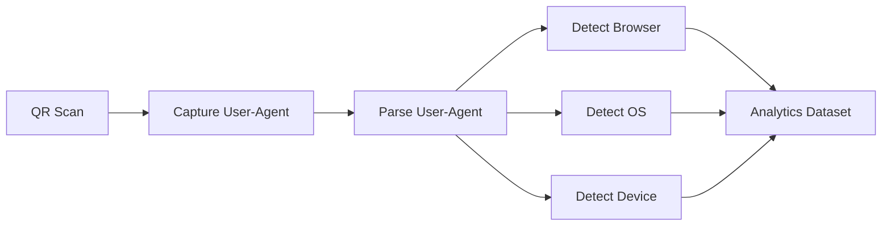
```mermaid
graph LR
    A[QR Scan] --> B[Capture User-Agent]
    B --> C[Parse User-Agent]
    C --> D[Detect Browser]
    C --> E[Detect OS]
    C --> F[Detect Device]
    D --> G[Analytics Dataset]
    E --> G
    F --> G
```

### Project Context: SQAnalytics

A Smart QR Analytics Platform built with:
- **FastAPI** - Modern Python web framework
- **PostgreSQL** - Enterprise-grade database
- **SQLAlchemy** - ORM for database interaction
- **Supabase** - PostgreSQL hosting
- **User-Agent Parsing** - Device & browser analytics

---

*"From Raw User-Agent Strings to Actionable Analytics Insights"*

</div>

---

# Learning Objectives

By completing this handbook, you will master:

### Fundamental Concepts
- **User Agent Definition** - What it is and why browsers send it
- **User-Agent Anatomy** - Understanding the string structure
- **Parsing Principles** - Extracting meaningful data
- **Analytics Enrichment** - Adding context to raw events

### Practical Skills
- **Browser Detection** - Identifying Chrome, Firefox, Safari, Edge
- **OS Detection** - Windows, macOS, Linux, Android, iOS
- **Device Classification** - Desktop, Mobile, Tablet
- **Library Usage** - user-agents and ua-parser
- **Data Enrichment** - Transforming raw data into analytics

### Production Application
- **Event Tracking** - Capturing user interactions
- **Analytics Pipelines** - Building data processing flows
- **Dashboard Data** - Preparing for visualization
- **Behavior Analytics** - Understanding user patterns

---

# Executive Summary

## The Analytics Journey

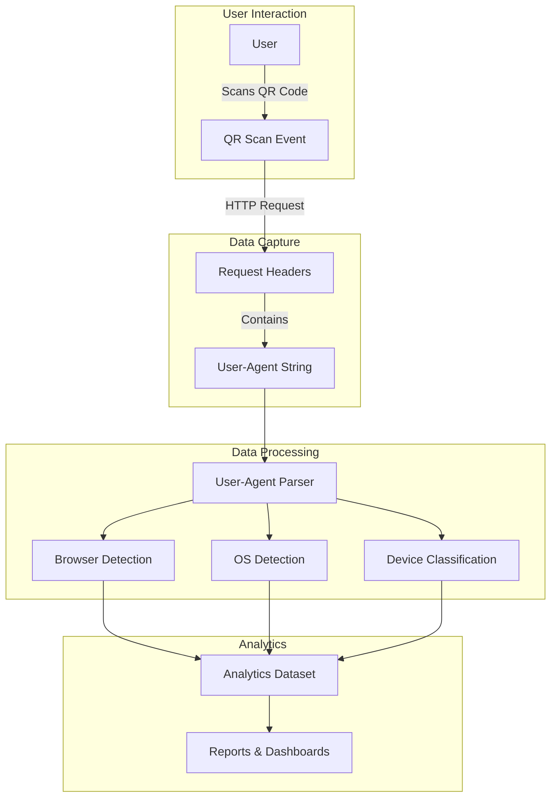
```mermaid
graph TD
    subgraph "User Interaction"
        U[User] -->|Scans QR Code| S[QR Scan Event]
    end
    
    subgraph "Data Capture"
        S -->|HTTP Request| H[Request Headers]
        H -->|Contains| UA[User-Agent String]
    end
    
    subgraph "Data Processing"
        UA --> P[User-Agent Parser]
        P --> B[Browser Detection]
        P --> O[OS Detection]
        P --> D[Device Classification]
    end
    
    subgraph "Analytics"
        B --> A[Analytics Dataset]
        O --> A
        D --> A
        A --> R[Reports & Dashboards]
    end
```

## Why User-Agent Analytics Matters

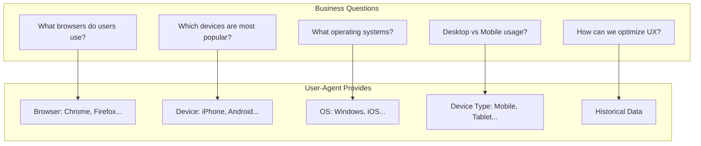
```mermaid
graph TD
    subgraph "Business Questions"
        Q1[What browsers do users use?]
        Q2[Which devices are most popular?]
        Q3[What operating systems?]
        Q4[Desktop vs Mobile usage?]
        Q5[How can we optimize UX?]
    end
    
    subgraph "User-Agent Provides"
        U1[Browser: Chrome, Firefox...]
        U2[Device: iPhone, Android...]
        U3[OS: Windows, iOS...]
        U4[Device Type: Mobile, Tablet...]
        U5[Historical Data]
    end
    
    Q1 --> U1
    Q2 --> U2
    Q3 --> U3
    Q4 --> U4
    Q5 --> U5
```

## The Complete Picture

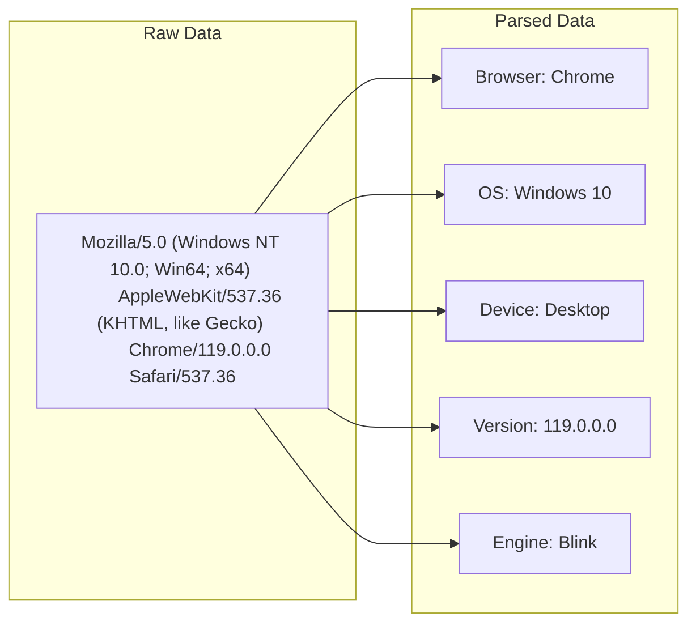
```mermaid
graph LR
    subgraph "Raw Data"
        R["Mozilla/5.0 (Windows NT 10.0; Win64; x64) 
        AppleWebKit/537.36 (KHTML, like Gecko) 
        Chrome/119.0.0.0 Safari/537.36"]
    end
    
    subgraph "Parsed Data"
        B["Browser: Chrome"]
        OS["OS: Windows 10"]
        D["Device: Desktop"]
        V["Version: 119.0.0.0"]
        E["Engine: Blink"]
    end
    
    R --> B
    R --> OS
    R --> D
    R --> V
    R --> E
```

---

# Table of Contents

1. [Section 1: What Is a User Agent?](#section-1)
2. [Section 2: Anatomy of a User-Agent String](#section-2)
3. [Section 3: Why Analytics Systems Parse User Agents](#section-3)
4. [Section 4: Browser Detection](#section-4)
5. [Section 5: Operating System Detection](#section-5)
6. [Section 6: Device Type Detection](#section-6)
7. [Section 7: User Agent Parsing Libraries](#section-7)
8. [Section 8: Analytics Data Enrichment](#section-8)
9. [Section 9: SQAnalytics Case Study](#section-9)
10. [Section 10: Common Developer Mistakes](#section-10)
11. [Section 11: Hands-On Exercises](#section-11)
12. [User Agent Analytics Roadmap](#roadmap)
13. [User Agent Cheat Sheet](#cheat-sheet)
14. [Troubleshooting Guide](#troubleshooting)
15. [Interview Preparation Guide](#interview)

---

# Section 1: What Is a User Agent?

## The Simple Explanation

A **User Agent** is a string of text that your browser sends to websites to identify itself. It tells websites:
- What browser you're using
- What operating system you're running
- What device you're on

### The Identity Card Analogy

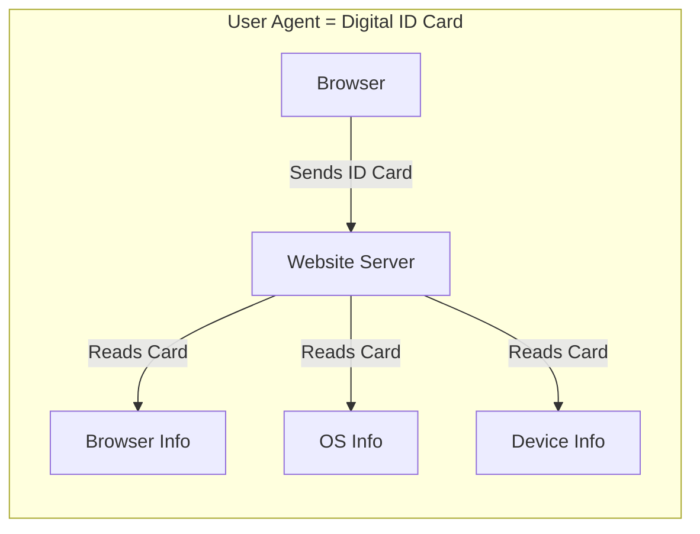
```mermaid
graph LR
    subgraph "User Agent = Digital ID Card"
        B[Browser] -->|Sends ID Card| S[Website Server]
        S -->|Reads Card| I[Browser Info]
        S -->|Reads Card| O[OS Info]
        S -->|Reads Card| D[Device Info]
    end
```

## Why Browsers Send User Agents

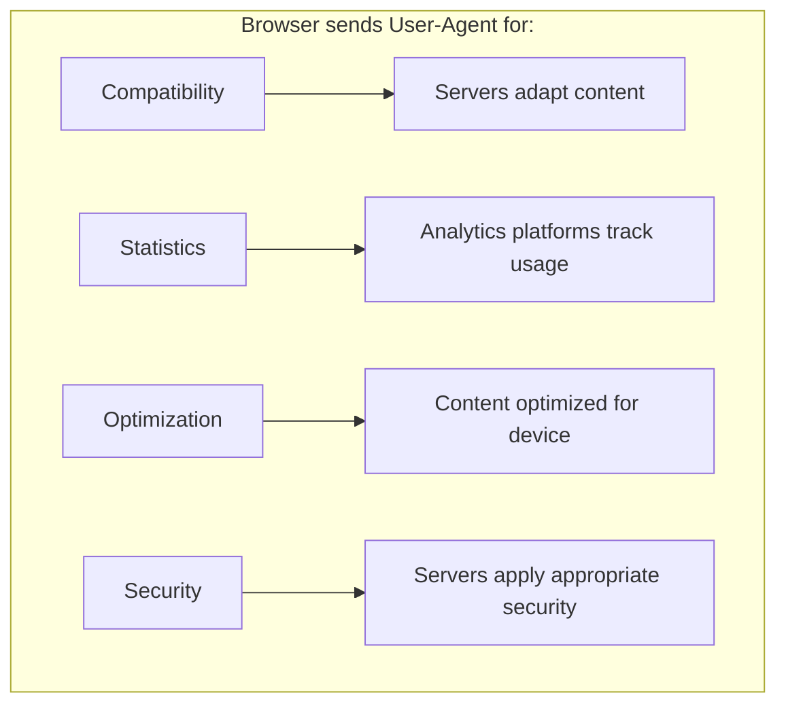
```mermaid
graph TD
    subgraph "Browser sends User-Agent for:"
        R1[Compatibility] --> E1[Servers adapt content]
        R2[Statistics] --> E2[Analytics platforms track usage]
        R3[Optimization] --> E3[Content optimized for device]
        R4[Security] --> E4[Servers apply appropriate security]
    end
```

## Real-World Example

### Chrome User-Agent

```
Mozilla/5.0 (Windows NT 10.0; Win64; x64) 
AppleWebKit/537.36 (KHTML, like Gecko) 
Chrome/119.0.0.0 Safari/537.36
```

### Firefox User-Agent

```
Mozilla/5.0 (Windows NT 10.0; Win64; x64; rv:109.0) 
Gecko/20100101 Firefox/119.0
```

### Safari User-Agent (Mac)

```
Mozilla/5.0 (Macintosh; Intel Mac OS X 10_15_7) 
AppleWebKit/605.1.15 (KHTML, like Gecko) 
Version/17.1 Safari/605.1.15
```

## User-Agent History

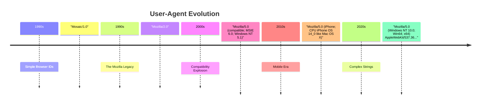
```mermaid
timeline
    title User-Agent Evolution
    1990s: Simple Browser IDs
        "Mosaic/1.0"
    1990s: The Mozilla Legacy
        "Mozilla/2.0"
    2000s: Compatibility Explosion
        "Mozilla/5.0 (compatible; MSIE 6.0; Windows NT 5.1)"
    2010s: Mobile Era
        "Mozilla/5.0 (iPhone; CPU iPhone OS 14_0 like Mac OS X)"
    2020s: Complex Strings
        "Mozilla/5.0 (Windows NT 10.0; Win64; x64) AppleWebKit/537.36..."
```

---

## 🔍 Learning Checkpoint

1. What does a User-Agent string identify?
   - a) User's name and email
   - b) Browser, OS, and device
   - c) User's location
   - d) User's browsing history

2. Why do browsers send User-Agent strings?
   - a) To identify users personally
   - b) To help servers optimize content delivery
   - c) To share passwords
   - d) To track user location

**[Answers: 1-b, 2-b]**

---

# Section 2: Anatomy of a User-Agent String

## The Structure Breakdown

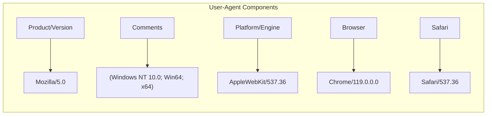
```mermaid
graph LR
    subgraph "User-Agent Components"
        P[Product/Version] --> P1["Mozilla/5.0"]
        C[Comments] --> C1["(Windows NT 10.0; Win64; x64)"]
        P2[Platform/Engine] --> P3["AppleWebKit/537.36"]
        B[Browser] --> B1["Chrome/119.0.0.0"]
        S[Safari] --> S1["Safari/537.36"]
    end
```

## Detailed Anatomy

### Complete Chrome User-Agent

```
Mozilla/5.0 (Windows NT 10.0; Win64; x64) AppleWebKit/537.36 (KHTML, like Gecko) Chrome/119.0.0.0 Safari/537.36
```

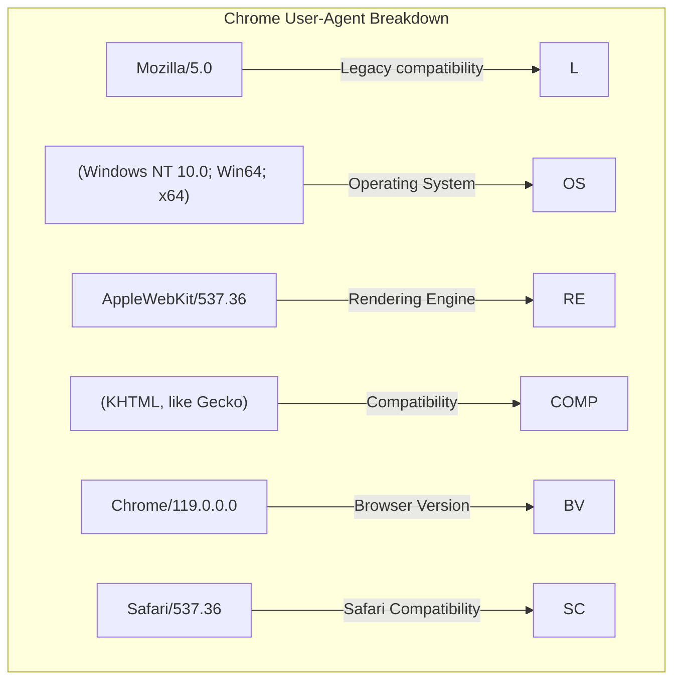
```mermaid
graph TD
    subgraph "Chrome User-Agent Breakdown"
        M["Mozilla/5.0"] -->|"Legacy compatibility"| L
        W["(Windows NT 10.0; Win64; x64)"] -->|"Operating System"| OS
        A["AppleWebKit/537.36"] -->|"Rendering Engine"| RE
        C["(KHTML, like Gecko)"] -->|"Compatibility"| COMP
        CH["Chrome/119.0.0.0"] -->|"Browser Version"| BV
        S["Safari/537.36"] -->|"Safari Compatibility"| SC
    end
```

### Firefox User-Agent Breakdown

```
Mozilla/5.0 (Windows NT 10.0; Win64; x64; rv:109.0) Gecko/20100101 Firefox/119.0
```

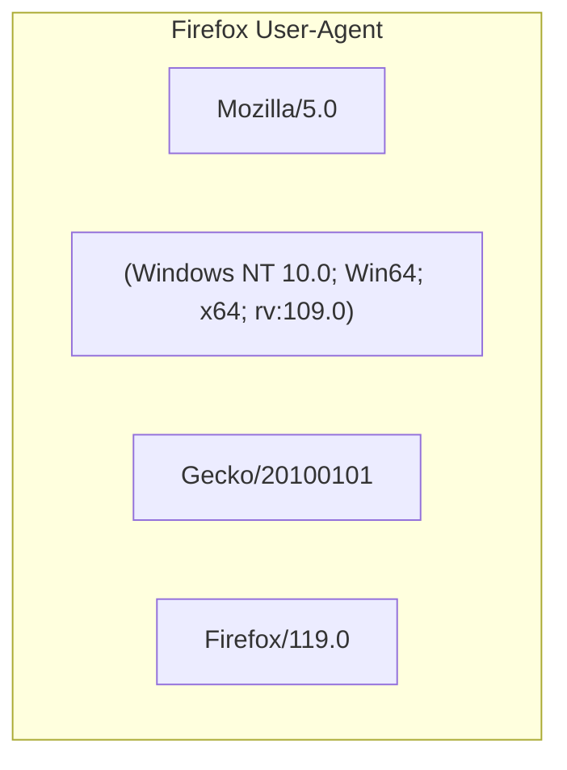
```mermaid
graph TD
    subgraph "Firefox User-Agent"
        M["Mozilla/5.0"]
        W["(Windows NT 10.0; Win64; x64; rv:109.0)"]
        G["Gecko/20100101"]
        F["Firefox/119.0"]
    end
```

### Safari User-Agent Breakdown

```
Mozilla/5.0 (Macintosh; Intel Mac OS X 10_15_7) AppleWebKit/605.1.15 (KHTML, like Gecko) Version/17.1 Safari/605.1.15
```

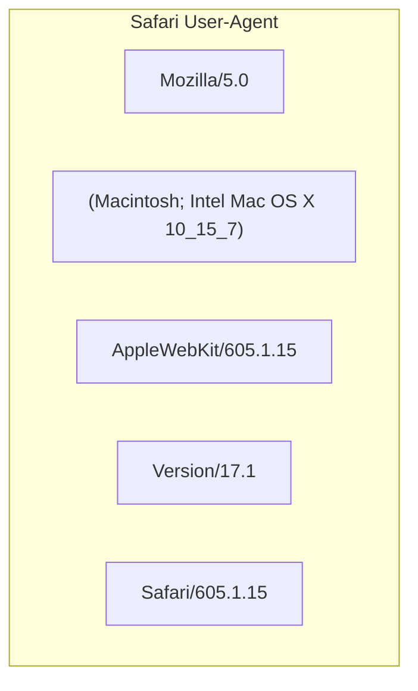
```mermaid
graph TD
    subgraph "Safari User-Agent"
        M["Mozilla/5.0"]
        P["(Macintosh; Intel Mac OS X 10_15_7)"]
        A["AppleWebKit/605.1.15"]
        V["Version/17.1"]
        S["Safari/605.1.15"]
    end
```

## Mobile User-Agents

### iPhone Safari

```
Mozilla/5.0 (iPhone; CPU iPhone OS 14_0 like Mac OS X) AppleWebKit/605.1.15 (KHTML, like Gecko) Version/14.0 Mobile/15E148 Safari/604.1
```

### Android Chrome

```
Mozilla/5.0 (Linux; Android 13; SM-G991B) AppleWebKit/537.36 (KHTML, like Gecko) Chrome/119.0.0.0 Mobile Safari/537.36
```

### Mobile Browser Indicators

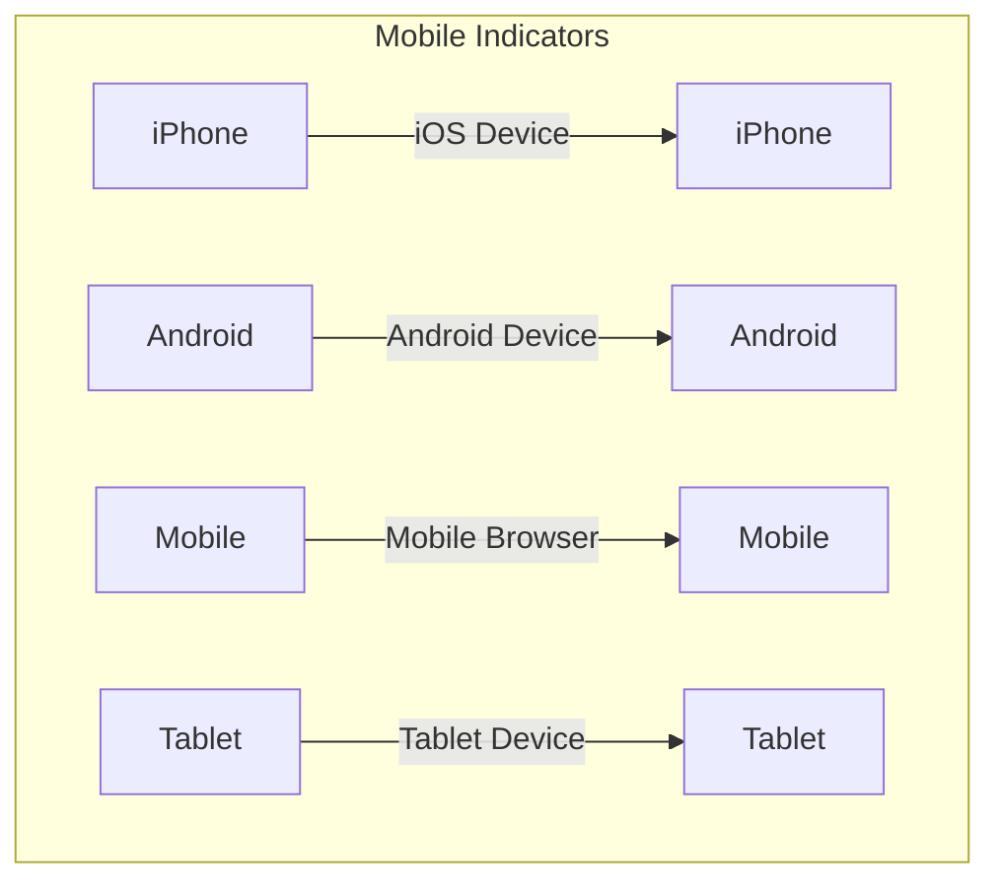
```mermaid
graph TD
    subgraph "Mobile Indicators"
        I1["iPhone"] -->|"iOS Device"| D1[iPhone]
        I2["Android"] -->|"Android Device"| D2[Android]
        I3["Mobile"] -->|"Mobile Browser"| D3[Mobile]
        I4["Tablet"] -->|"Tablet Device"| D4[Tablet]
    end
```

## Platform and Engine Detection

### Operating System Indicators

| OS | Pattern | Example |
|----|---------|---------|
| **Windows** | `Windows NT` | `Windows NT 10.0` |
| **macOS** | `Mac OS X` | `Mac OS X 10_15_7` |
| **Linux** | `Linux` | `Linux x86_64` |
| **Android** | `Android` | `Android 13` |
| **iOS** | `iPhone`, `iPad`, `iPod` | `iPhone; CPU iPhone OS 14_0` |

### Browser Engine Indicators

| Engine | Pattern | Used By |
|--------|---------|---------|
| **Blink** | `Chrome` | Chrome, Edge, Opera |
| **WebKit** | `AppleWebKit`, `Safari` | Safari, iOS browsers |
| **Gecko** | `Gecko`, `Firefox` | Firefox |
| **Trident** | `MSIE`, `Trident` | Internet Explorer |

---

## 🔍 Parsing Exercise

**Parse this User-Agent:**

```
Mozilla/5.0 (Windows NT 10.0; Win64; x64; rv:109.0) Gecko/20100101 Firefox/119.0
```

**Answer:**

| Component | Value |
|-----------|-------|
| **Browser** | Firefox |
| **Version** | 119.0 |
| **OS** | Windows 10 |
| **Platform** | x64 |
| **Engine** | Gecko |

---

# Section 3: Why Analytics Systems Parse User Agents

## The Analytics Perspective

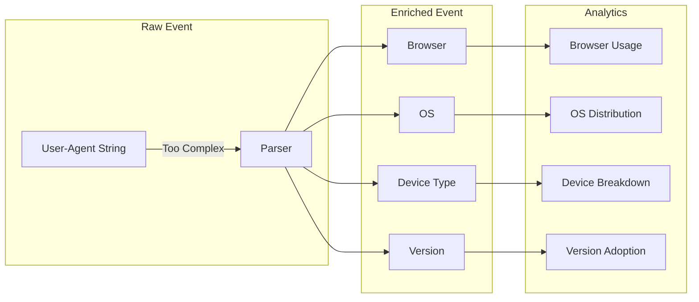
```mermaid
graph LR
    subgraph "Raw Event"
        R[User-Agent String] -->|Too Complex| P[Parser]
    end
    
    subgraph "Enriched Event"
        P --> B[Browser]
        P --> O[OS]
        P --> D[Device Type]
        P --> V[Version]
    end
    
    subgraph "Analytics"
        B --> A1[Browser Usage]
        O --> A2[OS Distribution]
        D --> A3[Device Breakdown]
        V --> A4[Version Adoption]
    end
```

## Business Value

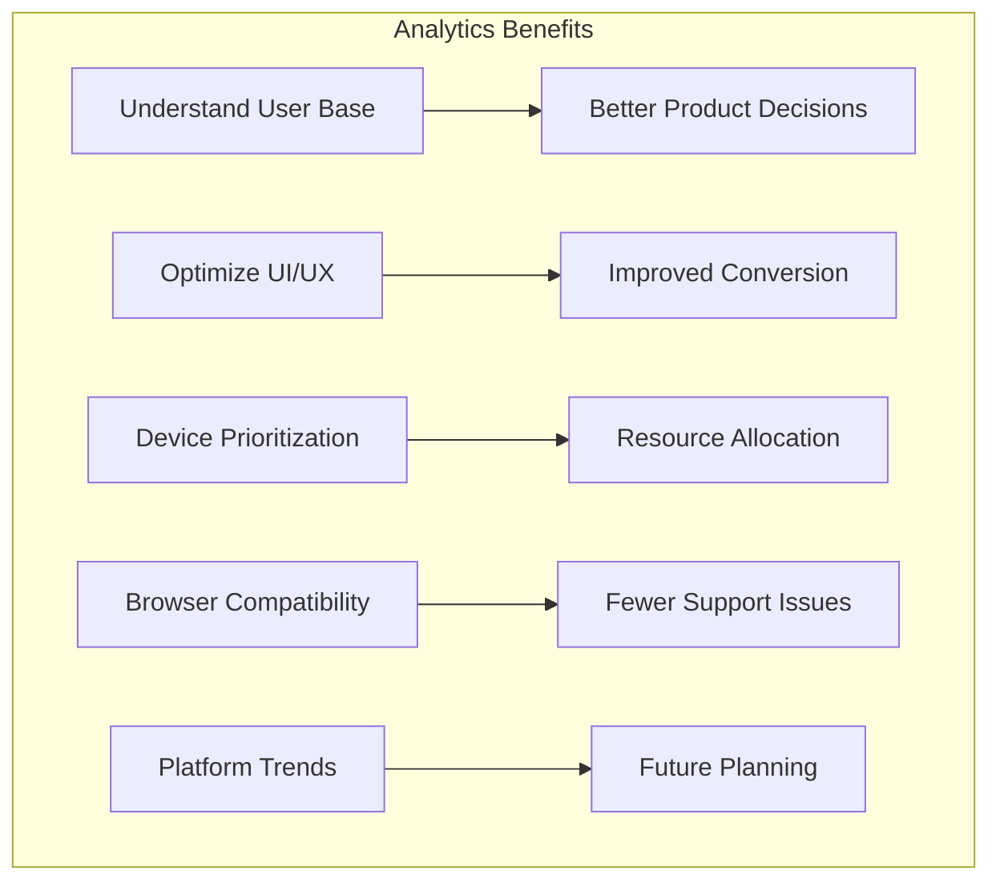
```mermaid
graph TD
    subgraph "Analytics Benefits"
        B1[Understand User Base] --> A1[Better Product Decisions]
        B2[Optimize UI/UX] --> A2[Improved Conversion]
        B3[Device Prioritization] --> A3[Resource Allocation]
        B4[Browser Compatibility] --> A4[Fewer Support Issues]
        B5[Platform Trends] --> A5[Future Planning]
    end
```

## Real-World Analytics Examples

### Google Analytics User-Agent Data

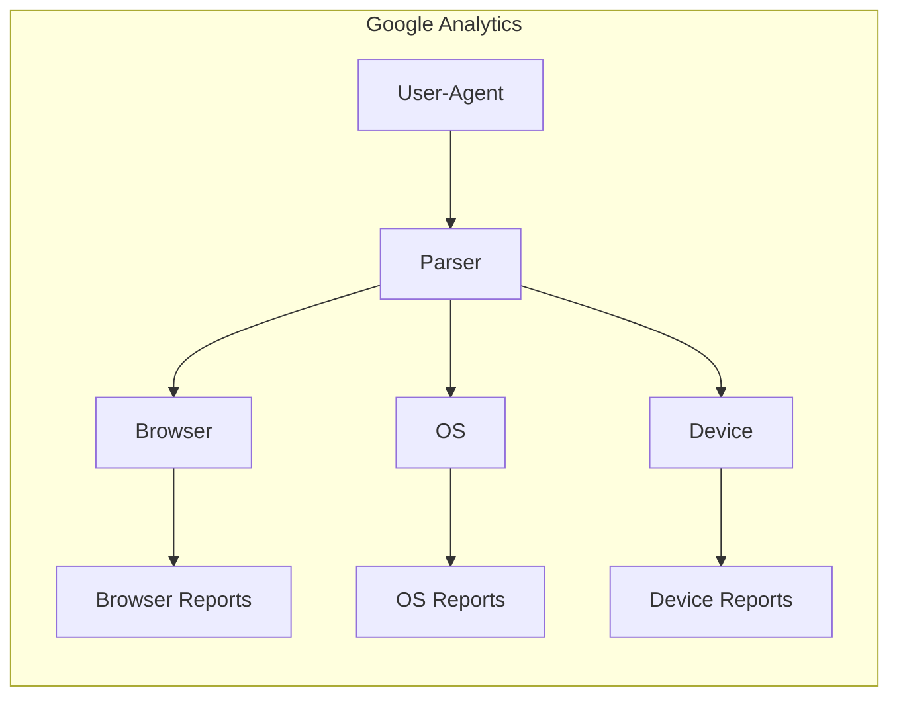
```mermaid
graph LR
    subgraph "Google Analytics"
        UA[User-Agent] --> P[Parser]
        P --> B[Browser]
        P --> O[OS]
        P --> D[Device]
        B --> R1[Browser Reports]
        O --> R2[OS Reports]
        D --> R3[Device Reports]
    end
```

### Adobe Analytics

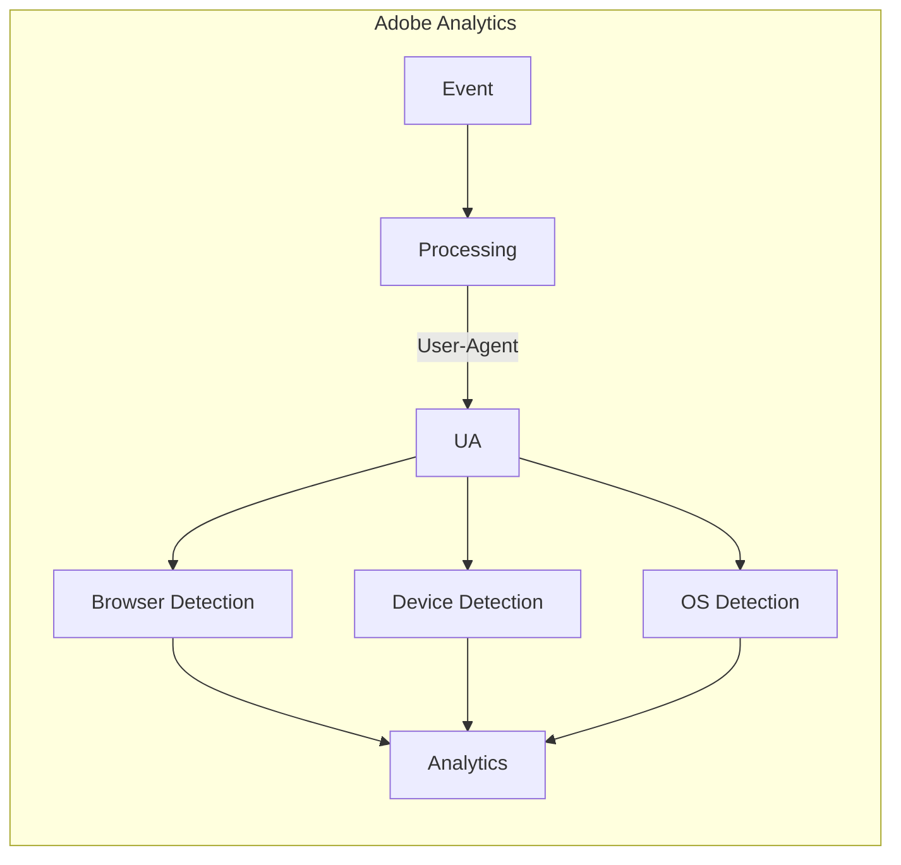
```mermaid
graph LR
    subgraph "Adobe Analytics"
        E[Event] --> P[Processing]
        P -->|User-Agent| UA
        UA --> B[Browser Detection]
        UA --> D[Device Detection]
        UA --> O[OS Detection]
        B --> A[Analytics]
        D --> A
        O --> A
    end
```

### Mixpanel & Amplitude

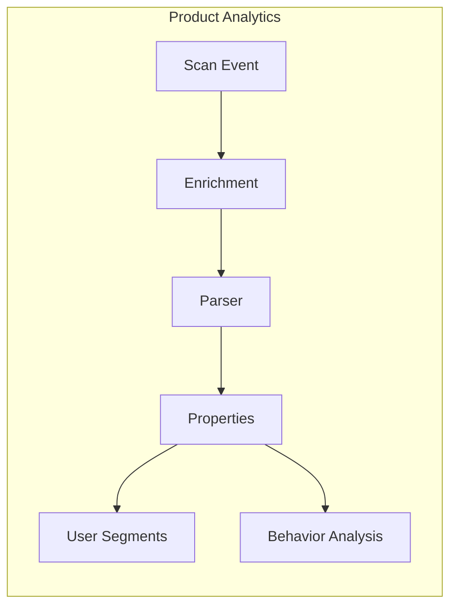
```mermaid
graph LR
    subgraph "Product Analytics"
        S[Scan Event] --> E[Enrichment]
        E --> P[Parser]
        P --> R[Properties]
        R --> F[User Segments]
        R --> G[Behavior Analysis]
    end
```

## Common Analytics Use Cases

### Use Case 1: Browser Distribution

```python
# Example analytics query
browser_stats = db.query(
    ScanEvent.browser,
    func.count(ScanEvent.id).label('count')
).group_by(ScanEvent.browser).all()

# Results:
# Chrome: 45%
# Safari: 25%
# Firefox: 15%
# Edge: 10%
# Other: 5%
```

### Use Case 2: Device Type Analysis

```python
# Device breakdown
device_stats = db.query(
    ScanEvent.device_type,
    func.count(ScanEvent.id).label('count')
).group_by(ScanEvent.device_type).all()

# Results:
# Mobile: 60%
# Desktop: 35%
# Tablet: 5%
```

### Use Case 3: OS Version Adoption

```python
# OS version trends
os_trends = db.query(
    ScanEvent.operating_system,
    func.date_trunc('month', ScanEvent.scanned_at),
    func.count(ScanEvent.id)
).group_by(ScanEvent.operating_system, 'date_trunc').all()
```

---

## 📊 Analytics Impact

| Metric | Without Parsing | With Parsing |
|--------|----------------|--------------|
| **Data Quality** | Low | High |
| **Analytics Insights** | Limited | Rich |
| **User Understanding** | Poor | Excellent |
| **Optimization** | Impossible | Targeted |
| **Business Value** | Minimal | Transformative |

---

# Section 4: Browser Detection

## Detection Process

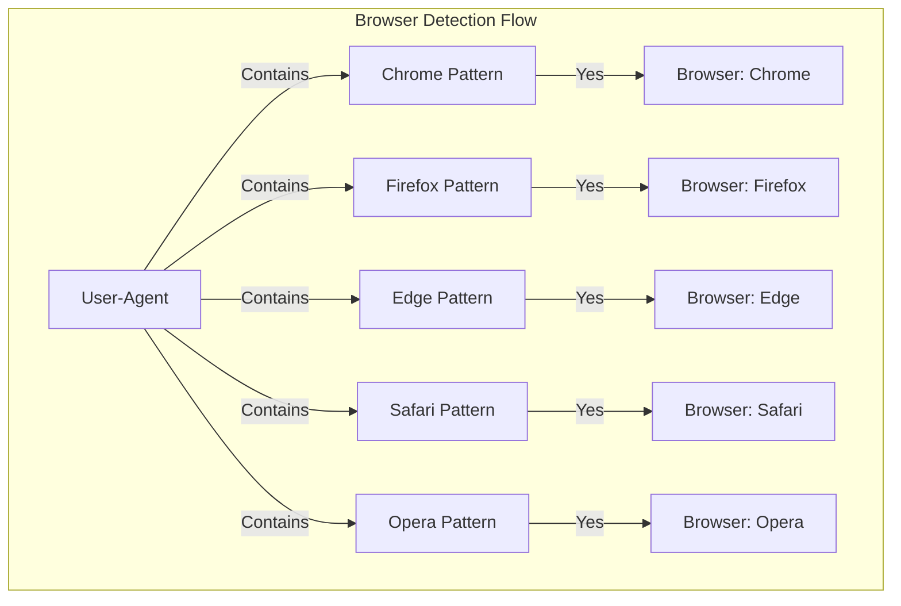
```mermaid
graph TD
    subgraph "Browser Detection Flow"
        UA[User-Agent] -->|Contains| CH[Chrome Pattern]
        UA -->|Contains| FF[Firefox Pattern]
        UA -->|Contains| ED[Edge Pattern]
        UA -->|Contains| SA[Safari Pattern]
        UA -->|Contains| OP[Opera Pattern]
        
        CH -->|Yes| R1[Browser: Chrome]
        FF -->|Yes| R2[Browser: Firefox]
        ED -->|Yes| R3[Browser: Edge]
        SA -->|Yes| R4[Browser: Safari]
        OP -->|Yes| R5[Browser: Opera]
    end
```

## Browser Detection Examples

### Chrome Detection

```python
def detect_browser(user_agent: str) -> str:
    ua_lower = user_agent.lower()
    
    if 'chrome' in ua_lower and 'safari' in ua_lower and 'edge' not in ua_lower:
        return 'Chrome'
    elif 'firefox' in ua_lower:
        return 'Firefox'
    elif 'safari' in ua_lower and 'chrome' not in ua_lower:
        return 'Safari'
    elif 'edge' in ua_lower:
        return 'Edge'
    elif 'opera' in ua_lower or 'opr' in ua_lower:
        return 'Opera'
    else:
        return 'Unknown'
```

### Browser Detection with Version

```python
import re

def detect_browser_with_version(user_agent: str):
    """
    Detect browser and extract version
    """
    patterns = {
        'Chrome': r'Chrome/(\d+\.\d+\.\d+\.\d+)',
        'Firefox': r'Firefox/(\d+\.\d+)',
        'Safari': r'Version/(\d+\.\d+)',
        'Edge': r'Edge/(\d+\.\d+\.\d+\.\d+)',
        'Opera': r'OPR/(\d+\.\d+\.\d+\.\d+)'
    }
    
    for browser, pattern in patterns.items():
        match = re.search(pattern, user_agent)
        if match:
            return browser, match.group(1)
    
    return 'Unknown', None
```

## Browser Patterns Reference

| Browser | Pattern | Example |
|---------|---------|---------|
| **Chrome** | `Chrome/xxx` | `Chrome/119.0.0.0` |
| **Firefox** | `Firefox/xxx` | `Firefox/119.0` |
| **Safari** | `Version/xxx Safari/xxx` | `Version/17.1 Safari/605.1.15` |
| **Edge** | `Edge/xxx` | `Edge/119.0.0.0` |
| **Opera** | `OPR/xxx` | `OPR/102.0.0.0` |
| **Internet Explorer** | `MSIE xxx` or `Trident/xxx` | `MSIE 11.0` |

## Detection Decision Tree

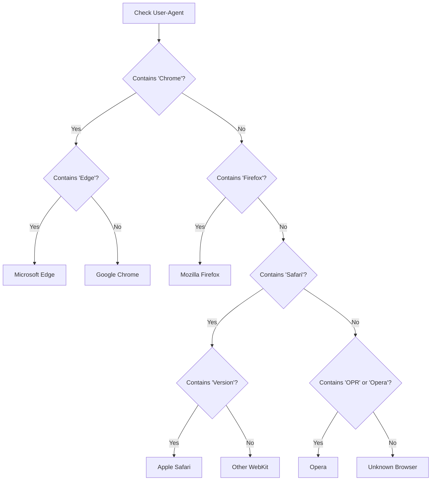
```mermaid
graph TD
    A[Check User-Agent] --> B{Contains 'Chrome'?}
    B -->|Yes| C{Contains 'Edge'?}
    C -->|Yes| D[Microsoft Edge]
    C -->|No| E[Google Chrome]
    
    B -->|No| F{Contains 'Firefox'?}
    F -->|Yes| G[Mozilla Firefox]
    F -->|No| H{Contains 'Safari'?}
    
    H -->|Yes| I{Contains 'Version'?}
    I -->|Yes| J[Apple Safari]
    I -->|No| K[Other WebKit]
    
    H -->|No| L{Contains 'OPR' or 'Opera'?}
    L -->|Yes| M[Opera]
    L -->|No| N[Unknown Browser]
```

## Browser Detection with Library

```python
from user_agents import parse

def detect_browser_from_ua(user_agent_string: str):
    ua = parse(user_agent_string)
    
    browser_info = {
        'browser': ua.browser.family,
        'browser_version': ua.browser.version_string,
        'browser_major': ua.browser.version[0] if ua.browser.version else None
    }
    
    return browser_info

# Example usage
user_agent = "Mozilla/5.0 (Windows NT 10.0; Win64; x64) AppleWebKit/537.36 (KHTML, like Gecko) Chrome/119.0.0.0 Safari/537.36"
result = detect_browser_from_ua(user_agent)
print(result)  # {'browser': 'Chrome', 'browser_version': '119.0.0.0', 'browser_major': 119}
```

---

## 🔍 Browser Detection Checkpoint

**Detect Browser:**

```
Mozilla/5.0 (Windows NT 10.0; Win64; x64; rv:109.0) Gecko/20100101 Firefox/119.0
```

**Answer:** Firefox

---

# Section 5: Operating System Detection

## OS Detection Process

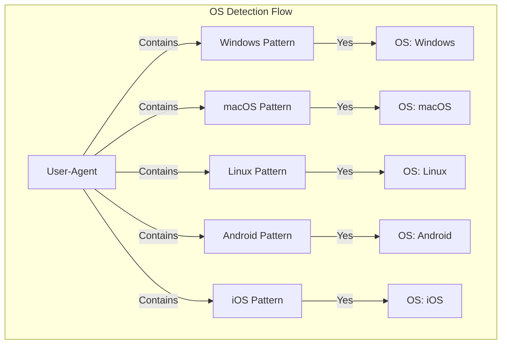
```mermaid
graph TD
    subgraph "OS Detection Flow"
        UA[User-Agent] -->|Contains| W[Windows Pattern]
        UA -->|Contains| M[macOS Pattern]
        UA -->|Contains| L[Linux Pattern]
        UA -->|Contains| A[Android Pattern]
        UA -->|Contains| I[iOS Pattern]
        
        W -->|Yes| R1[OS: Windows]
        M -->|Yes| R2[OS: macOS]
        L -->|Yes| R3[OS: Linux]
        A -->|Yes| R4[OS: Android]
        I -->|Yes| R5[OS: iOS]
    end
```

## Operating System Detection Examples

### Windows Detection

```python
import re

def detect_windows_version(user_agent: str):
    """
    Detect Windows version from User-Agent
    """
    patterns = {
        'Windows 11': r'Windows NT 10\.0',
        'Windows 10': r'Windows NT 10\.0',
        'Windows 8.1': r'Windows NT 6\.3',
        'Windows 8': r'Windows NT 6\.2',
        'Windows 7': r'Windows NT 6\.1',
        'Windows Vista': r'Windows NT 6\.0',
        'Windows XP': r'Windows NT 5\.1'
    }
    
    for os_name, pattern in patterns.items():
        if re.search(pattern, user_agent):
            return os_name
    
    return 'Unknown Windows'

# Example
ua = "Mozilla/5.0 (Windows NT 10.0; Win64; x64) AppleWebKit/537.36..."
print(detect_windows_version(ua))  # Windows 11 or 10
```

### macOS Detection

```python
def detect_macos_version(user_agent: str):
    """
    Detect macOS version from User-Agent
    """
    patterns = {
        'macOS Sonoma': r'Mac OS X 10_14',
        'macOS Ventura': r'Mac OS X 10_13',
        'macOS Monterey': r'Mac OS X 10_12',
        'macOS Big Sur': r'Mac OS X 10_11',
        'macOS Catalina': r'Mac OS X 10_15',
        'macOS Mojave': r'Mac OS X 10_14',
        'macOS High Sierra': r'Mac OS X 10_13'
    }
    
    for os_name, pattern in patterns.items():
        if re.search(pattern, user_agent):
            return os_name
    
    return 'Unknown macOS'
```

### iOS Detection

```python
def detect_ios_version(user_agent: str):
    """
    Detect iOS version from User-Agent
    """
    pattern = r'iPhone OS (\d+)_(\d+)'
    match = re.search(pattern, user_agent)
    
    if match:
        major, minor = match.groups()
        return f'iOS {major}.{minor}'
    
    if 'iPhone' in user_agent:
        return 'iOS (Unknown Version)'
    
    return 'Unknown iOS'
```

## OS Patterns Reference

| OS | Pattern | Version Example |
|----|---------|-----------------|
| **Windows 11** | `Windows NT 10.0` | 10.0 (with Win64) |
| **Windows 10** | `Windows NT 10.0` | 10.0 |
| **Windows 7** | `Windows NT 6.1` | 6.1 |
| **macOS 14** | `Mac OS X 10_14` | 10_14 |
| **macOS 15** | `Mac OS X 10_15` | 10_15 |
| **Android 13** | `Android 13` | 13 |
| **iOS 14** | `iPhone OS 14_0` | 14_0 |
| **Linux** | `Linux` | x86_64, i686 |

## OS Detection Decision Tree

```mermaid
graph TD
    A[Check User-Agent] --> B{Contains 'Windows'?}
    B -->|Yes| C[Windows]
    
    B -->|No| D{Contains 'Mac OS X'?}
    D -->|Yes| E[macOS]
    
    D -->|No| F{Contains 'Android'?}
    F -->|Yes| G[Android]
    
    F -->|No| H{Contains 'iPhone' or 'iPad'?}
    H -->|Yes| I[iOS]
    
    H -->|No| J{Contains 'Linux'?}
    J -->|Yes| K[Linux]
    J -->|No| L[Unknown OS]
```

## Complete OS Detection Function

```python
import re
from user_agents import parse

def detect_operating_system(user_agent: str) -> dict:
    """
    Comprehensive OS detection
    """
    ua = parse(user_agent)
    
    os_info = {
        'os': ua.os.family,
        'os_version': ua.os.version_string,
        'os_major': ua.os.version[0] if ua.os.version else None
    }
    
    # Additional Windows detection
    if ua.os.family == 'Windows':
        if 'Windows NT 10.0' in user_agent:
            if 'Win64' in user_agent:
                os_info['os_version'] = 'Windows 11/10 (64-bit)'
            else:
                os_info['os_version'] = 'Windows 10'
        elif 'Windows NT 6.1' in user_agent:
            os_info['os_version'] = 'Windows 7'
        elif 'Windows NT 6.2' in user_agent:
            os_info['os_version'] = 'Windows 8'
        elif 'Windows NT 6.3' in user_agent:
            os_info['os_version'] = 'Windows 8.1'
    
    return os_info

# Example usage
ua = "Mozilla/5.0 (Windows NT 10.0; Win64; x64) AppleWebKit/537.36 Chrome/119.0.0.0 Safari/537.36"
result = detect_operating_system(ua)
print(result)  # {'os': 'Windows', 'os_version': 'Windows 11/10 (64-bit)', 'os_major': 10}
```

---

## 🔍 OS Detection Checkpoint

**Detect OS:**

```
Mozilla/5.0 (Macintosh; Intel Mac OS X 10_15_7) AppleWebKit/605.1.15 (KHTML, like Gecko) Version/17.1 Safari/605.1.15
```

**Answer:** macOS (Catalina or newer)

---

# Section 6: Device Type Detection

## Device Classification

```mermaid
graph TD
    subgraph "Device Types"
        D[Device Detection] --> M[Mobile]
        D --> T[Tablet]
        D --> S[Smart TV]
        D --> G[Game Console]
        D --> W[Watch]
        
        M -->|Examples| M1["Smartphones (iOS, Android)"]
        T -->|Examples| T1["iPad, Android Tablets"]
        S -->|Examples| S1["Apple TV, Android TV"]
        G -->|Examples| G1["PlayStation, Xbox"]
        W -->|Examples| W1["Apple Watch, Wear OS"]
    end
```

## Device Type Detection Examples

### Basic Device Detection

```python
from user_agents import parse

def detect_device_type(user_agent: str) -> str:
    """
    Detect device type from User-Agent
    """
    ua = parse(user_agent)
    
    # Check for mobile
    if ua.is_mobile:
        return 'Mobile'
    # Check for tablet
    elif ua.is_tablet:
        return 'Tablet'
    # Check for PC
    elif ua.is_pc:
        return 'Desktop'
    else:
        return 'Unknown'
```

### Advanced Device Detection

```python
import re

def detect_device_type_advanced(user_agent: str) -> dict:
    """
    Advanced device detection with specifics
    """
    ua_lower = user_agent.lower()
    
    device_info = {
        'device_type': 'Unknown',
        'device_brand': 'Unknown',
        'device_model': 'Unknown'
    }
    
    # Check for mobile
    if 'mobile' in ua_lower:
        device_info['device_type'] = 'Mobile'
        
        # Android
        if 'android' in ua_lower:
            device_info['device_brand'] = 'Android'
            # Extract model
            match = re.search(r'android[\s/](\d+\.\d+)', ua_lower)
            if match:
                device_info['device_model'] = f'Android {match.group(1)}'
        
        # iPhone
        elif 'iphone' in ua_lower:
            device_info['device_brand'] = 'Apple'
            match = re.search(r'iphone os (\d+)_(\d+)', ua_lower)
            if match:
                major, minor = match.groups()
                device_info['device_model'] = f'iPhone iOS {major}.{minor}'
    
    # Check for tablet
    elif 'tablet' in ua_lower or 'ipad' in ua_lower:
        device_info['device_type'] = 'Tablet'
        
        if 'ipad' in ua_lower:
            device_info['device_brand'] = 'Apple'
            device_info['device_model'] = 'iPad'
        elif 'android' in ua_lower:
            device_info['device_brand'] = 'Android'
            device_info['device_model'] = 'Android Tablet'
    
    # Desktop
    elif 'windows' in ua_lower or 'mac os' in ua_lower or 'linux' in ua_lower:
        device_info['device_type'] = 'Desktop'
        
        if 'windows' in ua_lower:
            device_info['device_brand'] = 'PC'
            match = re.search(r'windows nt (\d+)', ua_lower)
            if match:
                version = match.group(1)
                if version == '10':
                    device_info['device_model'] = 'Windows PC'
                elif version == '6.1':
                    device_info['device_model'] = 'Windows 7 PC'
        elif 'mac os' in ua_lower:
            device_info['device_brand'] = 'Apple'
            device_info['device_model'] = 'Mac'
    
    return device_info
```

## Device Detection Decision Tree

```mermaid
graph TD
    A[User-Agent] --> B{Contains 'Mobile'?}
    B -->|Yes| C{Contains 'iPhone'?}
    C -->|Yes| D[iPhone - Mobile]
    C -->|No| E{Contains 'Android'?}
    E -->|Yes| F[Android - Mobile]
    E -->|No| G[Other Mobile]
    
    B -->|No| H{Contains 'Tablet' or 'iPad'?}
    H -->|Yes| I{Contains 'iPad'?}
    I -->|Yes| J[iPad - Tablet]
    I -->|No| K[Android Tablet]
    
    H -->|No| L{Contains 'Windows' or 'Mac OS'?}
    L -->|Yes| M[Desktop]
    L -->|No| N[Unknown]
```

## Device Type Patterns Reference

| Device Type | Pattern | Example |
|-------------|---------|---------|
| **Mobile** | `Mobile`, `iPhone`, `Android` | `Mobile Safari/604.1` |
| **Tablet** | `Tablet`, `iPad` | `iPad; CPU OS 14_0` |
| **Desktop** | `Windows`, `Mac OS`, `Linux` | `Windows NT 10.0` |
| **Smart TV** | `SmartTV`, `Apple TV` | `Apple TV; tvOS` |
| **Game Console** | `PlayStation`, `Xbox` | `PlayStation 4` |
| **Watch** | `Watch` | `Apple Watch; WatchOS` |

## Complete Device Detection Function

```python
from user_agents import parse

def detect_device_complete(user_agent: str) -> dict:
    """
    Comprehensive device detection
    """
    ua = parse(user_agent)
    
    # Basic classification
    device_type = 'Unknown'
    if ua.is_mobile:
        device_type = 'Mobile'
    elif ua.is_tablet:
        device_type = 'Tablet'
    elif ua.is_pc:
        device_type = 'Desktop'
    
    # Brand and model
    brand = 'Unknown'
    model = 'Unknown'
    
    # Extract from OS family
    if ua.os.family == 'iOS':
        if 'iPad' in user_agent:
            brand = 'Apple'
            model = 'iPad'
        else:
            brand = 'Apple'
            model = 'iPhone'
    elif ua.os.family == 'Android':
        brand = 'Android'
        model = f'Android {ua.os.version_string}'
    elif ua.os.family == 'Windows':
        brand = 'PC'
        if 'Windows NT 10.0' in user_agent:
            if 'Win64' in user_agent:
                model = 'Windows 11/10 PC (64-bit)'
            else:
                model = 'Windows 10 PC'
        elif 'Windows NT 6.1' in user_agent:
            model = 'Windows 7 PC'
        elif 'Windows NT 6.2' in user_agent:
            model = 'Windows 8 PC'
        elif 'Windows NT 6.3' in user_agent:
            model = 'Windows 8.1 PC'
    elif ua.os.family == 'Mac OS X':
        brand = 'Apple'
        model = 'Mac'
    elif ua.os.family == 'Linux':
        brand = 'Linux'
        model = 'Linux PC'
    
    return {
        'device_type': device_type,
        'brand': brand,
        'model': model
    }

# Example usage
ua = "Mozilla/5.0 (iPhone; CPU iPhone OS 14_0 like Mac OS X) AppleWebKit/605.1.15 (KHTML, like Gecko) Version/14.0 Mobile/15E148 Safari/604.1"
result = detect_device_complete(ua)
print(result)  # {'device_type': 'Mobile', 'brand': 'Apple', 'model': 'iPhone'}
```

---

## 📊 Device Type Summary

| Device Type | Detection Method | Data Enrichment |
|-------------|------------------|-----------------|
| **Mobile** | `is_mobile` flag | Brand, Model, OS |
| **Tablet** | `is_tablet` flag | Brand, Model, OS |
| **Desktop** | `is_pc` flag | OS, Platform |
| **Smart TV** | Custom detection | TV Platform |
| **Console** | Custom detection | Console Type |
| **Watch** | Custom detection | Watch Model |

---

# Section 7: User Agent Parsing Libraries

## Library Comparison

```mermaid
graph LR
    subgraph "Python Libraries"
        UA["user-agents"] -->|Simple| E1["Easy to use"]
        UA -->|Popular| E2["Well maintained"]
        
        P["ua-parser"] -->|Standard| E3["Industry standard"]
        P -->|Database| E4["Updated frequently"]
        
        C["Custom"] -->|Control| E5["Full control"]
        C -->|Complex| E6["Maintenance burden"]
    end
```

## 1. User-Agents Library

### Installation

```bash
pip install user-agents
```

### Basic Usage

```python
from user_agents import parse

def parse_user_agent(ua_string: str):
    """
    Parse User-Agent using user-agents library
    """
    ua = parse(ua_string)
    
    return {
        'browser': ua.browser.family,
        'browser_version': ua.browser.version_string,
        'os': ua.os.family,
        'os_version': ua.os.version_string,
        'device_type': 'Mobile' if ua.is_mobile else 'Tablet' if ua.is_tablet else 'Desktop' if ua.is_pc else 'Unknown'
    }

# Example
ua_string = "Mozilla/5.0 (Windows NT 10.0; Win64; x64) AppleWebKit/537.36 (KHTML, like Gecko) Chrome/119.0.0.0 Safari/537.36"
result = parse_user_agent(ua_string)
print(result)
```

### Advanced Features

```python
from user_agents import parse

def enrich_scan_event(user_agent: str) -> dict:
    """
    Enrich scan event with user-agent data
    """
    ua = parse(user_agent)
    
    enrichment = {
        # Browser
        'browser': ua.browser.family,
        'browser_version': ua.browser.version_string,
        'browser_major': ua.browser.version[0] if ua.browser.version else None,
        'browser_minor': ua.browser.version[1] if len(ua.browser.version) > 1 else None,
        
        # Operating System
        'operating_system': ua.os.family,
        'os_version': ua.os.version_string,
        'os_major': ua.os.version[0] if ua.os.version else None,
        
        # Device
        'device_type': 'Mobile' if ua.is_mobile else 'Tablet' if ua.is_tablet else 'Desktop' if ua.is_pc else 'Unknown',
        'device_brand': ua.device.brand,
        'device_model': ua.device.model,
        
        # Additional
        'is_mobile': ua.is_mobile,
        'is_tablet': ua.is_tablet,
        'is_pc': ua.is_pc,
        'is_bot': ua.is_bot,
        'language': None,  # Not available in user-agents
    }
    
    return enrichment
```

## 2. UA-Parser Library

### Installation

```bash
pip install ua-parser
```

### Basic Usage

```python
from ua_parser import user_agent_parser

def parse_ua_parser(ua_string: str):
    """
    Parse User-Agent using ua-parser
    """
    parsed = user_agent_parser.Parse(ua_string)
    
    return {
        'browser': parsed['user_agent']['family'],
        'browser_version': parsed['user_agent']['major'],
        'os': parsed['os']['family'],
        'os_version': f"{parsed['os']['major']}.{parsed['os']['minor']}",
        'device': parsed['device']['family']
    }

# Example
ua_string = "Mozilla/5.0 (Windows NT 10.0; Win64; x64) AppleWebKit/537.36 Chrome/119.0.0.0 Safari/537.36"
result = parse_ua_parser(ua_string)
print(result)
```

### Advanced Features

```python
from ua_parser import user_agent_parser

def enrich_with_ua_parser(user_agent: str) -> dict:
    """
    Enrich data using ua-parser
    """
    parsed = user_agent_parser.Parse(user_agent)
    
    return {
        'browser': parsed['user_agent']['family'],
        'browser_version': parsed['user_agent']['major'],
        'browser_minor': parsed['user_agent']['minor'],
        'browser_patch': parsed['user_agent']['patch'],
        
        'os': parsed['os']['family'],
        'os_version': parsed['os']['major'],
        'os_minor': parsed['os']['minor'],
        'os_patch': parsed['os']['patch'],
        'os_patch_minor': parsed['os']['patch_minor'],
        
        'device': parsed['device']['family'],
        'device_brand': parsed['device']['brand'],
        'device_model': parsed['device']['model'],
    }
```

## 3. Custom Parser Implementation

### Simple Custom Parser

```python
import re

class SimpleUserAgentParser:
    """
    Custom User-Agent parser for common cases
    """
    
    def __init__(self):
        self.browser_patterns = {
            'Chrome': r'Chrome/(\d+\.\d+\.\d+\.\d+)',
            'Firefox': r'Firefox/(\d+\.\d+)',
            'Safari': r'Version/(\d+\.\d+) Safari/',
            'Edge': r'Edge/(\d+\.\d+\.\d+\.\d+)',
            'Opera': r'OPR/(\d+\.\d+\.\d+\.\d+)',
            'Internet Explorer': r'MSIE (\d+\.\d+)'
        }
        
        self.os_patterns = {
            'Windows 11': r'Windows NT 10\.0',
            'Windows 10': r'Windows NT 10\.0',
            'Windows 7': r'Windows NT 6\.1',
            'macOS Sonoma': r'Mac OS X 10_14',
            'macOS Ventura': r'Mac OS X 10_13',
            'Android': r'Android (\d+\.\d+)',
            'iOS': r'iPhone OS (\d+)_(\d+)'
        }
        
        self.device_patterns = {
            'Mobile': r'(Mobile|iPhone|Android)',
            'Tablet': r'(Tablet|iPad)',
            'Desktop': r'(Windows|Mac OS|Linux)'
        }
    
    def parse_browser(self, user_agent: str) -> dict:
        """Extract browser information"""
        for browser, pattern in self.browser_patterns.items():
            match = re.search(pattern, user_agent)
            if match:
                return {
                    'browser': browser,
                    'version': match.group(1)
                }
        return {'browser': 'Unknown', 'version': None}
    
    def parse_os(self, user_agent: str) -> dict:
        """Extract operating system information"""
        for os_name, pattern in self.os_patterns.items():
            match = re.search(pattern, user_agent)
            if match:
                return {
                    'os': os_name,
                    'version': match.group(1) if match.groups() else None
                }
        return {'os': 'Unknown', 'version': None}
    
    def parse_device(self, user_agent: str) -> str:
        """Extract device type"""
        ua_lower = user_agent.lower()
        if 'mobile' in ua_lower or 'iphone' in ua_lower or 'android' in ua_lower:
            return 'Mobile'
        elif 'tablet' in ua_lower or 'ipad' in ua_lower:
            return 'Tablet'
        elif 'windows' in ua_lower or 'mac os' in ua_lower:
            return 'Desktop'
        return 'Unknown'
    
    def parse(self, user_agent: str) -> dict:
        """Complete parse"""
        return {
            'browser_info': self.parse_browser(user_agent),
            'os_info': self.parse_os(user_agent),
            'device_type': self.parse_device(user_agent)
        }

# Usage
parser = SimpleUserAgentParser()
ua_string = "Mozilla/5.0 (Windows NT 10.0; Win64; x64) AppleWebKit/537.36 (KHTML, like Gecko) Chrome/119.0.0.0 Safari/537.36"
result = parser.parse(ua_string)
print(result)
```

## Library Comparison Table

| Feature | user-agents | ua-parser | Custom |
|---------|-------------|-----------|--------|
| **Ease of Use** | Excellent | Good | Depends |
| **Maintenance** | Automatic | Automatic | Manual |
| **Accuracy** | Good | Excellent | Variable |
| **Speed** | Fast | Fast | Fast |
| **Customization** | Limited | Limited | Full |
| **Database Updates** | Package updates | Package updates | Manual |
| **Bot Detection** | Yes | Limited | Manual |
| **Browser Version** | String | Major/Minor | Custom |

---

## 🎯 Library Selection Guide

```mermaid
graph TD
    Q1[What's your use case?]
    
    Q1 -->|Quick analytics| UA[user-agents]
    Q1 -->|Production quality| UP[ua-parser]
    Q1 -->|Special requirements| C[Custom]
    
    UA --> R1["Pros: Easy, Pythonic"]
    UP --> R2["Pros: Accurate, Standard"]
    C --> R3["Pros: Full control"]
    
    UA --> W1["Cons: Less detailed"]
    UP --> W2["Cons: More complex"]
    C --> W3["Cons: Maintenance"]
```

---

# Section 8: Analytics Data Enrichment

## The Enrichment Pipeline

```mermaid
graph TD
    subgraph "Raw Event"
        E[QR Scan Event] --> R1["id: 1"]
        R1 --> R2["timestamp: 2024-01-01 10:00:00"]
        R1 --> R3["qr_code_id: 1"]
        R1 --> R4["user_agent: Mozilla/5.0..."]
        R1 --> R5["ip_address: 192.168.1.1"]
    end
    
    subgraph "Enrichment Pipeline"
        R4 --> P[User-Agent Parser]
        P --> B[Browser Detection]
        P --> O[OS Detection]
        P --> D[Device Detection]
    end
    
    subgraph "Enriched Event"
        E2[Enriched Scan Event] --> I1["id: 1"]
        I1 --> I2["timestamp: 2024-01-01 10:00:00"]
        I1 --> I3["qr_code_id: 1"]
        I1 --> I4["browser: Chrome"]
        I1 --> I5["browser_version: 119.0"]
        I1 --> I6["os: Windows 10"]
        I1 --> I7["device_type: Desktop"]
        I1 --> I8["ip_address: 192.168.1.1"]
    end
```

## Data Enrichment Implementation

### Complete Enrichment Function

```python
from datetime import datetime
from typing import Optional
from user_agents import parse

def enrich_scan_event(
    qr_code_id: int,
    user_agent: Optional[str],
    ip_address: Optional[str],
    timestamp: datetime = None
) -> dict:
    """
    Enrich a scan event with user-agent data
    """
    if timestamp is None:
        timestamp = datetime.utcnow()
    
    # Base event data
    event = {
        'qr_code_id': qr_code_id,
        'scanned_at': timestamp,
        'ip_address': ip_address,
        'user_agent': user_agent,
    }
    
    # Parse user-agent if present
    if user_agent:
        try:
            ua = parse(user_agent)
            
            # Browser
            event['browser'] = ua.browser.family
            event['browser_version'] = ua.browser.version_string
            event['browser_major'] = ua.browser.version[0] if ua.browser.version else None
            
            # Operating System
            event['operating_system'] = ua.os.family
            event['os_version'] = ua.os.version_string
            event['os_major'] = ua.os.version[0] if ua.os.version else None
            
            # Device
            if ua.is_mobile:
                event['device_type'] = 'Mobile'
            elif ua.is_tablet:
                event['device_type'] = 'Tablet'
            elif ua.is_pc:
                event['device_type'] = 'Desktop'
            else:
                event['device_type'] = 'Unknown'
            
            event['device_brand'] = ua.device.brand
            event['device_model'] = ua.device.model
            
            # Additional flags
            event['is_mobile'] = ua.is_mobile
            event['is_tablet'] = ua.is_tablet
            event['is_pc'] = ua.is_pc
            event['is_bot'] = ua.is_bot
            
        except Exception as e:
            # Handle parsing errors gracefully
            event['parse_error'] = str(e)
            event['browser'] = 'Unknown'
            event['operating_system'] = 'Unknown'
            event['device_type'] = 'Unknown'
    else:
        # No user-agent provided
        event['browser'] = 'Unknown'
        event['operating_system'] = 'Unknown'
        event['device_type'] = 'Unknown'
        event['is_bot'] = False
    
    return event
```

### Database Integration

```python
from sqlalchemy.orm import Session
from models import ScanEvent, QRCode

def record_scan_event(
    db: Session,
    qr_code_id: int,
    user_agent: Optional[str],
    ip_address: Optional[str]
) -> dict:
    """
    Record and enrich a scan event in the database
    """
    # Get QR code
    qr_code = db.get(QRCode, qr_code_id)
    if not qr_code:
        return {'error': 'QR code not found'}
    
    # Enrich event
    enriched_event = enrich_scan_event(
        qr_code_id=qr_code_id,
        user_agent=user_agent,
        ip_address=ip_address
    )
    
    # Create database record
    scan = ScanEvent(
        qr_code_id=enriched_event['qr_code_id'],
        scanned_at=enriched_event['scanned_at'],
        ip_address=enriched_event['ip_address'],
        user_agent=enriched_event['user_agent'],
        browser=enriched_event['browser'],
        browser_version=enriched_event.get('browser_version'),
        browser_major=enriched_event.get('browser_major'),
        operating_system=enriched_event['operating_system'],
        os_version=enriched_event.get('os_version'),
        os_major=enriched_event.get('os_major'),
        device_type=enriched_event['device_type'],
        device_brand=enriched_event.get('device_brand'),
        device_model=enriched_event.get('device_model'),
        is_mobile=enriched_event.get('is_mobile', False),
        is_tablet=enriched_event.get('is_tablet', False),
        is_pc=enriched_event.get('is_pc', False),
        is_bot=enriched_event.get('is_bot', False)
    )
    
    # Save to database
    db.add(scan)
    db.commit()
    db.refresh(scan)
    
    return enriched_event
```

## Analytics-Ready Dataset

### Creating Analytics Views

```python
from sqlalchemy import func, and_
from sqlalchemy.orm import Session

class ScanAnalytics:
    """
    Analytics queries for scan data
    """
    
    def __init__(self, db: Session):
        self.db = db
    
    def get_browser_distribution(self, date_range: tuple = None):
        """
        Get browser usage distribution
        """
        query = self.db.query(
            ScanEvent.browser,
            func.count(ScanEvent.id).label('count'),
            func.count(ScanEvent.id) * 100.0 / 
                self.db.query(func.count(ScanEvent.id)).scalar()
            .label('percentage')
        ).group_by(ScanEvent.browser)
        
        if date_range:
            start_date, end_date = date_range
            query = query.filter(
                and_(
                    ScanEvent.scanned_at >= start_date,
                    ScanEvent.scanned_at <= end_date
                )
            )
        
        return query.all()
    
    def get_device_trends(self):
        """
        Get device type trends over time
        """
        query = self.db.query(
            func.date_trunc('day', ScanEvent.scanned_at).label('date'),
            ScanEvent.device_type,
            func.count(ScanEvent.id).label('count')
        ).group_by(
            func.date_trunc('day', ScanEvent.scanned_at),
            ScanEvent.device_type
        ).order_by('date')
        
        return query.all()
    
    def get_os_distribution(self):
        """
        Get operating system distribution
        """
        query = self.db.query(
            ScanEvent.operating_system,
            func.count(ScanEvent.id).label('count')
        ).filter(
            ScanEvent.is_bot == False
        ).group_by(ScanEvent.operating_system)
        
        return query.all()
    
    def get_device_type_analytics(self):
        """
        Get comprehensive device analytics
        """
        query = self.db.query(
            ScanEvent.device_type,
            func.count(ScanEvent.id).label('total_scans'),
            func.count(
                func.distinct(ScanEvent.ip_address)
            ).label('unique_ips'),
            func.avg(ScanEvent.id).label('avg_scans_per_user')
        ).group_by(ScanEvent.device_type)
        
        return query.all()
```

### Analytics Dashboard Data

```python
from typing import Dict

def generate_analytics_dashboard(db: Session) -> Dict:
    """
    Generate comprehensive analytics dashboard data
    """
    analytics = ScanAnalytics(db)
    
    return {
        'browser_distribution': analytics.get_browser_distribution(),
        'os_distribution': analytics.get_os_distribution(),
        'device_trends': analytics.get_device_trends(),
        'device_type_analytics': analytics.get_device_type_analytics(),
        'total_scans': db.query(func.count(ScanEvent.id)).scalar(),
        'unique_users': db.query(
            func.count(func.distinct(ScanEvent.ip_address))
        ).scalar(),
        'bot_percentage': (
            db.query(func.count(ScanEvent.id))
            .filter(ScanEvent.is_bot == True).scalar() /
            db.query(func.count(ScanEvent.id)).scalar() * 100
        )
    }
```

---

## 📊 Before vs After Enrichment

### Before Enrichment

```python
{
    'id': 1,
    'qr_code_id': 1,
    'scanned_at': '2024-01-01 10:00:00',
    'user_agent': 'Mozilla/5.0 (Windows NT 10.0; Win64; x64) AppleWebKit/537.36 (KHTML, like Gecko) Chrome/119.0.0.0 Safari/537.36',
    'ip_address': '192.168.1.1'
}
```

### After Enrichment

```python
{
    'id': 1,
    'qr_code_id': 1,
    'scanned_at': '2024-01-01 10:00:00',
    'user_agent': 'Mozilla/5.0 (Windows NT 10.0; Win64; x64) AppleWebKit/537.36 (KHTML, like Gecko) Chrome/119.0.0.0 Safari/537.36',
    'ip_address': '192.168.1.1',
    'browser': 'Chrome',
    'browser_version': '119.0.0.0',
    'browser_major': 119,
    'operating_system': 'Windows',
    'os_version': '10',
    'os_major': 10,
    'device_type': 'Desktop',
    'device_brand': 'PC',
    'device_model': 'Windows 10',
    'is_mobile': False,
    'is_tablet': False,
    'is_pc': True,
    'is_bot': False
}
```

---

# Section 9: SQAnalytics Case Study

## Complete SQAnalytics Tracking Implementation

### Architecture Overview

```mermaid
graph TD
    subgraph "User Interaction"
        U[User] -->|Scans QR| S[QR Scan]
    end
    
    subgraph "Data Capture"
        S -->|HTTP Request| F[FastAPI Endpoint]
        F -->|Extract| H[Headers]
        H -->|Contains| UA[User-Agent]
    end
    
    subgraph "Processing"
        UA --> P[User-Agent Parser]
        P -->|Parse| E[Enrichment]
        E -->|Database| DB[PostgreSQL]
    end
    
    subgraph "Analytics"
        DB -->|Query| A[Analytics]
        A -->|Generate| R[Reports]
        R -->|Display| D[Dashboard]
    end
```

### 1. Database Models

```python
from sqlalchemy import Column, Integer, String, DateTime, Boolean, ForeignKey, JSON
from sqlalchemy.orm import declarative_base
from datetime import datetime

Base = declarative_base()

class ScanEvent(Base):
    """Complete scan event model with enriched fields"""
    __tablename__ = "scan_events"
    
    # Primary key
    id = Column(Integer, primary_key=True, index=True)
    
    # Relationships
    qr_code_id = Column(Integer, ForeignKey("qr_codes.id"), nullable=False)
    
    # Raw data
    user_agent = Column(String, nullable=True)
    ip_address = Column(String(45), nullable=True)
    
    # Enriched browser data
    browser = Column(String(50), nullable=True)
    browser_version = Column(String(20), nullable=True)
    browser_major = Column(Integer, nullable=True)
    
    # Enriched OS data
    operating_system = Column(String(50), nullable=True)
    os_version = Column(String(20), nullable=True)
    os_major = Column(Integer, nullable=True)
    
    # Enriched device data
    device_type = Column(String(20), nullable=True)
    device_brand = Column(String(50), nullable=True)
    device_model = Column(String(100), nullable=True)
    
    # Flags
    is_mobile = Column(Boolean, default=False)
    is_tablet = Column(Boolean, default=False)
    is_pc = Column(Boolean, default=False)
    is_bot = Column(Boolean, default=False)
    
    # Timestamps
    scanned_at = Column(DateTime, default=datetime.utcnow)
    created_at = Column(DateTime, default=datetime.utcnow)
    
    # Additional metadata
    metadata = Column(JSON, nullable=True)
    
    # Indexes for analytics
    __table_args__ = (
        Index('idx_scan_event_browser', 'browser'),
        Index('idx_scan_event_os', 'operating_system'),
        Index('idx_scan_event_device', 'device_type'),
        Index('idx_scan_event_scanned', 'scanned_at'),
        Index('idx_scan_event_qr_code', 'qr_code_id'),
    )
```

### 2. FastAPI Endpoint

```python
from fastapi import FastAPI, Request, Depends
from sqlalchemy.orm import Session
from datetime import datetime

app = FastAPI()

@app.post("/scan/{qr_code_id}")
async def track_scan(
    qr_code_id: int,
    request: Request,
    db: Session = Depends(get_db)
):
    """
    Track a QR code scan with full enrichment
    """
    # Get QR code
    qr_code = db.get(QRCode, qr_code_id)
    if not qr_code:
        raise HTTPException(404, "QR Code not found")
    
    # Extract request data
    user_agent = request.headers.get("user-agent")
    ip_address = request.client.host
    
    # Parse and enrich
    enriched = enrich_scan_event(
        qr_code_id=qr_code_id,
        user_agent=user_agent,
        ip_address=ip_address
    )
    
    # Create scan event
    scan = ScanEvent(
        qr_code_id=enriched['qr_code_id'],
        user_agent=enriched['user_agent'],
        ip_address=enriched['ip_address'],
        scanned_at=enriched['scanned_at'],
        browser=enriched['browser'],
        browser_version=enriched.get('browser_version'),
        browser_major=enriched.get('browser_major'),
        operating_system=enriched['operating_system'],
        os_version=enriched.get('os_version'),
        os_major=enriched.get('os_major'),
        device_type=enriched['device_type'],
        device_brand=enriched.get('device_brand'),
        device_model=enriched.get('device_model'),
        is_mobile=enriched.get('is_mobile', False),
        is_tablet=enriched.get('is_tablet', False),
        is_pc=enriched.get('is_pc', False),
        is_bot=enriched.get('is_bot', False),
        metadata={
            'referrer': request.headers.get("referer"),
            'accept_language': request.headers.get("accept-language")
        }
    )
    
    db.add(scan)
    db.commit()
    db.refresh(scan)
    
    # Update QR code scan count
    qr_code.scan_count = (qr_code.scan_count or 0) + 1
    db.commit()
    
    # Redirect to destination
    return {"message": "Scan recorded", "scan_id": scan.id}
```

### 3. Enrichment Service

```python
from user_agents import parse
from typing import Optional, Dict
from datetime import datetime

class UserAgentEnricher:
    """
    Service for enriching user-agent data
    """
    
    @staticmethod
    def enrich(user_agent: Optional[str]) -> Dict:
        """
        Enrich user-agent string with parsed data
        """
        result = {
            'browser': None,
            'browser_version': None,
            'browser_major': None,
            'operating_system': None,
            'os_version': None,
            'os_major': None,
            'device_type': None,
            'device_brand': None,
            'device_model': None,
            'is_mobile': False,
            'is_tablet': False,
            'is_pc': False,
            'is_bot': False
        }
        
        if not user_agent:
            return result
        
        try:
            ua = parse(user_agent)
            
            # Browser
            result['browser'] = ua.browser.family
            result['browser_version'] = ua.browser.version_string
            result['browser_major'] = ua.browser.version[0] if ua.browser.version else None
            
            # OS
            result['operating_system'] = ua.os.family
            result['os_version'] = ua.os.version_string
            result['os_major'] = ua.os.version[0] if ua.os.version else None
            
            # Device
            if ua.is_mobile:
                result['device_type'] = 'Mobile'
            elif ua.is_tablet:
                result['device_type'] = 'Tablet'
            elif ua.is_pc:
                result['device_type'] = 'Desktop'
            else:
                result['device_type'] = 'Unknown'
            
            result['device_brand'] = ua.device.brand
            result['device_model'] = ua.device.model
            
            # Flags
            result['is_mobile'] = ua.is_mobile
            result['is_tablet'] = ua.is_tablet
            result['is_pc'] = ua.is_pc
            result['is_bot'] = ua.is_bot
            
        except Exception as e:
            result['parse_error'] = str(e)
        
        return result

def enrich_scan_event(
    qr_code_id: int,
    user_agent: Optional[str],
    ip_address: Optional[str],
    timestamp: Optional[datetime] = None
) -> Dict:
    """
    Complete scan event enrichment
    """
    if timestamp is None:
        timestamp = datetime.utcnow()
    
    # Base event
    event = {
        'qr_code_id': qr_code_id,
        'scanned_at': timestamp,
        'user_agent': user_agent,
        'ip_address': ip_address
    }
    
    # Enrich with user-agent data
    enricher = UserAgentEnricher()
    enrichment = enricher.enrich(user_agent)
    event.update(enrichment)
    
    return event
```

### 4. Analytics Endpoints

```python
from fastapi import FastAPI, Depends, Query
from typing import Optional
from datetime import datetime, timedelta

@app.get("/analytics/browser-distribution")
async def get_browser_distribution(
    days: int = Query(30, ge=1, le=365),
    db: Session = Depends(get_db)
):
    """
    Get browser distribution for the last N days
    """
    cutoff_date = datetime.utcnow() - timedelta(days=days)
    
    results = db.query(
        ScanEvent.browser,
        func.count(ScanEvent.id).label('count'),
        func.count(ScanEvent.id) * 100.0 / 
            db.query(func.count(ScanEvent.id))
            .filter(ScanEvent.scanned_at >= cutoff_date)
            .scalar()
            .label('percentage')
    ).filter(
        ScanEvent.scanned_at >= cutoff_date,
        ScanEvent.is_bot == False
    ).group_by(ScanEvent.browser).all()
    
    return {
        'period': f'Last {days} days',
        'data': [
            {
                'browser': r.browser or 'Unknown',
                'count': r.count,
                'percentage': round(r.percentage, 2)
            }
            for r in results
        ]
    }

@app.get("/analytics/device-trends")
async def get_device_trends(
    days: int = Query(30, ge=1, le=365),
    db: Session = Depends(get_db)
):
    """
    Get device type trends
    """
    cutoff_date = datetime.utcnow() - timedelta(days=days)
    
    results = db.query(
        func.date_trunc('day', ScanEvent.scanned_at).label('date'),
        ScanEvent.device_type,
        func.count(ScanEvent.id).label('count')
    ).filter(
        ScanEvent.scanned_at >= cutoff_date,
        ScanEvent.is_bot == False
    ).group_by(
        func.date_trunc('day', ScanEvent.scanned_at),
        ScanEvent.device_type
    ).order_by('date').all()
    
    return {
        'period': f'Last {days} days',
        'data': [
            {
                'date': r.date,
                'device_type': r.device_type or 'Unknown',
                'count': r.count
            }
            for r in results
        ]
    }

@app.get("/analytics/os-distribution")
async def get_os_distribution(
    days: int = Query(30, ge=1, le=365),
    db: Session = Depends(get_db)
):
    """
    Get operating system distribution
    """
    cutoff_date = datetime.utcnow() - timedelta(days=days)
    
    results = db.query(
        ScanEvent.operating_system,
        func.count(ScanEvent.id).label('count')
    ).filter(
        ScanEvent.scanned_at >= cutoff_date,
        ScanEvent.is_bot == False
    ).group_by(ScanEvent.operating_system).all()
    
    return {
        'period': f'Last {days} days',
        'data': [
            {
                'os': r.operating_system or 'Unknown',
                'count': r.count
            }
            for r in results
        ]
    }
```

### 5. Dashboard Summary

```python
@app.get("/analytics/dashboard")
async def get_analytics_dashboard(
    db: Session = Depends(get_db)
):
    """
    Get comprehensive analytics dashboard data
    """
    total_scans = db.query(func.count(ScanEvent.id)).scalar()
    total_bots = db.query(func.count(ScanEvent.id)).filter(
        ScanEvent.is_bot == True
    ).scalar()
    unique_users = db.query(
        func.count(func.distinct(ScanEvent.ip_address))
    ).scalar()
    
    # Top browsers
    top_browsers = db.query(
        ScanEvent.browser,
        func.count(ScanEvent.id).label('count')
    ).filter(
        ScanEvent.is_bot == False
    ).group_by(ScanEvent.browser).order_by(
        func.count(ScanEvent.id).desc()
    ).limit(5).all()
    
    # Device breakdown
    device_breakdown = db.query(
        ScanEvent.device_type,
        func.count(ScanEvent.id).label('count')
    ).filter(
        ScanEvent.is_bot == False
    ).group_by(ScanEvent.device_type).all()
    
    return {
        'summary': {
            'total_scans': total_scans,
            'unique_users': unique_users,
            'bot_scans': total_bots,
            'bot_percentage': round((total_bots / total_scans * 100), 2) if total_scans > 0 else 0
        },
        'top_browsers': [
            {'browser': r.browser or 'Unknown', 'count': r.count}
            for r in top_browsers
        ],
        'device_breakdown': [
            {'device_type': r.device_type or 'Unknown', 'count': r.count}
            for r in device_breakdown
        ]
    }
```

---

## 📊 SQAnalytics Data Flow

```mermaid
sequenceDiagram
    participant U as User
    participant F as FastAPI
    participant E as Enricher
    participant DB as PostgreSQL
    participant A as Analytics
    
    U->>F: Scan QR Code
    F->>F: Extract User-Agent
    F->>E: Parse User-Agent
    E->>E: Detect Browser
    E->>E: Detect OS
    E->>E: Detect Device
    E-->>F: Enriched Data
    F->>DB: Store Scan Event
    DB-->>F: Success
    F-->>U: Redirect
    
    Note over A,DB: Analytics Query
    A->>DB: Get Enriched Data
    DB-->>A: Results
    A-->>U: Dashboard View
```

---

# Section 10: Common Developer Mistakes

## Mistake 1: Storing Only Raw User-Agent

### ❌ The Problem

```python
# BAD: Only storing the raw string
class ScanEvent(Base):
    __tablename__ = "scan_events"
    id = Column(Integer, primary_key=True)
    user_agent = Column(String)  # Only raw data
```

### Impact
- Can't query by browser
- Can't create browser reports
- Expensive to parse on every query
- No analytics capabilities

### ✅ The Solution

```python
# GOOD: Store both raw and parsed data
class ScanEvent(Base):
    __tablename__ = "scan_events"
    id = Column(Integer, primary_key=True)
    
    # Raw data (keep for reference)
    user_agent = Column(String)
    
    # Enriched data (for analytics)
    browser = Column(String(50))
    browser_version = Column(String(20))
    operating_system = Column(String(50))
    device_type = Column(String(20))
    is_mobile = Column(Boolean, default=False)
    is_bot = Column(Boolean, default=False)
```

## Mistake 2: Wrong Browser Detection

### ❌ The Problem

```python
# BAD: Simplistic detection
def detect_browser(user_agent):
    if 'chrome' in user_agent.lower():
        return 'Chrome'
    # This will misidentify many browsers!
```

### Impact
- Edge detected as Chrome
- Safari detected as Chrome
- Inaccurate analytics
- Wrong optimization decisions

### ✅ The Solution

```python
# GOOD: Proper detection order
def detect_browser(user_agent):
    ua_lower = user_agent.lower()
    
    # Check Edge first (contains 'edge' and 'chrome')
    if 'edge' in ua_lower:
        return 'Edge'
    # Check Opera (contains 'opr')
    elif 'opr' in ua_lower or 'opera' in ua_lower:
        return 'Opera'
    # Check Firefox (contains 'firefox')
    elif 'firefox' in ua_lower:
        return 'Firefox'
    # Check Safari (contains 'safari' but not 'chrome')
    elif 'safari' in ua_lower and 'chrome' not in ua_lower:
        return 'Safari'
    # Check Chrome (last, since many browsers contain 'chrome')
    elif 'chrome' in ua_lower:
        return 'Chrome'
    else:
        return 'Unknown'
```

## Mistake 3: Missing Mobile Detection

### ❌ The Problem

```python
# BAD: Only detecting desktop browsers
if 'windows' in user_agent or 'mac os' in user_agent:
    return 'Desktop'
else:
    return 'Unknown'
```

### Impact
- Mobile traffic recorded as Unknown
- Can't optimize for mobile users
- Poor mobile experience
- Incomplete analytics

### ✅ The Solution

```python
# GOOD: Comprehensive device detection
from user_agents import parse

def detect_device_type(user_agent):
    ua = parse(user_agent)
    
    if ua.is_mobile:
        return 'Mobile'
    elif ua.is_tablet:
        return 'Tablet'
    elif ua.is_pc:
        return 'Desktop'
    else:
        return 'Unknown'
```

## Mistake 4: Over-Engineering Parser

### ❌ The Problem

```python
# BAD: Complex custom parser for no reason
class CustomUserAgentParser:
    # Hundreds of lines of custom code
    # Manual maintenance of browser versions
    # Complex regex patterns
    # Duplicating library functionality
```

### Impact
- Maintenance nightmare
- Bug prone
- Outdated detection
- Wasted development time
- Inconsistent results

### ✅ The Solution

```python
# GOOD: Use tested library
from user_agents import parse

def parse_user_agent(user_agent):
    """Use reliable, maintained library"""
    try:
        ua = parse(user_agent)
        return {
            'browser': ua.browser.family,
            'os': ua.os.family,
            'device': 'Mobile' if ua.is_mobile else 'Tablet' if ua.is_tablet else 'Desktop'
        }
    except Exception as e:
        # Graceful fallback
        return {'error': str(e)}
```

## Mistake 5: Not Handling Bots

### ❌ The Problem

```python
# BAD: Treating all traffic as human
@app.post("/scan/{qr_code_id}")
async def track_scan(qr_code_id: int, request: Request):
    # Counts bots as real users
    return record_scan(qr_code_id)
```

### Impact
- Analytics skewed by bot traffic
- False engagement metrics
- Poor optimization decisions
- Wasted resources

### ✅ The Solution

```python
# GOOD: Detect and filter bots
from user_agents import parse

def is_bot(user_agent):
    if not user_agent:
        return True  # Missing UA likely bot
    
    ua = parse(user_agent)
    return ua.is_bot

@app.post("/scan/{qr_code_id}")
async def track_scan(qr_code_id: int, request: Request):
    user_agent = request.headers.get("user-agent")
    
    # Detect bot
    if is_bot(user_agent):
        # Still record but flag as bot
        return record_scan(qr_code_id, is_bot=True)
    
    # Process as human
    return record_scan(qr_code_id, is_bot=False)
```

## Troubleshooting Flowchart

```mermaid
graph TD
    A[User-Agent Issue] --> B{Type of Problem?}
    
    B -->|Wrong Detection| C{Which detection?}
    C -->|Browser| D[Check detection order]
    C -->|OS| E[Check OS patterns]
    C -->|Device| F[Check device flags]
    
    B -->|Missing Data| G{Which field missing?}
    G -->|Browser| H[Check if UA exists]
    G -->|Device| I[Check device detection]
    
    B -->|Performance| J[Check parsing cache]
    B -->|Bot Detection| K[Check bot patterns]
    
    D --> L[Fix detection logic]
    E --> M[Update OS patterns]
    F --> N[Fix device classification]
```

---

## 🔍 Common Mistake Checklist

- [ ] Store both raw and parsed data
- [ ] Use proper detection order
- [ ] Include mobile/tablet detection
- [ ] Use proven libraries
- [ ] Handle bots properly
- [ ] Handle missing User-Agent
- [ ] Cache parsing results
- [ ] Add proper error handling

---

# Section 11: Hands-On Exercises

## Exercise 1: Parse Browser Information

### Objective
Parse browser information from User-Agent strings.

### Instructions

```python
# 1. Given the following User-Agents:
ua1 = "Mozilla/5.0 (Windows NT 10.0; Win64; x64) AppleWebKit/537.36 (KHTML, like Gecko) Chrome/119.0.0.0 Safari/537.36"
ua2 = "Mozilla/5.0 (Macintosh; Intel Mac OS X 10_15_7) AppleWebKit/605.1.15 (KHTML, like Gecko) Version/17.1 Safari/605.1.15"
ua3 = "Mozilla/5.0 (Windows NT 10.0; Win64; x64; rv:109.0) Gecko/20100101 Firefox/119.0"

# 2. Write a function that extracts:
# - Browser name
# - Browser version
# - Browser major version

# 3. Test with all three User-Agents
```

### Expected Output

```python
def parse_browser_info(user_agent: str) -> dict:
    from user_agents import parse
    
    try:
        ua = parse(user_agent)
        return {
            'browser': ua.browser.family,
            'version': ua.browser.version_string,
            'major_version': ua.browser.version[0] if ua.browser.version else None
        }
    except Exception as e:
        return {'error': str(e)}

# Results:
# ua1: {'browser': 'Chrome', 'version': '119.0.0.0', 'major_version': 119}
# ua2: {'browser': 'Safari', 'version': '17.1', 'major_version': 17}
# ua3: {'browser': 'Firefox', 'version': '119.0', 'major_version': 119}
```

### Learning Outcomes
- Understanding User-Agent structure
- Using parsing libraries
- Extracting specific data
- Handling different browsers

---

## Exercise 2: Detect Device Type

### Objective
Detect device type (Mobile, Tablet, Desktop) from User-Agent.

### Instructions

```python
# 1. Given User-Agents for different devices:
mobile_ua = "Mozilla/5.0 (iPhone; CPU iPhone OS 14_0 like Mac OS X) AppleWebKit/605.1.15 (KHTML, like Gecko) Version/14.0 Mobile/15E148 Safari/604.1"
tablet_ua = "Mozilla/5.0 (iPad; CPU OS 14_0 like Mac OS X) AppleWebKit/605.1.15 (KHTML, like Gecko) Version/14.0 Mobile/15E148 Safari/604.1"
desktop_ua = "Mozilla/5.0 (Windows NT 10.0; Win64; x64) AppleWebKit/537.36 (KHTML, like Gecko) Chrome/119.0.0.0 Safari/537.36"

# 2. Write a function that detects device type
# 3. Also extract device brand and model if available
```

### Expected Output

```python
def detect_device_complete(user_agent: str) -> dict:
    from user_agents import parse
    
    try:
        ua = parse(user_agent)
        
        device_type = 'Unknown'
        if ua.is_mobile:
            device_type = 'Mobile'
        elif ua.is_tablet:
            device_type = 'Tablet'
        elif ua.is_pc:
            device_type = 'Desktop'
        
        return {
            'device_type': device_type,
            'brand': ua.device.brand,
            'model': ua.device.model,
            'os': ua.os.family
        }
    except Exception as e:
        return {'error': str(e)}

# Results:
# mobile_ua: {'device_type': 'Mobile', 'brand': 'Apple', 'model': 'iPhone', 'os': 'iOS'}
# tablet_ua: {'device_type': 'Tablet', 'brand': 'Apple', 'model': 'iPad', 'os': 'iOS'}
# desktop_ua: {'device_type': 'Desktop', 'brand': None, 'model': None, 'os': 'Windows'}
```

### Learning Outcomes
- Device classification
- Mobile vs Tablet vs Desktop
- Brand and model extraction
- OS detection

---

## Exercise 3: Build Analytics Enrichment

### Objective
Create a complete enrichment function that adds analytics fields.

### Instructions

```python
# 1. Create an enrichment function that takes:
# - User-Agent string
# - IP address
# - QR code ID
# - Timestamp

# 2. Add these fields:
# - Browser (name, version, major)
# - OS (name, version, major)
# - Device (type, brand, model)
# - Flags (mobile, tablet, pc, bot)

# 3. Return enriched event dictionary
# 4. Add error handling
```

### Expected Output

```python
from datetime import datetime
from typing import Optional

def enrich_scan_event(
    qr_code_id: int,
    user_agent: Optional[str],
    ip_address: Optional[str],
    timestamp: datetime = None
) -> dict:
    from user_agents import parse
    from datetime import datetime
    
    if timestamp is None:
        timestamp = datetime.utcnow()
    
    # Base event
    event = {
        'qr_code_id': qr_code_id,
        'scanned_at': timestamp,
        'user_agent': user_agent,
        'ip_address': ip_address,
    }
    
    # Default values
    defaults = {
        'browser': 'Unknown',
        'browser_version': None,
        'browser_major': None,
        'operating_system': 'Unknown',
        'os_version': None,
        'os_major': None,
        'device_type': 'Unknown',
        'device_brand': None,
        'device_model': None,
        'is_mobile': False,
        'is_tablet': False,
        'is_pc': False,
        'is_bot': False
    }
    
    event.update(defaults)
    
    if not user_agent:
        return event
    
    try:
        ua = parse(user_agent)
        
        # Browser
        event['browser'] = ua.browser.family
        event['browser_version'] = ua.browser.version_string
        event['browser_major'] = ua.browser.version[0] if ua.browser.version else None
        
        # OS
        event['operating_system'] = ua.os.family
        event['os_version'] = ua.os.version_string
        event['os_major'] = ua.os.version[0] if ua.os.version else None
        
        # Device
        if ua.is_mobile:
            event['device_type'] = 'Mobile'
            event['is_mobile'] = True
        elif ua.is_tablet:
            event['device_type'] = 'Tablet'
            event['is_tablet'] = True
        elif ua.is_pc:
            event['device_type'] = 'Desktop'
            event['is_pc'] = True
        
        event['device_brand'] = ua.device.brand
        event['device_model'] = ua.device.model
        event['is_bot'] = ua.is_bot
        
    except Exception as e:
        event['parse_error'] = str(e)
    
    return event
```

### Learning Outcomes
- Building comprehensive enrichment
- Handling missing data
- Error handling
- Database integration patterns

---

## Mini Project 1: Browser Analytics Dashboard

### Objective
Build a browser analytics dashboard.

### Requirements

```python
# 1. Create models for storing enriched data
# 2. Implement data collection endpoint
# 3. Create analytics queries
# 4. Build dashboard endpoints
# 5. Include:
#    - Browser distribution
#    - Version adoption
#    - Browser trends
#    - Mobile vs Desktop ratio
```

### Expected Output

```python
# Browser analytics dashboard
@app.get("/analytics/browser-dashboard")
async def browser_dashboard(
    days: int = 30,
    db: Session = Depends(get_db)
):
    return {
        'browser_distribution': get_browser_distribution(db, days),
        'version_adoption': get_version_adoption(db, days),
        'browser_trends': get_browser_trends(db, days),
        'mobile_desktop_ratio': get_mobile_desktop_ratio(db, days),
        'top_browsers': get_top_browsers(db, days, limit=5)
    }
```

---

## Mini Project 2: Device Tracking Service

### Objective
Build a device tracking service for analytics.

### Requirements

```python
# 1. Track device information per user
# 2. Associate devices with users
# 3. Track device changes
# 4. Create device analytics
# 5. Include:
#    - Device type distribution
#    - Brand analytics
#    - OS version adoption
#    - Mobile vs Desktop
```

### Expected Output

```python
# Device tracking
@app.post("/track/device")
async def track_device(
    user_id: int,
    user_agent: str,
    db: Session = Depends(get_db)
):
    device_info = parse_device_info(user_agent)
    
    # Store device association
    device = Device(
        user_id=user_id,
        device_type=device_info['device_type'],
        brand=device_info['brand'],
        model=device_info['model'],
        os=device_info['os'],
        last_seen=datetime.utcnow()
    )
    
    db.add(device)
    db.commit()
    
    return device_info
```

---

## Exercise Solutions

### Common Solution Patterns

```python
# Pattern 1: Safe parsing with fallback
def safe_parse_user_agent(user_agent):
    try:
        from user_agents import parse
        return parse(user_agent)
    except Exception as e:
        return None

# Pattern 2: Caching parsed results
from functools import lru_cache

@lru_cache(maxsize=1000)
def cached_parse_user_agent(user_agent):
    from user_agents import parse
    return parse(user_agent)

# Pattern 3: Batch processing
def batch_enrich_events(events):
    enricher = UserAgentEnricher()
    return [enricher.enrich(event) for event in events]
```

### Learning Outcomes Checklist

- [ ] Can parse browser information
- [ ] Can detect operating systems
- [ ] Can classify device types
- [ ] Can build enrichment pipelines
- [ ] Can query analytics data
- [ ] Can handle parsing errors
- [ ] Can filter bot traffic
- [ ] Can build dashboards

---

# User Agent Analytics Roadmap

## Learning Progression

```mermaid
graph TD
    A[User-Agent Basics] --> B[Understanding Structure]
    B --> C[Manual Parsing]
    C --> D[Library Usage]
    D --> E[Browser Detection]
    D --> F[OS Detection]
    D --> G[Device Detection]
    E --> H[Analytics Enrichment]
    F --> H
    G --> H
    H --> I[Database Integration]
    I --> J[Analytics Queries]
    J --> K[Dashboard Development]
    K --> L[Production Analytics]
```

## Skill Progression

| Level | Skills | Knowledge |
|-------|--------|-----------|
| **Beginner** | Basic UA parsing | What is User-Agent |
| **Intermediate** | Library usage | Browser/OS/Device detection |
| **Advanced** | Enrichment pipelines | Analytics integration |
| **Expert** | Production systems | Scalable analytics |

---

# User Agent Cheat Sheet

## Common User-Agent Patterns

### Browser Patterns

| Browser | Pattern | Example |
|---------|---------|---------|
| Chrome | `Chrome/xxx` | `Chrome/119.0.0.0` |
| Firefox | `Firefox/xxx` | `Firefox/119.0` |
| Safari | `Version/xxx Safari/xxx` | `Version/17.1 Safari/605.1.15` |
| Edge | `Edge/xxx` | `Edge/119.0.0.0` |
| Opera | `OPR/xxx` | `OPR/102.0.0.0` |

### OS Patterns

| OS | Pattern | Example |
|----|---------|---------|
| Windows | `Windows NT` | `Windows NT 10.0` |
| macOS | `Mac OS X` | `Mac OS X 10_15_7` |
| Android | `Android` | `Android 13` |
| iOS | `iPhone OS` | `iPhone OS 14_0` |
| Linux | `Linux` | `Linux x86_64` |

### Device Patterns

| Device Type | Pattern | Example |
|-------------|---------|---------|
| Mobile | `Mobile` | `Mobile Safari` |
| Tablet | `Tablet`, `iPad` | `iPad; CPU OS 14_0` |
| Desktop | `Windows`, `Mac OS` | `Windows NT 10.0` |

## Detection Functions Quick Reference

### Browser Detection

```python
from user_agents import parse

def get_browser(ua: str) -> dict:
    ua_obj = parse(ua)
    return {
        'name': ua_obj.browser.family,
        'version': ua_obj.browser.version_string,
        'major': ua_obj.browser.version[0] if ua_obj.browser.version else None
    }
```

### OS Detection

```python
def get_os(ua: str) -> dict:
    ua_obj = parse(ua)
    return {
        'name': ua_obj.os.family,
        'version': ua_obj.os.version_string,
        'major': ua_obj.os.version[0] if ua_obj.os.version else None
    }
```

### Device Detection

```python
def get_device(ua: str) -> dict:
    ua_obj = parse(ua)
    device_type = 'Unknown'
    if ua_obj.is_mobile:
        device_type = 'Mobile'
    elif ua_obj.is_tablet:
        device_type = 'Tablet'
    elif ua_obj.is_pc:
        device_type = 'Desktop'
    
    return {
        'type': device_type,
        'brand': ua_obj.device.brand,
        'model': ua_obj.device.model,
        'is_mobile': ua_obj.is_mobile,
        'is_tablet': ua_obj.is_tablet,
        'is_pc': ua_obj.is_pc,
        'is_bot': ua_obj.is_bot
    }
```

## Best Practices

```python
# 1. Always handle missing User-Agent
def safe_parse(ua):
    if not ua:
        return {'error': 'No User-Agent provided'}
    try:
        return parse(ua)
    except Exception as e:
        return {'error': str(e)}

# 2. Cache parsing results
from functools import lru_cache

@lru_cache(maxsize=10000)
def cached_parse(ua):
    return parse(ua)

# 3. Batch process when possible
def batch_parse(uas):
    return [parse(ua) for ua in uas]

# 4. Store both raw and parsed data
class ScanEvent:
    user_agent = Column(String)  # Raw
    browser = Column(String(50))  # Parsed
    operating_system = Column(String(50))  # Parsed
    device_type = Column(String(20))  # Parsed

# 5. Filter bots in analytics
def human_traffic_only(query):
    return query.filter(ScanEvent.is_bot == False)
```

---

# Troubleshooting Guide

## Issue 1: Parsing Failures

### Symptoms
- `'NoneType' object has no attribute 'browser'`
- Empty results
- KeyError when accessing fields

### Root Cause
- Missing User-Agent header
- Malformed User-Agent string
- Library version issues

### Solutions

```python
# Robust parsing with fallback
def robust_parse(user_agent):
    if not user_agent:
        return {
            'browser': 'Unknown',
            'os': 'Unknown',
            'device': 'Unknown'
        }
    
    try:
        from user_agents import parse
        ua = parse(user_agent)
        return {
            'browser': ua.browser.family or 'Unknown',
            'os': ua.os.family or 'Unknown',
            'device': 'Mobile' if ua.is_mobile else 'Tablet' if ua.is_tablet else 'Desktop'
        }
    except Exception as e:
        return {
            'browser': 'Unknown',
            'os': 'Unknown',
            'device': 'Unknown',
            'error': str(e)
        }
```

## Issue 2: Wrong Browser Detection

### Symptoms
- Edge detected as Chrome
- Safari detected as Chrome
- Unknown browser for common browsers

### Root Cause
- Wrong detection order
- Browser spoofing
- Incomplete patterns

### Solutions

```python
# Correct detection order
def detect_browser_correct(user_agent):
    ua_lower = user_agent.lower()
    
    # Most specific first
    if 'edge' in ua_lower:
        return 'Edge'
    elif 'opr' in ua_lower or 'opera' in ua_lower:
        return 'Opera'
    elif 'firefox' in ua_lower:
        return 'Firefox'
    elif 'safari' in ua_lower and 'chrome' not in ua_lower:
        return 'Safari'
    elif 'chrome' in ua_lower:
        return 'Chrome'
    else:
        return 'Unknown'
```

## Issue 3: Missing Mobile Detection

### Symptoms
- All traffic labeled as Desktop
- Mobile device_type shows as Unknown
- No mobile/tablet data in reports

### Root Cause
- Not using library's mobile detection
- Missing Mobile/Android patterns
- Incorrect parsing order

### Solutions

```python
from user_agents import parse

def detect_device_correct(user_agent):
    try:
        ua = parse(user_agent)
        
        if ua.is_mobile:
            return 'Mobile'
        elif ua.is_tablet:
            return 'Tablet'
        elif ua.is_pc:
            return 'Desktop'
        else:
            return 'Unknown'
    except:
        return 'Unknown'

# Also check for mobile indicators
def has_mobile_indicators(user_agent):
    mobile_indicators = ['mobile', 'android', 'iphone', 'ipod']
    return any(indicator in user_agent.lower() for indicator in mobile_indicators)
```

## Issue 4: Bot Traffic Not Filtered

### Symptoms
- Unusually high traffic
- Strange User-Agent patterns
- Analytics skewed

### Root Cause
- Bots not detected
- No bot filtering
- Missing User-Agent header

### Solutions

```python
from user_agents import parse

def is_bot_detected(user_agent):
    if not user_agent:
        return True  # Missing UA likely bot
    
    try:
        ua = parse(user_agent)
        return ua.is_bot
    except:
        return False

# Known bot patterns
BOT_PATTERNS = [
    'googlebot', 'bingbot', 'yahoo', 'slurp',
    'baiduspider', 'yandex', 'facebookexternalhit',
    'twitterbot', 'discordbot', 'whatsapp'
]

def is_bot_pattern(user_agent):
    ua_lower = user_agent.lower()
    return any(bot in ua_lower for bot in BOT_PATTERNS)
```

## Issue 5: Performance Problems

### Symptoms
- Slow parsing
- High CPU usage
- Timeouts on batch processing

### Root Cause
- Parsing same UA repeatedly
- No caching
- Processing in loops

### Solutions

```python
# 1. Implement caching
from functools import lru_cache

@lru_cache(maxsize=10000)
def cached_parse(user_agent):
    return parse(user_agent)

# 2. Batch process
def batch_parse(user_agents):
    return [parse(ua) for ua in user_agents]

# 3. Use database indexes
class ScanEvent(Base):
    __tablename__ = "scan_events"
    # ...
    __table_args__ = (
        Index('idx_browser', 'browser'),
        Index('idx_os', 'operating_system'),
        Index('idx_device_type', 'device_type'),
    )

# 4. Denormalize for analytics
class AnalyticsSummary(Base):
    __tablename__ = "analytics_summary"
    # Pre-aggregated data
    date = Column(Date)
    browser = Column(String)
    count = Column(Integer)
```

## Troubleshooting Flowchart

```mermaid
graph TD
    A[User-Agent Issue] --> B{Problem Type?}
    
    B -->|Parsing Errors| C[Check UA exists]
    C -->|Yes| D[Try library parse]
    D -->|Fails| E[Use fallback parsing]
    C -->|No| F[Set default values]
    
    B -->|Wrong Detection| G[Check detection order]
    G --> H[Most specific first]
    H --> I[Test with examples]
    
    B -->|Missing Data| J[Check enrichment pipeline]
    J --> K[Verify all fields set]
    K --> L[Add default values]
    
    B -->|Bot Traffic| M[Check bot detection]
    M --> N[Implement bot patterns]
    N --> O[Filter analytics queries]
    
    B -->|Performance| P[Implement caching]
    P --> Q[Batch processing]
    Q --> R[Add database indexes]
```

---

# Interview Preparation Guide

## Beginner Questions

### Q1: What is a User-Agent?
**Answer:** A User-Agent is a string that browsers and other HTTP clients send to web servers to identify themselves. It contains information about the browser, operating system, device type, and sometimes the application making the request.

### Q2: Why do we parse User-Agent strings?
**Answer:** We parse User-Agent strings to:
- Understand our users' technology choices
- Optimize content for different devices and browsers
- Generate analytics reports
- Make data-driven decisions about product development

### Q3: What are the main components of a User-Agent?
**Answer:** The main components are:
- Browser name and version
- Operating system name and version
- Device type (mobile, tablet, desktop)
- Rendering engine

### Q4: How do you detect if a user is on mobile?
**Answer:** You can detect mobile users by:
1. Using a library like `user-agents` to check `ua.is_mobile`
2. Looking for mobile indicators like 'Mobile', 'Android', 'iPhone' in the string
3. Checking for patterns specific to mobile browsers

### Q5: What is browser spoofing?
**Answer:** Browser spoofing is when a browser identifies itself as a different browser or version. This is often done for compatibility reasons but can affect analytics accuracy.

### Q6: How do you handle missing User-Agent?
**Answer:** Always handle missing User-Agent by:
1. Setting default values (e.g., 'Unknown')
2. Logging the issue
3. Continuing processing with default values
4. Not failing the request

### Q7: What are the most common browsers?
**Answer:** The most common browsers are:
- Chrome
- Safari
- Firefox
- Edge
- Opera

### Q8: What's the difference between Mobile and Tablet detection?
**Answer:** Mobile devices are typically phones with smaller screens, while tablets have larger screens. Libraries like `user-agents` distinguish them using `is_mobile` and `is_tablet` flags.

### Q9: Why is device detection important?
**Answer:** Device detection is important for:
- Responsive design optimization
- Feature availability decisions
- Analytics segmentation
- User experience improvement

### Q10: What is a bot in the context of User-Agent?
**Answer:** A bot is an automated program that makes HTTP requests. They have distinct User-Agent strings or are identified as bots by parsing libraries. They should be filtered out for accurate analytics.

### Q11: How do you know if a request is from a bot?
**Answer:** You can detect bots by:
1. Using `ua.is_bot` from user-agents library
2. Checking for bot patterns in User-Agent
3. Looking for known bot User-Agent strings

### Q12: What's the purpose of the Mozilla/5.0 prefix?
**Answer:** The Mozilla/5.0 prefix is a legacy compatibility identifier. Most modern browsers include it for historical reasons, even though they're not actually Mozilla browsers.

### Q13: How often do User-Agent strings change?
**Answer:** User-Agent strings change with:
- Browser updates
- OS updates
- New browser versions
- Sometimes even minor versions

### Q14: What should you store in your database?
**Answer:** Store:
- Raw User-Agent string (for reference)
- Parsed data (browser, OS, device type)
- Parsed version information
- Detection flags (is_mobile, is_bot)

### Q15: What are the limitations of User-Agent parsing?
**Answer:** Limitations include:
- Spoofing (can't always trust)
- Missing data (some User-Agents are minimal)
- Legacy strings (historical overhead)
- Inconsistent patterns

---

## Intermediate Questions

### Q16: What are the differences between user-agents and ua-parser?
**Answer:** 
- **user-agents**: Simple, Pythonic, built on ua-parser, easier to use
- **ua-parser**: More comprehensive, industry standard, more detailed data
- Both have similar accuracy but different APIs

### Q17: How do you handle different browser detection order?
**Answer:** Detection order matters because some browsers include identifiers of others. The correct order is: Edge > Opera > Firefox > Safari > Chrome > Others.

### Q18: What are the implications of AppleWebKit in User-Agents?
**Answer:** AppleWebKit indicates the browser uses the WebKit rendering engine. Many browsers (Chrome, Safari, Edge) include this for compatibility, but it doesn't mean the browser is Safari.

### Q19: How would you design a scalable User-Agent parsing service?
**Answer:** A scalable service should:
1. Use caching (LRU cache for parsed results)
2. Batch process when possible
3. Use async processing
4. Implement database indexes on parsed fields
5. Use a message queue for high volume

### Q20: How do you handle version extraction?
**Answer:** Version extraction should:
1. Use regex patterns from the User-Agent
2. Extract major, minor, and patch versions
3. Store versions in separate fields (major, minor, patch)
4. Handle missing version gracefully

### Q21: What's the difference between Mobile and Desktop versions of browsers?
**Answer:** Mobile versions often have different:
- Rendering engines
- Feature support
- User-Agent strings with mobile indicators
- Screen size optimizations

### Q22: How do you test User-Agent parsing?
**Answer:** Test by:
1. Using sample User-Agent strings
2. Verifying against known values
3. Testing edge cases (empty, malformed)
4. Performance testing
5. Integration testing with real browsers

### Q23: What are the privacy considerations with User-Agents?
**Answer:** Privacy considerations include:
- User-Agents can reveal device information
- They should be stored securely
- Users should be informed of tracking
- Consider data retention policies

### Q24: How do you handle new browser versions?
**Answer:** Handle new versions by:
1. Using updated libraries
2. Regex patterns that handle new formats
3. Regular library updates
4. Fallback patterns for unknown strings

### Q25: What are the common pitfalls in custom parsers?
**Answer:** Common pitfalls include:
- Wrong detection order
- Incomplete patterns
- Browser spoofing
- Mobile detection misses
- Bot detection failures

### Q26: How do you integrate User-Agent parsing with analytics?
**Answer:** Integration involves:
1. Parsing in the application layer
2. Storing enriched data
3. Creating analytics views
4. Building dashboards
5. Regular reporting

### Q27: What's the impact of incognito/private browsing on User-Agents?
**Answer:** Incognito mode doesn't typically change the User-Agent, but may affect other tracking methods like cookies.

### Q28: How do you handle multiple devices per user?
**Answer:** Handle multiple devices by:
1. Associating devices with users
2. Tracking device changes over time
3. Creating device profiles
4. Analyzing cross-device patterns

### Q29: What are the best practices for User-Agent parsing?
**Answer:** Best practices:
1. Use proven libraries
2. Cache parsed results
3. Store both raw and parsed data
4. Handle errors gracefully
5. Filter bots for analytics
6. Use appropriate indexes

### Q30: How do you create analytics reports from User-Agent data?
**Answer:** Create reports by:
1. Querying enriched data
2. Grouping by browser/OS/device
3. Aggregating counts
4. Calculating percentages
5. Building visualizations

---

## Scenario-Based Questions

### Q31: Your analytics show 100% Chrome traffic - what could be wrong?
**Answer:** This could mean:
1. Detection order is wrong (all browsers detected as Chrome)
2. Library is outdated
3. Only checking for 'chrome' without considering other browsers
4. The detection logic has a catch-all for Chrome
5. Edge or other Chromium-based browsers are being misidentified

### Q32: How would you handle billions of User-Agent strings?
**Answer:** Handle large volumes by:
1. Using a dedicated parsing service
2. Implementing caching (LRU)
3. Batch processing
4. Using message queues
5. Pre-aggregating data
6. Using columnar storage for analytics

### Q33: A new browser is released - how do you update your parser?
**Answer:** Update by:
1. Getting sample User-Agent strings
2. Analyzing the pattern
3. Adding to patterns or updating library
4. Testing thoroughly
5. Deploying with feature flags

### Q34: How do you identify users vs bots accurately?
**Answer:** Identify bots by:
1. Using library bot detection
2. Checking for known bot patterns
3. Analyzing request patterns
4. Using behavior analysis
5. Implementing multiple detection layers

### Q35: What would you do if User-Agents started sending new formats?
**Answer:** For new formats:
1. Monitor and log unknown patterns
2. Use fallback detection
3. Create test cases
4. Update detection logic
5. Gradual rollout

### Q36: How do you handle GDPR with User-Agent data?
**Answer:** Handle GDPR by:
1. Not storing personally identifiable information
2. Having data retention policies
3. Getting proper consent
4. Providing opt-out options
5. Ensuring data security

### Q37: What's your approach to cross-platform device tracking?
**Answer:** Cross-platform tracking:
1. Use user accounts for identification
2. Track device IDs
3. Maintain device history
4. Analyze device switching patterns
5. Create unified user profiles

### Q38: How do you validate User-Agent parsing in production?
**Answer:** Validate by:
1. Monitoring error rates
2. Checking detection accuracy against known browsers
3. Using AB testing
4. Regular auditing
5. Automated testing

### Q39: What's the most challenging aspect of User-Agent analytics?
**Answer:** Most challenging aspects include:
1. Keeping up with browser updates
2. Handling browser spoofing
3. Detecting legitimate new patterns
4. Performance at scale
5. Maintaining accuracy

### Q40: How would you design a real-time analytics system?
**Answer:** Design by:
1. Using FastAPI for API layer
2. Adding User-Agent enrichment
3. Using PostgreSQL for storage
4. Implementing caching
5. Creating real-time views
6. Using WebSockets for live updates

---

## Answer Key Summary

### Beginner Level
- Understand User-Agent basics
- Know common browser/OS patterns
- Can use parsing libraries
- Understand why parsing matters

### Intermediate Level
- Can implement detection logic
- Handle edge cases
- Optimize performance
- Design analytics systems

### Scenario Level
- Troubleshoot common issues
- Scale solutions
- Handle new patterns
- Design robust systems

---

# Appendix: Quick Reference Cards

## Browser Detection Card

```python
from user_agents import parse

# Detect browser
ua = parse(user_agent_string)
browser = ua.browser.family
version = ua.browser.version_string
major = ua.browser.version[0] if ua.browser.version else None
```

## OS Detection Card

```python
# Detect operating system
os_name = ua.os.family
os_version = ua.os.version_string
os_major = ua.os.version[0] if ua.os.version else None
```

## Device Detection Card

```python
# Detect device type
device_type = 'Mobile' if ua.is_mobile else 'Tablet' if ua.is_tablet else 'Desktop' if ua.is_pc else 'Unknown'
brand = ua.device.brand
model = ua.device.model
```

## Common Patterns Card

| Browser | Pattern |
|---------|---------|
| Chrome | Chrome/xxx |
| Firefox | Firefox/xxx |
| Safari | Version/xxx Safari/xxx |
| Edge | Edge/xxx |
| Opera | OPR/xxx |

## Best Practices Card

1. ✅ Use tested libraries
2. ✅ Cache parsed results
3. ✅ Store raw and parsed data
4. ✅ Handle missing UA
5. ✅ Filter bots for analytics
6. ✅ Index parsed fields
7. ✅ Regular library updates
8. ✅ Error handling
9. ✅ Performance optimization
10. ✅ Privacy compliance

---

**End of Handbook**

---

*"The key to great analytics is understanding your users' technology choices and behaviors. User-Agent parsing unlocks this insight, transforming raw data into actionable intelligence for better product decisions."*